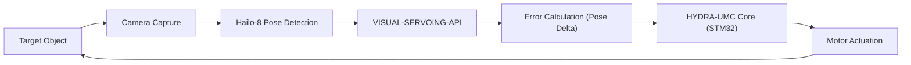

<p align="center">
  
</p>

# 🎯 HYDRA-UMC-VISUAL-SERVOING-API

<p align="center">🇺🇸 <b>English</b> | <a href="README_spa.md">🇪🇸 Español</a> | <a href="README_fra.md">🇫🇷 Français</a> | <a href="README_ita.md">🇮🇹 Italiano</a> | <a href="README_deu.md">🇩🇪 Deutsch</a> | <a href="README_zho.md">🇨🇳 简体中文</a> | <a href="README_jpn.md">🇯🇵 日本語</a></p>

### 📐 Close-Loop Kinematic Correction via Image Feedback

<p align="left">
  
  
  
</p>

---

## 1. 🛠️ TECHNICAL OVERVIEW

**HYDRA-UMC-VISUAL-SERVOING-API** is the precision bridge between perception and motion. It calculates the error delta between a desired pose and the actual visual pose of an object, providing real-time kinematic corrections to the HYDRA-UMC core.

It supports both **Eye-in-Hand** (camera on tool) and **Eye-to-Hand** (fixed camera) configurations, enabling ultra-precise Pick-and-Place, SMD alignment, and dynamic trajectory adjustment.

### Key Features:
* 🎯 **Sub-micrometric Correction:** Dynamic adjustment based on real-time visual fiducials.
* 🔄 **Closed-Loop Control:** Continuous feedback loop bypassing the high-level orchestrator for low latency.
* 📐 **Pose Estimation:** 6-DOF object pose estimation from single or multi-camera views.
* ⚡ **Hardware Accelerated:** Uses Hailo-8 output for instant coordinate calculation.

---

## 2. 🔄 VISUAL SERVOING LOOP



---

## 3. 🧱 ARCHITECTURE & DESIGN DECISIONS

* **Why this API has no hardware/firmware of its own.** It runs entirely on the shared CM5 + Hailo-8 module owned by the integration parent, HYDRA-UMC-VISION-NODE - no board of its own to design, so `hardware/`/`firmware/`/`os/` were pruned rather than left empty.
* **Why it's a sibling, not a submodule, of HYDRA-UMC-VISION-NODE.** Pose correction runs as its own process/deployable so a crash or slow inference cycle here can't stall the parent's own detection pipeline, which HYDRA-UMC-SAFETY-ZONES depends on for E-STOP timing.
* **Why the entry point only prints identity/version/role today.** Andamiaje (scaffolding) stage: proving the package installs, compiles and imports cleanly is a prerequisite for the real 6-DOF pose-correction math that lands later.
* **How this fits the rest of the ecosystem.** Sits downstream of perception (HYDRA-UMC-VISION-NODE) and upstream of motion (HYDRA-UMC firmware) - turns detected offsets into the kinematic corrections the robot arm's own jog/servo loop applies.

---

## 📂 DIRECTORY STRUCTURE

CM5 + Hailo-8 is off-the-shelf hardware with no board of its own, so this
project carries no `hardware/` or `firmware/` folder. `os/` and `models/`
live only in the integration parent, `HYDRA-UMC-VISION-NODE`.

```text
HYDRA-UMC-VISUAL-SERVOING-API/
├── src/                 # Source code (hydra_umc_visual_servoing_api package)
├── docs/                # Documentation and kinematic theory
├── build/               # Build output (local .venv lives here too)
├── images/              # Media and diagrams
├── scripts/             # Utility scripts
├── pyproject.toml       # Package metadata, dependencies, odometer version
├── bump_version.py      # Odometer-style version bump (run by build.sh/.bat)
├── build.sh / build.bat # venv + editable install + compile-check
└── run.sh / run.bat     # Runs the entry point from the local venv
```

---

## 🏗️ BUILD & RUN

Requires Python 3.10+.

```bash
# Linux / macOS
./build.sh   # bumps the odometer version, creates .venv, installs the
             # package editable, compile-checks every file under src/
./run.sh     # runs the entry point from .venv, prints name + version + role
```

```bat
:: Windows
build.bat
run.bat
```

`build.sh`/`build.bat` bump this project's own `pyproject.toml` version
using the ecosystem-wide "odometer" rule (PATCH+1, carrying into MINOR past
9) before every real build, then compile-check the source with
`python -m compileall`.

---

## 🚀 ROADMAP
* **Phase 1:** Multi-camera pipeline synchronization and calibration for 8x USB 3.0 feeds.
* **Phase 2:** Migration to YOLOv11 and Hailo-8L optimization for industrial component detection.
* **Phase 3:** Real-time 3D reconstruction from stereo vision nodes and safety zone dynamic mapping.
* **Phase 4:** Support for 9-DOF visual tracking (including orientation redundancy) and sub-micrometric correction.

---

## 🔗 Related Projects

This project is part of a larger robotics ecosystem by the same author (JuanenRac / Electro Hobby 3D), spanning firmware, control software, AI nodes, and fleet tooling. Worth knowing about, since a request might actually be about one of these rather than this repository.

### Family

**Parent:** **[HYDRA-UMC-VISION-NODE](https://github.com/JuanenRac/HYDRA-UMC-VISION-NODE)** — the integration parent this API turns perception into pose corrections for.

**Siblings:**
- **[HYDRA-UMC-VISION-STREAMER](https://github.com/JuanenRac/HYDRA-UMC-VISION-STREAMER)** — captures and pre-processes the camera feeds the parent consumes.
- **[HYDRA-UMC-DETECTION-HEF](https://github.com/JuanenRac/HYDRA-UMC-DETECTION-HEF)** — compiles the `.hef` models the parent loads onto its Hailo-8 NPU.
- **[HYDRA-UMC-SAFETY-ZONES](https://github.com/JuanenRac/HYDRA-UMC-SAFETY-ZONES)** — turns the parent's perception into intrusion detection and E-STOP triggers.

### Directly Related (outside the family)

- **[HYDRA-UMC](https://github.com/JuanenRac/HYDRA-UMC)** — sends kinematic pose corrections to this firmware.

### Rest of the Ecosystem

**HYDRA-UMC platform** — the multi-robot micro-factory cell
- **[HYDRA-UMC](https://github.com/JuanenRac/HYDRA-UMC)** — the CM5 + STM32H745 motherboard orchestrating up to 8 robot arms.
- **[HYDRA-UMC-SERVER](https://github.com/JuanenRac/HYDRA-UMC-SERVER)** — the Express/WebSocket backend every control client talks to.
- **[HYDRA-UMC-STUDIO](https://github.com/JuanenRac/HYDRA-UMC-STUDIO)** — web-based control dashboard, multi-robot 3D visualization.
- **[HYDRA-UMC-ANDROID-CONTROL](https://github.com/JuanenRac/HYDRA-UMC-ANDROID-CONTROL)** — Android control app over Wi-Fi/Bluetooth.
- **[HYDRA-UMC-IOS-CONTROL](https://github.com/JuanenRac/HYDRA-UMC-IOS-CONTROL)** — iOS/iPadOS control app built in Flutter.
- **[HYDRA-UMC-SUITE](https://github.com/JuanenRac/HYDRA-UMC-SUITE)** — desktop swarm command center (Python/PySide6).
- **[HYDRA-UMC-EDITOR-URDF](https://github.com/JuanenRac/HYDRA-UMC-EDITOR-URDF)** — desktop URDF model editor for the robot catalog.
- **[HYDRA-UMC-DSI](https://github.com/JuanenRac/HYDRA-UMC-DSI)** — native touch UI for the onboard DSI touchscreen.

**URTC platform** — the tool head controller every HYDRA-UMC robot arm carries
- **[URTC](https://github.com/JuanenRac/URTC)** — CAN bus tool head controller, 25 tool profiles.
- **[URTC-FLASHER](https://github.com/JuanenRac/URTC-FLASHER)** — desktop CAN-OTA + SWD/JTAG flashing tool.
- **[URTC-TESTER](https://github.com/JuanenRac/URTC-TESTER)** — desktop live CAN-bus diagnostic tool.
- **[URTC-WEB-STUDIO](https://github.com/JuanenRac/URTC-WEB-STUDIO)** — browser-based alternative via Web Serial API.

**🧠 Cognitive AI Node (Hailo-10)**
- [HYDRA-UMC-COGNITIVE-NODE](https://github.com/JuanenRac/HYDRA-UMC-COGNITIVE-NODE)
- [HYDRA-UMC-VLA-ENGINE](https://github.com/JuanenRac/HYDRA-UMC-VLA-ENGINE)
- [HYDRA-UMC-VOICE-UI](https://github.com/JuanenRac/HYDRA-UMC-VOICE-UI)
- [HYDRA-UMC-SEMANTIC-PLANNER](https://github.com/JuanenRac/HYDRA-UMC-SEMANTIC-PLANNER)
- [HYDRA-UMC-DOCS-QA](https://github.com/JuanenRac/HYDRA-UMC-DOCS-QA)

**🐝 Orchestration & Swarm**
- [HYDRA-UMC-ORCHESTRATOR](https://github.com/JuanenRac/HYDRA-UMC-ORCHESTRATOR)
- [HYDRA-UMC-SWARM-SYNC](https://github.com/JuanenRac/HYDRA-UMC-SWARM-SYNC)
- [HYDRA-UMC-PATH-PLANNER-3D](https://github.com/JuanenRac/HYDRA-UMC-PATH-PLANNER-3D)
- [HYDRA-UMC-JOB-DISPATCHER](https://github.com/JuanenRac/HYDRA-UMC-JOB-DISPATCHER)
- [HYDRA-UMC-NODE-HEALING](https://github.com/JuanenRac/HYDRA-UMC-NODE-HEALING)

**🎮 Digital Twin & Simulation**
- [HYDRA-UMC-TWIN](https://github.com/JuanenRac/HYDRA-UMC-TWIN)
- [HYDRA-UMC-PHYSICS-REPLICA](https://github.com/JuanenRac/HYDRA-UMC-PHYSICS-REPLICA)
- [HYDRA-UMC-HIL-BRIDGE](https://github.com/JuanenRac/HYDRA-UMC-HIL-BRIDGE)
- [HYDRA-UMC-SYNTHETIC-DATA-GEN](https://github.com/JuanenRac/HYDRA-UMC-SYNTHETIC-DATA-GEN)

**📊 Data & Analytics**
- [HYDRA-UMC-DATALAKE](https://github.com/JuanenRac/HYDRA-UMC-DATALAKE)
- [HYDRA-UMC-TELEMETRY-COLLECTOR](https://github.com/JuanenRac/HYDRA-UMC-TELEMETRY-COLLECTOR)
- [HYDRA-UMC-ANOMALY-DETECTOR](https://github.com/JuanenRac/HYDRA-UMC-ANOMALY-DETECTOR)
- [HYDRA-UMC-PRODUCTION-REPORTS](https://github.com/JuanenRac/HYDRA-UMC-PRODUCTION-REPORTS)

**🏭 Industrial Gateway**
- [HYDRA-UMC-GATEWAY-INDUSTRIAL](https://github.com/JuanenRac/HYDRA-UMC-GATEWAY-INDUSTRIAL)
- [HYDRA-UMC-OPCUA-SERVER](https://github.com/JuanenRac/HYDRA-UMC-OPCUA-SERVER)
- [HYDRA-UMC-MQTT-BROKER](https://github.com/JuanenRac/HYDRA-UMC-MQTT-BROKER)
- [HYDRA-UMC-MTCONNECT-ADAPTER](https://github.com/JuanenRac/HYDRA-UMC-MTCONNECT-ADAPTER)

**🛠️ Complementary Tools**
- [URTC-SMART-RACK](https://github.com/JuanenRac/URTC-SMART-RACK)
- [URTC-VISION-TOOL](https://github.com/JuanenRac/URTC-VISION-TOOL)
- [HYDRA-UMC-WATCH](https://github.com/JuanenRac/HYDRA-UMC-WATCH)
- [HYDRA-UMC-TOOL-CLI](https://github.com/JuanenRac/HYDRA-UMC-TOOL-CLI)
- [HYDRA-UMC-DASHBOARD-AI](https://github.com/JuanenRac/HYDRA-UMC-DASHBOARD-AI)


## 👤 AUTHOR
**JuanenRac** (Electro Hobby 3D)
📧 electrohobby3d@gmail.com

## 📜 LICENSE
GPL-3.0 - See LICENSE for details.

## Related Projects

> Canonical public ecosystem relationship map.

**Direct integrations:**
[HYDRA-UMC-OS](https://github.com/JuanenRac/HYDRA-UMC-OS) · [HYDRA-UMC-SDK](https://github.com/JuanenRac/HYDRA-UMC-SDK) · [HYDRA-UMC-SERVER](https://github.com/JuanenRac/HYDRA-UMC-SERVER) · [URTC](https://github.com/JuanenRac/URTC) · [HYDRA-UMC-VISION-NODE](https://github.com/JuanenRac/HYDRA-UMC-VISION-NODE) · [HYDRA-UMC-VISION-STREAMER](https://github.com/JuanenRac/HYDRA-UMC-VISION-STREAMER) · [HYDRA-UMC-DETECTION-HEF](https://github.com/JuanenRac/HYDRA-UMC-DETECTION-HEF) · [HYDRA-UMC-SAFETY-ZONES](https://github.com/JuanenRac/HYDRA-UMC-SAFETY-ZONES)

**Platform and contracts:**
[HYDRA-UMC-OS](https://github.com/JuanenRac/HYDRA-UMC-OS) · [HYDRA-UMC-SDK](https://github.com/JuanenRac/HYDRA-UMC-SDK)

**Rest of the ecosystem:**
All remaining public repositories are grouped by the seven ecosystem layers in the [JuanenRac ecosystem dashboard](https://juanenrac.github.io/JuanenRac/).
