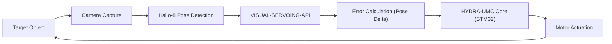

<p align="center">
  
</p>

# 🎯 HYDRA-UMC-VISUAL-SERVOING-API

<p align="center">🇺🇸 <b>English</b> | <a href="README_spa.md">🇪🇸 Español</a> | <a href="README_fra.md">🇫🇷 Français</a> | <a href="README_ita.md">🇮🇹 Italiano</a> | <a href="README_deu.md">🇩🇪 Deutsch</a> | <a href="README_zho.md">🇨🇳 简体中文</a> | <a href="README_jpn.md">🇯🇵 日本語</a></p>

### 📐 Close-Loop Kinematic Correction via Image Feedback

<p align="left">
  
  
  
</p>

---

## 1. 🛠️ TECHNICAL OVERVIEW

**HYDRA-UMC-VISUAL-SERVOING-API** is the precision bridge between perception and motion. It calculates the error delta between a desired pose and the actual visual pose of an object, providing real-time kinematic corrections to the HYDRA-UMC core.

It supports both **Eye-in-Hand** (camera on tool) and **Eye-to-Hand** (fixed camera) configurations, enabling ultra-precise Pick-and-Place, SMD alignment, and dynamic trajectory adjustment.

### Key Features:
* ✅ **Real v0 - PBVS correction law:** `pose.py` + `servo.py` compute the pose delta between a current and target 6-DOF pose (shortest-turn angle wrapping, no gimbal-lock-prone long way around) and turn it into a proportional velocity command, clamped without distorting its direction. Exposed via the `correct` subcommand below - no camera or NPU needed to run or test it.
* 🛡️ **Real v0 - Safety-gated authorization:** `authorization.py` refuses to turn perception into motion unless the upstream safety state is `READY` and the visual data is fresh/confident enough. Exposed via the new `request` subcommand below - no camera, NPU, or SAFETY-ZONES process needed to run or test it.
* 🔄 **Closed-Loop Control:** Continuous feedback loop bypassing the high-level orchestrator for low latency. *(architecture goal - the gRPC feed to the HYDRA-UMC core is still future work.)*
* 📐 **Pose Estimation:** 6-DOF object pose estimation from single or multi-camera views. *(future work - needs the real Hailo-8 NPU this repo doesn't have access to yet.)*
* ⚡ **Hardware Accelerated:** Uses Hailo-8 output for instant coordinate calculation. *(future work, same reason.)*
* 🔌 **HailoRT integration boundary, prepared ahead of the module:** `hailo_runtime.py` is written against the real, confirmed `hailo_platform` API (`VDevice`, `HEF`, `ConfigureParams`) - lazily imported so this repo installs/tests cleanly with no `hailort` package or Hailo-8 module present - and `hailo_output_to_pose()` adapts a real inference result straight into the `Pose6D` `compute_pose_error()` already consumes. *(implemented, integration boundary only - actually running inference still needs a real compiled pose-estimation `.hef` and a physical Hailo-8 module.)*

---

## 2. 🔄 VISUAL SERVOING LOOP



---

## 3. 🧱 ARCHITECTURE & DESIGN DECISIONS

* **Why this API has no hardware/firmware of its own.** It runs entirely on the shared CM5 + Hailo-8 module owned by the integration parent, HYDRA-UMC-VISION-NODE - no board of its own to design, so `hardware/`/`firmware/`/`os/` were pruned rather than left empty.
* **Why it's a sibling, not a submodule, of HYDRA-UMC-VISION-NODE.** Pose correction runs as its own process/deployable so a crash or slow inference cycle here can't stall the parent's own detection pipeline, which HYDRA-UMC-SAFETY-ZONES depends on for E-STOP timing.
* **Why the correction law ships before pose estimation.** Turning a pose *pair* into a bounded velocity command is pure control-theory math - it needs no camera or NPU to write or test, so v0 lands that piece (`pose.py`, `servo.py`) first. Real 6-DOF pose *estimation* needs the Hailo-8 hardware this environment doesn't have, and lands later.
* **How this fits the rest of the ecosystem.** Sits downstream of perception (HYDRA-UMC-VISION-NODE) and upstream of motion (HYDRA-UMC firmware) - turns detected offsets into the kinematic corrections the robot arm's own jog/servo loop applies.
* **Why `authorize_correction()` checks `safety_state` before confidence/freshness.** A safety fault must win over everything else, even a perfectly fresh and confident detection - so `INHIBITED` (safety_state != "READY") is checked first and short-circuits the rest of the policy. Only once the arm is confirmed safe to move does it matter whether the *data* is trustworthy enough to move it on (`REJECTED` for low confidence or stale data). This mirrors the `INHIBITED`-before-`DANGER`/`WARNING` precedence already used in HYDRA-UMC-SAFETY-ZONES.
* **Why `request` is a new subcommand instead of changing `correct`.** `correct` is the existing low-level pure-math utility (no safety awareness, no camera-freshness concept) with its own callers and tests; wrapping it in a safety gate in place would silently change its contract. `request` adds the gated, camera-facing entry point ecosystem code should actually call, while `correct` stays available unchanged for direct pose-math use.

---

## 📂 DIRECTORY STRUCTURE

CM5 + Hailo-8 is off-the-shelf hardware with no board of its own, so this
project carries no `hardware/` or `firmware/` folder. `os/` and `models/`
live only in the integration parent, `HYDRA-UMC-VISION-NODE`.

```text
HYDRA-UMC-VISUAL-SERVOING-API/
├── src/                 # Source code (hydra_umc_visual_servoing_api package)
│   └── hydra_umc_visual_servoing_api/
│       ├── pose.py           # Pose6D - 6-DOF pose (x, y, z, roll, pitch, yaw)
│       ├── servo.py          # PBVS pose-error + velocity-command correction law
│       ├── authorization.py  # Safety-gated request policy (INHIBITED/REJECTED/ACCEPTED)
│       ├── hailo_runtime.py  # Real HailoRT (hailo_platform) pose-estimator integration boundary, lazily imported
│       ├── api.py            # Plain JSON/HTTP surface (stdlib http.server) over correct/request
│       └── main.py           # CLI entry point (bare invocation + `correct` + `request`)
├── tests/               # Real pytest suite (pose, servo, authorization, hailo_runtime, api, CLI)
├── docs/                # Documentation and kinematic theory
├── build/               # Build output (local .venv lives here too)
├── images/              # Media and diagrams
├── systemd/
│   └── hydra-umc-visual-servoing-api.service # Local CM5 PBVS correction API systemd unit
├── tools/
│   ├── build_test.py    # Non-versioning build/compile check (no version/CHANGELOG bump)
│   └── ci_validate.py   # Manifest/CHANGELOG/docs validation used by CI
├── pyproject.toml       # Package metadata, dependencies, odometer version
├── bump_version.py      # Odometer-style native version bump (run by build.sh/.bat)
├── bump_manifest_version.py # Syncs hydra-umc.project.json's version to the native one (--sync)
├── build.sh / build.bat # venv + editable install + compile-check + tests
├── build-test.sh / build-test.bat # Non-versioning build check (no CHANGELOG/version bump)
└── run.sh / run.bat     # Runs the entry point from the local venv
```

---

## 🏗️ BUILD & RUN GUIDE

Requires Python 3.10+.

```bash
# Linux / macOS
./build.sh   # bumps the odometer version, creates .venv, installs the
             # package editable (with dev extras), compile-checks every
             # file under src/, and runs the real pytest suite
./run.sh     # runs the entry point from .venv, prints name + version + role
```

```bat
:: Windows
build.bat
run.bat
```

`build.sh`/`build.bat` bump this project's own `pyproject.toml` version
using the ecosystem-wide "odometer" rule (PATCH+1, carrying into MINOR past
9) before every real build, then compile-check the source with
`python -m compileall`.

Real example - compute the correction from a current pose to a target one:

```bash
./run.sh correct --current "0,0,0.5,0,0,0" --target "0.02,-0.01,0.48,0,0,0.05" \
  --gain 0.8 --max-linear-speed 0.05
# pose error   : dx=0.020000 dy=-0.010000 dz=-0.020000  droll=0.000000 dpitch=0.000000 dyaw=0.050000
# error norm   : linear=0.030000 m  angular=0.050000 rad
# velocity cmd : vx=0.016000 vy=-0.008000 vz=-0.016000  wroll=0.000000 wpitch=0.000000 wyaw=0.040000
# converged    : False
```

Real example - request a safety-gated correction (accepted, inhibited, and rejected):

```bash
./run.sh request --current "0,0,0,0,0,0" --target "1,0,0,0,0,0" \
  --frame-id cam0-f42 --confidence 0.9 --data-age-ms 30 --safety-state READY
# outcome : ACCEPTED - frame 'cam0-f42' authorized (confidence=0.9, data_age_ms=30.0)
# pose error   : dx=1.000000 dy=0.000000 dz=0.000000  droll=0.000000 dpitch=0.000000 dyaw=0.000000
# velocity cmd : vx=1.000000 vy=0.000000 vz=0.000000  wroll=0.000000 wpitch=0.000000 wyaw=0.000000

./run.sh request --current "0,0,0,0,0,0" --target "1,0,0,0,0,0" \
  --frame-id cam0-f42 --confidence 0.9 --data-age-ms 30 --safety-state FAULT
# outcome : INHIBITED - safety_state is 'FAULT', not 'READY'   (exit code 2)

./run.sh request --current "0,0,0,0,0,0" --target "1,0,0,0,0,0" \
  --frame-id cam0-f42 --confidence 0.2 --data-age-ms 30 --safety-state READY
# outcome : REJECTED - confidence 0.2 is below the required minimum 0.6 for frame 'cam0-f42'   (exit code 1)
```

---

## ✅ Current Status & Next Steps

**Real today:** the PBVS pose-error and velocity-command correction law
(`pose.py`, `servo.py`) - the "Error Calculation (Pose Delta)" step in
the loop diagram above - with a real `correct` CLI command; the
safety-gated authorization policy (`authorization.py`) that refuses to
turn a visual detection into motion unless the upstream safety state is
`READY` and the data is confident/fresh enough, exposed via the `request`
CLI command; and a real HailoRT integration boundary (`hailo_runtime.py`)
ready for a real Hailo-8 pose estimator the moment it plugs in. 68 tests
total.

**Still ahead, and blocked on real hardware:** actually running 6-DOF
pose *estimation* through `hailo_runtime.py` needs a real compiled
pose-estimation `.hef` (no specific model chosen yet) and a physical
Hailo-8 NPU attached, and the low-latency gRPC feed of the resulting
velocity command to the HYDRA-UMC core is separate future work.

## 🚀 ROADMAP
* **Phase 1:** Multi-camera pipeline synchronization and calibration for 8x USB 3.0 feeds.
* **Phase 2:** Migration to YOLOv11 and Hailo-8L optimization for industrial component detection.
* **Phase 3:** Real-time 3D reconstruction from stereo vision nodes and safety zone dynamic mapping.
* **Phase 4:** Support for 9-DOF visual tracking (including orientation redundancy) and sub-micrometric correction.

---

## 🔗 Related Projects

This project is part of the HYDRA-UMC robotics ecosystem by the same author (JuanenRac / Electro Hobby 3D). Worth knowing about, since a request might actually be about one of these rather than this repository.

**Parent Project**
- **[HYDRA-UMC-VISION-NODE](https://github.com/JuanenRac/HYDRA-UMC-VISION-NODE)** — integration hub for the Hailo-8 vision pipeline, with a real per-stage hardware-readiness check; the parent this repo is one specific stage or consumer of, within its own perception pipeline.

**Sibling Projects** — the other stages/consumers of HYDRA-UMC-VISION-NODE's own Hailo-8 perception pipeline
- **[HYDRA-UMC-VISION-STREAMER](https://github.com/JuanenRac/HYDRA-UMC-VISION-STREAMER)** — real GStreamer pipeline + MediaMTX config generator with a real HailoRT integration boundary.
- **[HYDRA-UMC-DETECTION-HEF](https://github.com/JuanenRac/HYDRA-UMC-DETECTION-HEF)** — real compiled-model registry with Hailo-architecture/checksum safe-load verification.
- **[HYDRA-UMC-SAFETY-ZONES](https://github.com/JuanenRac/HYDRA-UMC-SAFETY-ZONES)** — real zone-breach checking and E-STOP requesting, with calibration-freshness enforcement.

**Directly Related**
- **[HYDRA-UMC](https://github.com/JuanenRac/HYDRA-UMC)** — the physical robot-arm motherboard: CM5 host + dual-core STM32H745, orchestrating up to 8 tool arms over CAN-OTA/SPI-OTA; the STM32 core firmware that receives this API's own kinematic pose corrections.

**Also Part of the Ecosystem**

*Core Hardware & Platform*
- **[HYDRA-UMC-OS](https://github.com/JuanenRac/HYDRA-UMC-OS)** — reproducible Raspberry Pi OS product layer for the CM5: read-only agent, validated config/profiles, WiFi first-contact provisioning.
- **[HYDRA-UMC-SDK](https://github.com/JuanenRac/HYDRA-UMC-SDK)** — the shared JSON-Schema contract and safety-gate boundary every bridge validates its commands against.

*Core Backend & Clients*
- **[HYDRA-UMC-SERVER](https://github.com/JuanenRac/HYDRA-UMC-SERVER)** — the real headless backend (REST/WebSocket) every control client actually talks to.
- **[HYDRA-UMC-STUDIO](https://github.com/JuanenRac/HYDRA-UMC-STUDIO)** — web control dashboard with real-time multi-robot 3D visualization.
- **[HYDRA-UMC-SUITE](https://github.com/JuanenRac/HYDRA-UMC-SUITE)** — desktop (PySide6) swarm command center for multiple servers at once, packaged as a standalone executable.
- **[HYDRA-UMC-ANDROID-CONTROL](https://github.com/JuanenRac/HYDRA-UMC-ANDROID-CONTROL)** — native Android control app with biometric login and a paired Wear OS companion.
- **[HYDRA-UMC-IOS-CONTROL](https://github.com/JuanenRac/HYDRA-UMC-IOS-CONTROL)** — iOS/iPadOS control app (Flutter) with real-time WebSocket sync.
- **[HYDRA-UMC-DSI](https://github.com/JuanenRac/HYDRA-UMC-DSI)** — native touch UI for the onboard 7" DSI touchscreen, embedded on the CM5 itself.
- **[HYDRA-UMC-EDITOR-URDF](https://github.com/JuanenRac/HYDRA-UMC-EDITOR-URDF)** — desktop graphical URDF creator/editor that pushes finished models into STUDIO's own catalog.
- **[HYDRA-UMC-BRIDGE-AMR](https://github.com/JuanenRac/HYDRA-UMC-BRIDGE-AMR)** — coordination boundary for AGV/AMR fleets via a real VDA 5050 MQTT publisher.
- **[HYDRA-UMC-BRIDGE-CNC](https://github.com/JuanenRac/HYDRA-UMC-BRIDGE-CNC)** — high-level CNC-cell coordinator with real GRBL status/control-byte access.
- **[HYDRA-UMC-BRIDGE-DROIDS](https://github.com/JuanenRac/HYDRA-UMC-BRIDGE-DROIDS)** — coordination boundary for legged/humanoid droids, with a real Boston Dynamics Spot command sender.
- **[HYDRA-UMC-BRIDGE-LASER](https://github.com/JuanenRac/HYDRA-UMC-BRIDGE-LASER)** — laser-cell safety coordinator reading 3 real key/enclosure/interlock GPIO safeguards.
- **[HYDRA-UMC-BRIDGE-OPENPNP](https://github.com/JuanenRac/HYDRA-UMC-BRIDGE-OPENPNP)** — safe high-level board-flow coordinator for OpenPnP pick-and-place.
- **[HYDRA-UMC-BRIDGE-PRINTER3D](https://github.com/JuanenRac/HYDRA-UMC-BRIDGE-PRINTER3D)** — safe coordination boundary for Moonraker/Klipper 3D printers, with real gated job commands.
- **[HYDRA-UMC-BRIDGE-ROS2](https://github.com/JuanenRac/HYDRA-UMC-BRIDGE-ROS2)** — safety coordinator with a real, lazily-imported rclpy ROS 2 transport.
- **[HYDRA-UMC-BRIDGE-UAV](https://github.com/JuanenRac/HYDRA-UMC-BRIDGE-UAV)** — coordination boundary for camera-equipped UAVs, with a real MAVLink command sender.

*URTC Tool Platform*
- **[URTC](https://github.com/JuanenRac/URTC)** — firmware for the physical Universal Robot Tool Controller PCB, 25+ tool profiles over CAN bus.
- **[URTC-FLASHER](https://github.com/JuanenRac/URTC-FLASHER)** — desktop GUI flashing tool for URTC boards, CAN-OTA plus full-chip SWD/JTAG.
- **[URTC-TESTER](https://github.com/JuanenRac/URTC-TESTER)** — desktop live CAN-bus diagnostic tool for URTC boards, one panel per tool profile.
- **[URTC-WEB-STUDIO](https://github.com/JuanenRac/URTC-WEB-STUDIO)** — browser-based alternative to URTC-TESTER via the Web Serial API, no local install needed.

*Cognitive AI Node (Hailo-10)*
- **[HYDRA-UMC-COGNITIVE-NODE](https://github.com/JuanenRac/HYDRA-UMC-COGNITIVE-NODE)** — integration hub for the Hailo-10 cognitive pipeline (LLM/VLA/voice orchestration).
- **[HYDRA-UMC-VLA-ENGINE](https://github.com/JuanenRac/HYDRA-UMC-VLA-ENGINE)** — real action-token encoding/decoding and trajectory generation for a Vision-Language-Action model.
- **[HYDRA-UMC-VOICE-UI](https://github.com/JuanenRac/HYDRA-UMC-VOICE-UI)** — real voice front-end (VAD + intent parser) with a bounded, confirmation-gated Watch relay.
- **[HYDRA-UMC-SEMANTIC-PLANNER](https://github.com/JuanenRac/HYDRA-UMC-SEMANTIC-PLANNER)** — real rule-based task decomposition and semantic error recovery over MCU error codes.
- **[HYDRA-UMC-DOCS-QA](https://github.com/JuanenRac/HYDRA-UMC-DOCS-QA)** — real stdlib-only TF-IDF document search over this ecosystem's own Markdown docs.

*Orchestration & Swarm*
- **[HYDRA-UMC-ORCHESTRATOR](https://github.com/JuanenRac/HYDRA-UMC-ORCHESTRATOR)** — integration hub with a real gRPC/Protobuf health-report contract and mission state machine.
- **[HYDRA-UMC-JOB-DISPATCHER](https://github.com/JuanenRac/HYDRA-UMC-JOB-DISPATCHER)** — real priority-based job queue with deduplication, over a real HTTP API.
- **[HYDRA-UMC-NODE-HEALING](https://github.com/JuanenRac/HYDRA-UMC-NODE-HEALING)** — real gRPC-based fleet health watchdog with retry/backoff and identity-mismatch detection.
- **[HYDRA-UMC-PATH-PLANNER-3D](https://github.com/JuanenRac/HYDRA-UMC-PATH-PLANNER-3D)** — real RRT-based 3D path planner with real obstacle/workspace collision validation.
- **[HYDRA-UMC-SWARM-SYNC](https://github.com/JuanenRac/HYDRA-UMC-SWARM-SYNC)** — real CRDT LWW-Element-Map state sync, property-tested for multi-cell convergence.

*Digital Twin & Simulation*
- **[HYDRA-UMC-TWIN](https://github.com/JuanenRac/HYDRA-UMC-TWIN)** — integration hub for the digital-twin engine, with a real version-compatibility sync contract.
- **[HYDRA-UMC-HIL-BRIDGE](https://github.com/JuanenRac/HYDRA-UMC-HIL-BRIDGE)** — real hardware-in-the-loop safety interlock routing commands between simulation and real hardware.
- **[HYDRA-UMC-PHYSICS-REPLICA](https://github.com/JuanenRac/HYDRA-UMC-PHYSICS-REPLICA)** — real forward kinematics and joint-limit validation over a real URDF subset.
- **[HYDRA-UMC-SYNTHETIC-DATA-GEN](https://github.com/JuanenRac/HYDRA-UMC-SYNTHETIC-DATA-GEN)** — real procedural 2D scene generator with YOLO/COCO annotation export.

*Data & Analytics*
- **[HYDRA-UMC-DATALAKE](https://github.com/JuanenRac/HYDRA-UMC-DATALAKE)** — real sqlite3-backed time-series store with a real ingest/query HTTP API.
- **[HYDRA-UMC-ANOMALY-DETECTOR](https://github.com/JuanenRac/HYDRA-UMC-ANOMALY-DETECTOR)** — real FFT + statistical baseline anomaly detector with drift monitoring.
- **[HYDRA-UMC-PRODUCTION-REPORTS](https://github.com/JuanenRac/HYDRA-UMC-PRODUCTION-REPORTS)** — real OEE/availability calculation over DATALAKE history, with reproducible CSV export.
- **[HYDRA-UMC-TELEMETRY-COLLECTOR](https://github.com/JuanenRac/HYDRA-UMC-TELEMETRY-COLLECTOR)** — real CAN/WebSocket ingestion pipeline into DATALAKE, with sequence deduplication.

*Industrial Gateway*
- **[HYDRA-UMC-GATEWAY-INDUSTRIAL](https://github.com/JuanenRac/HYDRA-UMC-GATEWAY-INDUSTRIAL)** — integration hub relaying to industrial protocols, with a real command allowlist/backpressure layer.
- **[HYDRA-UMC-OPCUA-SERVER](https://github.com/JuanenRac/HYDRA-UMC-OPCUA-SERVER)** — real OPC-UA address space, verified with a real binary-protocol client session.
- **[HYDRA-UMC-MQTT-BROKER](https://github.com/JuanenRac/HYDRA-UMC-MQTT-BROKER)** — real MQTT broker with optional per-client authentication and topic ACLs.
- **[HYDRA-UMC-MTCONNECT-ADAPTER](https://github.com/JuanenRac/HYDRA-UMC-MTCONNECT-ADAPTER)** — real MTConnect `/probe` and `/current` XML endpoints with degraded-mode output.

*Complementary Tools & Ecosystem Operations*
- **[HYDRA-UMC-DASHBOARD-AI](https://github.com/JuanenRac/HYDRA-UMC-DASHBOARD-AI)** — Smart Summaries and Anomaly Highlighting panels over DATALAKE/ANOMALY-DETECTOR, with an honest statistical fallback.
- **[HYDRA-UMC-TOOL-CLI](https://github.com/JuanenRac/HYDRA-UMC-TOOL-CLI)** — fleet CLI with a real, stable exit-code contract, a genuine live client of HYDRA-UMC-SERVER's own API.
- **[HYDRA-UMC-WATCH](https://github.com/JuanenRac/HYDRA-UMC-WATCH)** — WearOS companion app with real haptic alerts and a paired-phone voice relay.
- **[URTC-SMART-RACK](https://github.com/JuanenRac/URTC-SMART-RACK)** — firmware for a board-mounting rack with real tool-ID decoding and Smart Idle pre-heating logic.
- **[URTC-VISION-TOOL](https://github.com/JuanenRac/URTC-VISION-TOOL)** — firmware plus a real Python vision companion for a thermal/RGB inspection tool head.
- **[HYDRA-UMC-UPDATER](https://github.com/JuanenRac/HYDRA-UMC-UPDATER)** — administrative desktop tool that discovers, clones and updates every repo in this ecosystem.


---

## 📚 Documentation & Community

- **[CONTRIBUTING.md](CONTRIBUTING.md)** — tech stack and coding guidelines for a pull request.
- **[CODE_OF_CONDUCT.md](CODE_OF_CONDUCT.md)** — the standards of behavior expected in this community.
- **[SECURITY.md](SECURITY.md)** — how to report a vulnerability, and this project's own real security focus areas.
- **[SUPPORT.md](SUPPORT.md)** — where to ask questions and report bugs.
- **[LICENSE.md](LICENSE.md)** — this project's own license.

## 👤 AUTHOR
**JuanenRac** (Electro Hobby 3D)
📧 electrohobby3d@gmail.com
📺 [youtube.com/@electrohobby3d](https://youtube.com/@electrohobby3d)

## 📜 LICENSE
GPL-3.0 - See LICENSE for details.
