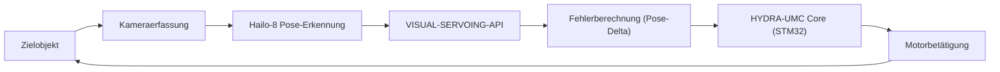

<p align="center">
  
</p>

# 🎯 HYDRA-UMC-VISUAL-SERVOING-API

<p align="center"><a href="README.md">🇺🇸 English</a> | <a href="README_spa.md">🇪🇸 Español</a> | <a href="README_fra.md">🇫🇷 Français</a> | <a href="README_ita.md">🇮🇹 Italiano</a> | 🇩🇪 <b>Deutsch</b> | <a href="README_zho.md">🇨🇳 简体中文</a> | <a href="README_jpn.md">🇯🇵 日本語</a></p>

### 📐 Kinematische Korrektur im geschlossenen Regelkreis über Bildfeedback

<p align="left">
  
  
  
</p>

---

## 1. 🛠️ TECHNISCHER ÜBERBLICK

**HYDRA-UMC-VISUAL-SERVOING-API** ist die Präzisionsbrücke zwischen Wahrnehmung und Bewegung. Sie berechnet das Fehlerdelta zwischen einer gewünschten Pose und der tatsächlichen visuellen Pose eines Objekts und liefert kinematische Korrekturen in Echtzeit an den HYDRA-UMC-Kern.

Sie unterstützt sowohl **Eye-in-Hand**- (Kamera am Werkzeug) als auch **Eye-to-Hand**-Konfigurationen (feste Kamera) und ermöglicht ultrapräzises Pick-and-Place, SMD-Ausrichtung und dynamische Trajektorienanpassung.

### Hauptmerkmale:
* 🎯 **Submikrometrische Korrektur:** Dynamische Anpassung basierend auf visuellen Fiducials in Echtzeit.
* 🔄 **Closed-Loop-Steuerung:** Kontinuierliche Feedbackschleife, die den High-Level-Orchestrator für niedrige Latenz umgeht.
* 📐 **Pose-Schätzung:** 6-DOF-Objektpose-Schätzung aus Einzel- oder Multi-Kamera-Ansichten.
* ⚡ **Hardware-beschleunigt:** Verwendet den Hailo-8-Ausgang für die sofortige Koordinatenberechnung.

---

## 2. 🔄 VISUAL SERVOING LOOP



---

## 3. 🧱 ARCHITEKTUR & DESIGNENTSCHEIDUNGEN

* **Warum diese API keine eigene Hardware/Firmware hat.** Sie läuft vollständig auf dem gemeinsam genutzten CM5 + Hailo-8-Modul des Integrations-Elternteils HYDRA-UMC-VISION-NODE - keine eigene Platine zu entwerfen, daher wurden `hardware/`/`firmware/`/`os/` entfernt statt leer gelassen.
* **Warum sie Geschwister, kein Submodul, von HYDRA-UMC-VISION-NODE ist.** Die Posenkorrektur läuft als eigener Prozess/eigenes Deployment, damit ein Absturz oder ein langsamer Inferenzzyklus hier nie die eigene Erkennungs-Pipeline des Elternteils blockieren kann, von der HYDRA-UMC-SAFETY-ZONES für das E-STOP-Timing abhängt.
* **Warum der Einstiegspunkt heute nur Identität/Version/Rolle ausgibt.** Andamiaje-Stadium (Gerüstbau): zu beweisen, dass das Paket sich installieren, kompilieren und sauber importieren lässt, ist Voraussetzung für die echte 6-Freiheitsgrad-Posenkorrektur, die später folgt.
* **Wie sich das ins restliche Ökosystem einfügt.** Sitzt stromabwärts der Wahrnehmung (HYDRA-UMC-VISION-NODE) und stromaufwärts der Bewegung (HYDRA-UMC-Firmware) - verwandelt erkannte Abweichungen in kinematische Korrekturen, die die eigene Jog-/Servo-Schleife des Roboterarms anwendet.

---

## 📂 VERZEICHNISSTRUKTUR

CM5 + Hailo-8 ist bereits vorhandene Hardware ohne eigene Platine, daher
hat dieses Projekt weder einen `hardware/`- noch einen `firmware/`-Ordner.
`os/` und `models/` leben nur im Integrations-Parent,
`HYDRA-UMC-VISION-NODE`.

```text
HYDRA-UMC-VISUAL-SERVOING-API/
├── src/                 # Quellcode (Paket hydra_umc_visual_servoing_api)
├── docs/                # Dokumentation und Kinematiktheorie
├── build/               # Build-Ausgabe (hier lebt auch das lokale .venv)
├── images/              # Medien und Diagramme
├── scripts/             # Utility-Skripte
├── pyproject.toml       # Paket-Metadaten, Abhängigkeiten, Kilometerzähler-Version
├── bump_version.py      # Kilometerzähler-Versionserhöhung (build.sh/.bat)
├── build.sh / build.bat # venv + editierbare Installation + Compile-Check
└── run.sh / run.bat     # Führt den Einstiegspunkt aus dem lokalen venv aus
```

---

## 🏗️ BUILD & RUN

Erfordert Python 3.10+.

```bash
# Linux / macOS
./build.sh   # erhöht die Kilometerzähler-Version, erstellt .venv, installiert
             # das Paket editierbar, Compile-Check für alles unter src/
./run.sh     # führt den Einstiegspunkt aus .venv aus, gibt Name + Version + Rolle aus
```

```bat
:: Windows
build.bat
run.bat
```

`build.sh`/`build.bat` erhöhen die Version in der eigenen `pyproject.toml`
dieses Projekts nach der ökosystemweiten "Kilometerzähler"-Regel (PATCH+1,
mit Übertrag auf MINOR nach 9) vor jedem echten Build und führen
anschließend einen Compile-Check des Quellcodes mit `python -m compileall`
durch.

---

## 🚀 ROADMAP
* **Phase 1:** Multi-Kamera-Pipeline-Synchronisation und Kalibrierung für 8x USB 3.0-Feeds.
* **Phase 2:** Migration zu YOLOv11 und Hailo-8L-Optimierung für die Erkennung industrieller Komponenten.
* **Phase 3:** Echtzeit-3D-Rekonstruktion aus Stereo-Vision-Knoten und dynamische Kartierung von Sicherheitszonen.
* **Phase 4:** Unterstützung für visuelles 9-DOF-Tracking (einschließlich Orientierungsredundanz) und submikrometrische Korrektur.

---

## 🔗 Verwandte Projekte

Dieses Projekt ist Teil eines größeren Robotik-Ökosystems desselben Autors (JuanenRac / Electro Hobby 3D), das Firmware, Steuerungssoftware, KI-Knoten und Flotten-Tools umfasst. Gut zu wissen, denn eine Anfrage könnte tatsächlich eines dieser Projekte betreffen statt dieses Repository.

### Familie

**Elternteil:** **[HYDRA-UMC-VISION-NODE](https://github.com/JuanenRac/HYDRA-UMC-VISION-NODE)** — der Integrations-Elternteil, für den diese API Wahrnehmung in Posenkorrekturen umwandelt.

**Geschwister:**
- **[HYDRA-UMC-VISION-STREAMER](https://github.com/JuanenRac/HYDRA-UMC-VISION-STREAMER)** — erfasst und verarbeitet die vom Elternteil konsumierten Kameraströme vor.
- **[HYDRA-UMC-DETECTION-HEF](https://github.com/JuanenRac/HYDRA-UMC-DETECTION-HEF)** — kompiliert die `.hef`-Modelle, die der Elternteil auf seine Hailo-8-NPU lädt.
- **[HYDRA-UMC-SAFETY-ZONES](https://github.com/JuanenRac/HYDRA-UMC-SAFETY-ZONES)** — wandelt die Wahrnehmung des Elternteils in Eindringlingserkennung und E-STOP-Auslösung um.

### Direkte Beziehung (außerhalb der Familie)

- **[HYDRA-UMC](https://github.com/JuanenRac/HYDRA-UMC)** — sendet kinematische Posenkorrekturen an diese Firmware.

### Restliches Ökosystem

**HYDRA-UMC-Plattform** — die Multi-Roboter-Mikrofabrikzelle
- **[HYDRA-UMC](https://github.com/JuanenRac/HYDRA-UMC)** — das CM5 + STM32H745-Motherboard, das bis zu 8 Roboterarme orchestriert.
- **[HYDRA-UMC-SERVER](https://github.com/JuanenRac/HYDRA-UMC-SERVER)** — das Express/WebSocket-Backend, mit dem jeder Steuerungsclient spricht.
- **[HYDRA-UMC-STUDIO](https://github.com/JuanenRac/HYDRA-UMC-STUDIO)** — webbasiertes Steuerungs-Dashboard, Multi-Roboter-3D-Visualisierung.
- **[HYDRA-UMC-ANDROID-CONTROL](https://github.com/JuanenRac/HYDRA-UMC-ANDROID-CONTROL)** — Android-Steuerungs-App über Wi-Fi/Bluetooth.
- **[HYDRA-UMC-IOS-CONTROL](https://github.com/JuanenRac/HYDRA-UMC-IOS-CONTROL)** — iOS/iPadOS-Steuerungs-App, gebaut in Flutter.
- **[HYDRA-UMC-SUITE](https://github.com/JuanenRac/HYDRA-UMC-SUITE)** — Desktop-Schwarm-Kommandozentrale (Python/PySide6).
- **[HYDRA-UMC-EDITOR-URDF](https://github.com/JuanenRac/HYDRA-UMC-EDITOR-URDF)** — Desktop-URDF-Modelleditor für den Roboterkatalog.
- **[HYDRA-UMC-DSI](https://github.com/JuanenRac/HYDRA-UMC-DSI)** — native Touch-UI für den eingebauten DSI-Touchscreen.

**URTC-Plattform** — der Werkzeugkopf-Controller, den jeder HYDRA-UMC-Roboterarm trägt
- **[URTC](https://github.com/JuanenRac/URTC)** — CAN-Bus-Werkzeugkopf-Controller, 25 Werkzeugprofile.
- **[URTC-FLASHER](https://github.com/JuanenRac/URTC-FLASHER)** — Desktop-Tool für CAN-OTA + SWD/JTAG-Flashing.
- **[URTC-TESTER](https://github.com/JuanenRac/URTC-TESTER)** — Desktop-Tool für Live-CAN-Bus-Diagnose.
- **[URTC-WEB-STUDIO](https://github.com/JuanenRac/URTC-WEB-STUDIO)** — browserbasierte Alternative über die Web-Serial-API.

**🧠 Cognitive AI Node (Hailo-10)**
- [HYDRA-UMC-COGNITIVE-NODE](https://github.com/JuanenRac/HYDRA-UMC-COGNITIVE-NODE)
- [HYDRA-UMC-VLA-ENGINE](https://github.com/JuanenRac/HYDRA-UMC-VLA-ENGINE)
- [HYDRA-UMC-VOICE-UI](https://github.com/JuanenRac/HYDRA-UMC-VOICE-UI)
- [HYDRA-UMC-SEMANTIC-PLANNER](https://github.com/JuanenRac/HYDRA-UMC-SEMANTIC-PLANNER)
- [HYDRA-UMC-DOCS-QA](https://github.com/JuanenRac/HYDRA-UMC-DOCS-QA)

**🐝 Orchestration & Swarm**
- [HYDRA-UMC-ORCHESTRATOR](https://github.com/JuanenRac/HYDRA-UMC-ORCHESTRATOR)
- [HYDRA-UMC-SWARM-SYNC](https://github.com/JuanenRac/HYDRA-UMC-SWARM-SYNC)
- [HYDRA-UMC-PATH-PLANNER-3D](https://github.com/JuanenRac/HYDRA-UMC-PATH-PLANNER-3D)
- [HYDRA-UMC-JOB-DISPATCHER](https://github.com/JuanenRac/HYDRA-UMC-JOB-DISPATCHER)
- [HYDRA-UMC-NODE-HEALING](https://github.com/JuanenRac/HYDRA-UMC-NODE-HEALING)

**🎮 Digital Twin & Simulation**
- [HYDRA-UMC-TWIN](https://github.com/JuanenRac/HYDRA-UMC-TWIN)
- [HYDRA-UMC-PHYSICS-REPLICA](https://github.com/JuanenRac/HYDRA-UMC-PHYSICS-REPLICA)
- [HYDRA-UMC-HIL-BRIDGE](https://github.com/JuanenRac/HYDRA-UMC-HIL-BRIDGE)
- [HYDRA-UMC-SYNTHETIC-DATA-GEN](https://github.com/JuanenRac/HYDRA-UMC-SYNTHETIC-DATA-GEN)

**📊 Data & Analytics**
- [HYDRA-UMC-DATALAKE](https://github.com/JuanenRac/HYDRA-UMC-DATALAKE)
- [HYDRA-UMC-TELEMETRY-COLLECTOR](https://github.com/JuanenRac/HYDRA-UMC-TELEMETRY-COLLECTOR)
- [HYDRA-UMC-ANOMALY-DETECTOR](https://github.com/JuanenRac/HYDRA-UMC-ANOMALY-DETECTOR)
- [HYDRA-UMC-PRODUCTION-REPORTS](https://github.com/JuanenRac/HYDRA-UMC-PRODUCTION-REPORTS)

**🏭 Industrial Gateway**
- [HYDRA-UMC-GATEWAY-INDUSTRIAL](https://github.com/JuanenRac/HYDRA-UMC-GATEWAY-INDUSTRIAL)
- [HYDRA-UMC-OPCUA-SERVER](https://github.com/JuanenRac/HYDRA-UMC-OPCUA-SERVER)
- [HYDRA-UMC-MQTT-BROKER](https://github.com/JuanenRac/HYDRA-UMC-MQTT-BROKER)
- [HYDRA-UMC-MTCONNECT-ADAPTER](https://github.com/JuanenRac/HYDRA-UMC-MTCONNECT-ADAPTER)

**🛠️ Complementary Tools**
- [URTC-SMART-RACK](https://github.com/JuanenRac/URTC-SMART-RACK)
- [URTC-VISION-TOOL](https://github.com/JuanenRac/URTC-VISION-TOOL)
- [HYDRA-UMC-WATCH](https://github.com/JuanenRac/HYDRA-UMC-WATCH)
- [HYDRA-UMC-TOOL-CLI](https://github.com/JuanenRac/HYDRA-UMC-TOOL-CLI)
- [HYDRA-UMC-DASHBOARD-AI](https://github.com/JuanenRac/HYDRA-UMC-DASHBOARD-AI)


## 👤 AUTOR
**JuanenRac** (Electro Hobby 3D)
📧 electrohobby3d@gmail.com

## 📜 LIZENZ
GPL-3.0 - Siehe LICENSE für Details.

## Verwandte Projekte

> Canonical public ecosystem relationship map.

**Direct integrations:**
[HYDRA-UMC-OS](https://github.com/JuanenRac/HYDRA-UMC-OS) · [HYDRA-UMC-SDK](https://github.com/JuanenRac/HYDRA-UMC-SDK) · [HYDRA-UMC-SERVER](https://github.com/JuanenRac/HYDRA-UMC-SERVER) · [URTC](https://github.com/JuanenRac/URTC) · [HYDRA-UMC-VISION-NODE](https://github.com/JuanenRac/HYDRA-UMC-VISION-NODE) · [HYDRA-UMC-VISION-STREAMER](https://github.com/JuanenRac/HYDRA-UMC-VISION-STREAMER) · [HYDRA-UMC-DETECTION-HEF](https://github.com/JuanenRac/HYDRA-UMC-DETECTION-HEF) · [HYDRA-UMC-SAFETY-ZONES](https://github.com/JuanenRac/HYDRA-UMC-SAFETY-ZONES)

**Platform and contracts:**
[HYDRA-UMC-OS](https://github.com/JuanenRac/HYDRA-UMC-OS) · [HYDRA-UMC-SDK](https://github.com/JuanenRac/HYDRA-UMC-SDK)

**Rest of the ecosystem:**
All remaining public repositories are grouped by the seven ecosystem layers in the [JuanenRac ecosystem dashboard](https://juanenrac.github.io/JuanenRac/).
