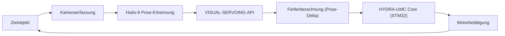

<p align="center">
  
</p>

# 🎯 HYDRA-UMC-VISUAL-SERVOING-API

<p align="center"><a href="README.md">🇺🇸 English</a> | <a href="README_spa.md">🇪🇸 Español</a> | <a href="README_fra.md">🇫🇷 Français</a> | <a href="README_ita.md">🇮🇹 Italiano</a> | 🇩🇪 <b>Deutsch</b> | <a href="README_zho.md">🇨🇳 简体中文</a> | <a href="README_jpn.md">🇯🇵 日本語</a></p>

### 📐 Kinematische Korrektur im geschlossenen Regelkreis über Bildfeedback

<p align="left">
  
  
  
</p>

---

## 1. 🛠️ TECHNISCHER ÜBERBLICK

**HYDRA-UMC-VISUAL-SERVOING-API** ist die Präzisionsbrücke zwischen Wahrnehmung und Bewegung. Sie berechnet das Fehlerdelta zwischen einer gewünschten Pose und der tatsächlichen visuellen Pose eines Objekts und liefert kinematische Korrekturen in Echtzeit an den HYDRA-UMC-Kern.

Sie unterstützt sowohl **Eye-in-Hand**- (Kamera am Werkzeug) als auch **Eye-to-Hand**-Konfigurationen (feste Kamera) und ermöglicht ultrapräzises Pick-and-Place, SMD-Ausrichtung und dynamische Trajektorienanpassung.

### Hauptmerkmale:
* ✅ **Echtes v0 - PBVS-Korrekturgesetz:** `pose.py` + `servo.py` berechnen das Pose-Delta zwischen einer aktuellen und einer Ziel-Pose (Winkel werden über den kürzesten Weg gewickelt, nicht den langen, gimbal-lock-anfälligen Umweg) und wandeln es in einen proportionalen Geschwindigkeitsbefehl um, begrenzt ohne dessen Richtung zu verzerren. Über den unten stehenden Unterbefehl `correct` verfügbar - keine Kamera oder NPU nötig, um es auszuführen oder zu testen.
* 🛡️ **Echtes v0 - sicherheitsgesperrte Autorisierung:** `authorization.py` verweigert die Umwandlung von Wahrnehmung in Bewegung, es sei denn, der vorgelagerte Sicherheitszustand ist `READY` und die visuellen Daten sind frisch/vertrauenswürdig genug. Über den neuen Unterbefehl `request` verfügbar - keine Kamera, NPU oder SAFETY-ZONES-Prozess nötig, um es auszuführen oder zu testen.
* 🔄 **Closed-Loop-Steuerung:** Kontinuierliche Feedbackschleife, die den High-Level-Orchestrator für niedrige Latenz umgeht. *(Architekturziel - die gRPC-Übertragung an den HYDRA-UMC-Kern ist noch zukünftige Arbeit.)*
* 📐 **Pose-Schätzung:** 6-DOF-Objektpose-Schätzung aus Einzel- oder Multi-Kamera-Ansichten. *(zukünftige Arbeit - benötigt die echte Hailo-8-NPU, die diese Umgebung noch nicht hat.)*
* ⚡ **Hardware-beschleunigt:** Verwendet den Hailo-8-Ausgang für die sofortige Koordinatenberechnung. *(zukünftige Arbeit, gleicher Grund.)*

---

## 2. 🔄 VISUAL SERVOING LOOP



---

## 3. 🧱 ARCHITEKTUR & DESIGNENTSCHEIDUNGEN

* **Warum diese API keine eigene Hardware/Firmware hat.** Sie läuft vollständig auf dem gemeinsam genutzten CM5 + Hailo-8-Modul des Integrations-Elternteils HYDRA-UMC-VISION-NODE - keine eigene Platine zu entwerfen, daher wurden `hardware/`/`firmware/`/`os/` entfernt statt leer gelassen.
* **Warum sie Geschwister, kein Submodul, von HYDRA-UMC-VISION-NODE ist.** Die Posenkorrektur läuft als eigener Prozess/eigenes Deployment, damit ein Absturz oder ein langsamer Inferenzzyklus hier nie die eigene Erkennungs-Pipeline des Elternteils blockieren kann, von der HYDRA-UMC-SAFETY-ZONES für das E-STOP-Timing abhängt.
* **Warum das Korrekturgesetz vor der Pose-Schätzung kommt.** Ein Pose-*Paar* in einen begrenzten Geschwindigkeitsbefehl umzuwandeln ist reine Regelungstheorie-Mathematik - dafür braucht es weder Kamera noch NPU zum Schreiben oder Testen, daher liefert v0 dieses Stück (`pose.py`, `servo.py`) zuerst. Die echte 6-Freiheitsgrad-Posenschätzung benötigt die Hailo-8-Hardware, die diese Umgebung nicht hat, und folgt später.
* **Wie sich das ins restliche Ökosystem einfügt.** Sitzt stromabwärts der Wahrnehmung (HYDRA-UMC-VISION-NODE) und stromaufwärts der Bewegung (HYDRA-UMC-Firmware) - verwandelt erkannte Abweichungen in kinematische Korrekturen, die die eigene Jog-/Servo-Schleife des Roboterarms anwendet.
* **Warum `authorize_correction()` `safety_state` vor Vertrauen/Aktualität prüft.** Ein Sicherheitsfehler muss über allem anderen stehen, selbst gegenüber einer perfekt frischen und vertrauenswürdigen Erkennung - daher wird `INHIBITED` (safety_state != "READY") zuerst geprüft und schneidet den Rest der Policy ab. Erst wenn bestätigt ist, dass sich der Arm sicher bewegen darf, zählt, ob die *Daten* vertrauenswürdig genug sind, ihn tatsächlich zu bewegen (`REJECTED` bei niedrigem Vertrauen oder veralteten Daten). Dies spiegelt dieselbe `INHIBITED`-vor-`DANGER`/`WARNING`-Priorität wider, die bereits in HYDRA-UMC-SAFETY-ZONES verwendet wird.
* **Warum `request` ein neuer Unterbefehl ist statt `correct` zu ändern.** `correct` ist das bestehende Low-Level-Dienstprogramm, reine Mathematik (ohne Sicherheitsbewusstsein oder Konzept der Kamera-Aktualität) mit eigenen Aufrufern und Tests; es vor Ort in eine Sicherheitssperre einzuhüllen würde seinen Vertrag stillschweigend ändern. `request` fügt den gesperrten, kameraorientierten Einstiegspunkt hinzu, den Ökosystem-Code tatsächlich aufrufen sollte, während `correct` unverändert für die direkte Verwendung der Posen-Mathematik verfügbar bleibt.

---

## 📂 VERZEICHNISSTRUKTUR

CM5 + Hailo-8 ist bereits vorhandene Hardware ohne eigene Platine, daher
hat dieses Projekt weder einen `hardware/`- noch einen `firmware/`-Ordner.
`os/` und `models/` leben nur im Integrations-Parent,
`HYDRA-UMC-VISION-NODE`.

```text
HYDRA-UMC-VISUAL-SERVOING-API/
├── src/                 # Quellcode (Paket hydra_umc_visual_servoing_api)
│   └── hydra_umc_visual_servoing_api/
│       ├── pose.py           # Pose6D - 6-DOF-Pose (x, y, z, roll, pitch, yaw)
│       ├── servo.py          # PBVS-Korrekturgesetz: Pose-Fehler + Geschwindigkeitsbefehl
│       ├── authorization.py  # Sicherheitsgesperrte Policy (INHIBITED/REJECTED/ACCEPTED)
│       └── main.py           # CLI-Einstiegspunkt (nackter Aufruf + `correct` + `request`)
├── tests/               # Echte pytest-Suite (Pose, Servo, Authorization, CLI)
├── docs/                # Dokumentation und Kinematiktheorie
├── build/               # Build-Ausgabe (hier lebt auch das lokale .venv)
├── images/              # Medien und Diagramme
├── scripts/             # Utility-Skripte
├── tools/
│   ├── build_test.py    # Nicht-versionierender Build-Check
│   └── ci_validate.py   # Manifest/CHANGELOG/Docs-Validierung, von CI genutzt
├── pyproject.toml       # Paket-Metadaten, Abhängigkeiten, Kilometerzähler-Version
├── bump_version.py      # Kilometerzähler-Versionserhöhung (build.sh/.bat)
├── build.sh / build.bat # venv + editierbare Installation + Compile-Check + Tests
├── build-test.sh / build-test.bat # Nicht-versionierender Build-Check
└── run.sh / run.bat     # Führt den Einstiegspunkt aus dem lokalen venv aus
```

---

## 🏗️ BUILD UND AUSFÜHRUNG

Erfordert Python 3.10+.

```bash
# Linux / macOS
./build.sh   # erhöht die Kilometerzähler-Version, erstellt .venv, installiert
             # das Paket editierbar (mit dev-Extras), Compile-Check für
             # alles unter src/, und führt die echte pytest-Suite aus
./run.sh     # führt den Einstiegspunkt aus .venv aus, gibt Name + Version + Rolle aus
```

```bat
:: Windows
build.bat
run.bat
```

`build.sh`/`build.bat` erhöhen die Version in der eigenen `pyproject.toml`
dieses Projekts nach der ökosystemweiten "Kilometerzähler"-Regel (PATCH+1,
mit Übertrag auf MINOR nach 9) vor jedem echten Build und führen
anschließend einen Compile-Check des Quellcodes mit `python -m compileall`
durch.

Echtes Beispiel - die Korrektur von einer aktuellen zu einer Ziel-Pose berechnen:

```bash
./run.sh correct --current "0,0,0.5,0,0,0" --target "0.02,-0.01,0.48,0,0,0.05" \
  --gain 0.8 --max-linear-speed 0.05
# pose error   : dx=0.020000 dy=-0.010000 dz=-0.020000  droll=0.000000 dpitch=0.000000 dyaw=0.050000
# error norm   : linear=0.030000 m  angular=0.050000 rad
# velocity cmd : vx=0.016000 vy=-0.008000 vz=-0.016000  wroll=0.000000 wpitch=0.000000 wyaw=0.040000
# converged    : False
```

Echtes Beispiel - eine sicherheitsgesperrte Korrektur anfordern (akzeptiert, gesperrt und abgelehnt):

```bash
./run.sh request --current "0,0,0,0,0,0" --target "1,0,0,0,0,0" \
  --frame-id cam0-f42 --confidence 0.9 --data-age-ms 30 --safety-state READY
# outcome : ACCEPTED - frame 'cam0-f42' authorized (confidence=0.9, data_age_ms=30.0)
# pose error   : dx=1.000000 dy=0.000000 dz=0.000000  droll=0.000000 dpitch=0.000000 dyaw=0.000000
# velocity cmd : vx=1.000000 vy=0.000000 vz=0.000000  wroll=0.000000 wpitch=0.000000 wyaw=0.000000

./run.sh request --current "0,0,0,0,0,0" --target "1,0,0,0,0,0" \
  --frame-id cam0-f42 --confidence 0.9 --data-age-ms 30 --safety-state FAULT
# outcome : INHIBITED - safety_state is 'FAULT', not 'READY'   (Exit-Code 2)

./run.sh request --current "0,0,0,0,0,0" --target "1,0,0,0,0,0" \
  --frame-id cam0-f42 --confidence 0.2 --data-age-ms 30 --safety-state READY
# outcome : REJECTED - confidence 0.2 is below the required minimum 0.6 for frame 'cam0-f42'   (Exit-Code 1)
```

---

## ✅ Aktueller Status und nächste Schritte

**Heute real:** das PBVS-Korrekturgesetz für Pose-Fehler und
Geschwindigkeitsbefehl (`pose.py`, `servo.py`) - der Schritt
"Fehlerberechnung (Pose-Delta)" im obigen Schleifendiagramm - mit einem
echten `correct`-CLI-Befehl; sowie die sicherheitsgesperrte
Autorisierungs-Policy (`authorization.py`), die eine visuelle Erkennung
nur dann in Bewegung umwandelt, wenn der vorgelagerte Sicherheitszustand
`READY` ist und die Daten vertrauenswürdig/frisch genug sind, verfügbar
über den `request`-CLI-Befehl. Insgesamt 40 Tests.

**Noch offen, blockiert durch echte Hardware:** die echte
6-Freiheitsgrad-Posenschätzung aus Kamerabildern (benötigt die
Hailo-8-NPU) und die gRPC-Übertragung des resultierenden
Geschwindigkeitsbefehls mit niedriger Latenz an den HYDRA-UMC-Kern.

## 🚀 FAHRPLAN
* **Phase 1:** Multi-Kamera-Pipeline-Synchronisation und Kalibrierung für 8x USB 3.0-Feeds.
* **Phase 2:** Migration zu YOLOv11 und Hailo-8L-Optimierung für die Erkennung industrieller Komponenten.
* **Phase 3:** Echtzeit-3D-Rekonstruktion aus Stereo-Vision-Knoten und dynamische Kartierung von Sicherheitszonen.
* **Phase 4:** Unterstützung für visuelles 9-DOF-Tracking (einschließlich Orientierungsredundanz) und submikrometrische Korrektur.

---

## 🔗 Verwandte Projekte

Dieses Projekt ist Teil eines größeren Robotik-Ökosystems desselben Autors (JuanenRac / Electro Hobby 3D), das Firmware, Steuerungssoftware, KI-Knoten und Flotten-Tools umfasst. Gut zu wissen, denn eine Anfrage könnte tatsächlich eines dieser Projekte betreffen statt dieses Repository.

### Familie

**Elternteil:** **[HYDRA-UMC-VISION-NODE](https://github.com/JuanenRac/HYDRA-UMC-VISION-NODE)** — der Integrations-Elternteil, für den diese API Wahrnehmung in Posenkorrekturen umwandelt.

**Geschwister:**
- **[HYDRA-UMC-VISION-STREAMER](https://github.com/JuanenRac/HYDRA-UMC-VISION-STREAMER)** — erfasst und verarbeitet die vom Elternteil konsumierten Kameraströme vor.
- **[HYDRA-UMC-DETECTION-HEF](https://github.com/JuanenRac/HYDRA-UMC-DETECTION-HEF)** — kompiliert die `.hef`-Modelle, die der Elternteil auf seine Hailo-8-NPU lädt.
- **[HYDRA-UMC-SAFETY-ZONES](https://github.com/JuanenRac/HYDRA-UMC-SAFETY-ZONES)** — wandelt die Wahrnehmung des Elternteils in Eindringlingserkennung und E-STOP-Auslösung um.

### Direkte Beziehung (außerhalb der Familie)

- **[HYDRA-UMC](https://github.com/JuanenRac/HYDRA-UMC)** — sendet kinematische Posenkorrekturen an diese Firmware.

### Restliches Ökosystem

**HYDRA-UMC-Plattform** — die Multi-Roboter-Mikrofabrikzelle
- **[HYDRA-UMC](https://github.com/JuanenRac/HYDRA-UMC)** — das CM5 + STM32H745-Motherboard, das bis zu 8 Roboterarme orchestriert.
- **[HYDRA-UMC-SERVER](https://github.com/JuanenRac/HYDRA-UMC-SERVER)** — das Express/WebSocket-Backend, mit dem jeder Steuerungsclient spricht.
- **[HYDRA-UMC-STUDIO](https://github.com/JuanenRac/HYDRA-UMC-STUDIO)** — webbasiertes Steuerungs-Dashboard, Multi-Roboter-3D-Visualisierung.
- **[HYDRA-UMC-ANDROID-CONTROL](https://github.com/JuanenRac/HYDRA-UMC-ANDROID-CONTROL)** — Android-Steuerungs-App über Wi-Fi/Bluetooth.
- **[HYDRA-UMC-IOS-CONTROL](https://github.com/JuanenRac/HYDRA-UMC-IOS-CONTROL)** — iOS/iPadOS-Steuerungs-App, gebaut in Flutter.
- **[HYDRA-UMC-SUITE](https://github.com/JuanenRac/HYDRA-UMC-SUITE)** — Desktop-Schwarm-Kommandozentrale (Python/PySide6).
- **[HYDRA-UMC-EDITOR-URDF](https://github.com/JuanenRac/HYDRA-UMC-EDITOR-URDF)** — Desktop-URDF-Modelleditor für den Roboterkatalog.
- **[HYDRA-UMC-DSI](https://github.com/JuanenRac/HYDRA-UMC-DSI)** — native Touch-UI für den eingebauten DSI-Touchscreen.

**URTC-Plattform** — der Werkzeugkopf-Controller, den jeder HYDRA-UMC-Roboterarm trägt
- **[URTC](https://github.com/JuanenRac/URTC)** — CAN-Bus-Werkzeugkopf-Controller, 25 Werkzeugprofile.
- **[URTC-FLASHER](https://github.com/JuanenRac/URTC-FLASHER)** — Desktop-Tool für CAN-OTA + SWD/JTAG-Flashing.
- **[URTC-TESTER](https://github.com/JuanenRac/URTC-TESTER)** — Desktop-Tool für Live-CAN-Bus-Diagnose.
- **[URTC-WEB-STUDIO](https://github.com/JuanenRac/URTC-WEB-STUDIO)** — browserbasierte Alternative über die Web-Serial-API.

**🧠 Kognitiver KI-Knoten (Hailo-10)**
- [HYDRA-UMC-COGNITIVE-NODE](https://github.com/JuanenRac/HYDRA-UMC-COGNITIVE-NODE)
- [HYDRA-UMC-VLA-ENGINE](https://github.com/JuanenRac/HYDRA-UMC-VLA-ENGINE)
- [HYDRA-UMC-VOICE-UI](https://github.com/JuanenRac/HYDRA-UMC-VOICE-UI)
- [HYDRA-UMC-SEMANTIC-PLANNER](https://github.com/JuanenRac/HYDRA-UMC-SEMANTIC-PLANNER)
- [HYDRA-UMC-DOCS-QA](https://github.com/JuanenRac/HYDRA-UMC-DOCS-QA)

**🐝 Orchestrierung & Schwarm**
- [HYDRA-UMC-ORCHESTRATOR](https://github.com/JuanenRac/HYDRA-UMC-ORCHESTRATOR)
- [HYDRA-UMC-SWARM-SYNC](https://github.com/JuanenRac/HYDRA-UMC-SWARM-SYNC)
- [HYDRA-UMC-PATH-PLANNER-3D](https://github.com/JuanenRac/HYDRA-UMC-PATH-PLANNER-3D)
- [HYDRA-UMC-JOB-DISPATCHER](https://github.com/JuanenRac/HYDRA-UMC-JOB-DISPATCHER)
- [HYDRA-UMC-NODE-HEALING](https://github.com/JuanenRac/HYDRA-UMC-NODE-HEALING)

**🎮 Digitaler Zwilling & Simulation**
- [HYDRA-UMC-TWIN](https://github.com/JuanenRac/HYDRA-UMC-TWIN)
- [HYDRA-UMC-PHYSICS-REPLICA](https://github.com/JuanenRac/HYDRA-UMC-PHYSICS-REPLICA)
- [HYDRA-UMC-HIL-BRIDGE](https://github.com/JuanenRac/HYDRA-UMC-HIL-BRIDGE)
- [HYDRA-UMC-SYNTHETIC-DATA-GEN](https://github.com/JuanenRac/HYDRA-UMC-SYNTHETIC-DATA-GEN)

**📊 Daten & Analytik**
- [HYDRA-UMC-DATALAKE](https://github.com/JuanenRac/HYDRA-UMC-DATALAKE)
- [HYDRA-UMC-TELEMETRY-COLLECTOR](https://github.com/JuanenRac/HYDRA-UMC-TELEMETRY-COLLECTOR)
- [HYDRA-UMC-ANOMALY-DETECTOR](https://github.com/JuanenRac/HYDRA-UMC-ANOMALY-DETECTOR)
- [HYDRA-UMC-PRODUCTION-REPORTS](https://github.com/JuanenRac/HYDRA-UMC-PRODUCTION-REPORTS)

**🏭 Industrielles Gateway**
- [HYDRA-UMC-GATEWAY-INDUSTRIAL](https://github.com/JuanenRac/HYDRA-UMC-GATEWAY-INDUSTRIAL)
- [HYDRA-UMC-OPCUA-SERVER](https://github.com/JuanenRac/HYDRA-UMC-OPCUA-SERVER)
- [HYDRA-UMC-MQTT-BROKER](https://github.com/JuanenRac/HYDRA-UMC-MQTT-BROKER)
- [HYDRA-UMC-MTCONNECT-ADAPTER](https://github.com/JuanenRac/HYDRA-UMC-MTCONNECT-ADAPTER)

**🛠️ Ergänzende Werkzeuge**
- [URTC-SMART-RACK](https://github.com/JuanenRac/URTC-SMART-RACK)
- [URTC-VISION-TOOL](https://github.com/JuanenRac/URTC-VISION-TOOL)
- [HYDRA-UMC-WATCH](https://github.com/JuanenRac/HYDRA-UMC-WATCH)
- [HYDRA-UMC-TOOL-CLI](https://github.com/JuanenRac/HYDRA-UMC-TOOL-CLI)
- [HYDRA-UMC-DASHBOARD-AI](https://github.com/JuanenRac/HYDRA-UMC-DASHBOARD-AI)


## 👤 AUTOR
**JuanenRac** (Electro Hobby 3D)
📧 electrohobby3d@gmail.com
📺 [youtube.com/@electrohobby3d](https://youtube.com/@electrohobby3d)

## 📜 LIZENZ
GPL-3.0 - Siehe LICENSE für Details.
