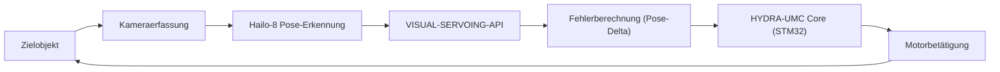

<p align="center">
  
</p>

# 🎯 HYDRA-UMC-VISUAL-SERVOING-API

<p align="center"><a href="README.md">🇺🇸 English</a> | <a href="README_spa.md">🇪🇸 Español</a> | <a href="README_fra.md">🇫🇷 Français</a> | <a href="README_ita.md">🇮🇹 Italiano</a> | 🇩🇪 <b>Deutsch</b> | <a href="README_zho.md">🇨🇳 简体中文</a> | <a href="README_jpn.md">🇯🇵 日本語</a></p>

### 📐 Kinematische Korrektur im geschlossenen Regelkreis über Bildfeedback

<p align="left">
  
  
  
</p>

---

## 1. 🛠️ TECHNISCHER ÜBERBLICK

**HYDRA-UMC-VISUAL-SERVOING-API** ist die Präzisionsbrücke zwischen Wahrnehmung und Bewegung. Sie berechnet das Fehlerdelta zwischen einer gewünschten Pose und der tatsächlichen visuellen Pose eines Objekts und liefert kinematische Korrekturen in Echtzeit an den HYDRA-UMC-Kern.

Sie unterstützt sowohl **Eye-in-Hand**- (Kamera am Werkzeug) als auch **Eye-to-Hand**-Konfigurationen (feste Kamera) und ermöglicht ultrapräzises Pick-and-Place, SMD-Ausrichtung und dynamische Trajektorienanpassung.

### Hauptmerkmale:
* ✅ **Echtes v0 - PBVS-Korrekturgesetz:** `pose.py` + `servo.py` berechnen das Pose-Delta zwischen einer aktuellen und einer Ziel-Pose (Winkel werden über den kürzesten Weg gewickelt, nicht den langen, gimbal-lock-anfälligen Umweg) und wandeln es in einen proportionalen Geschwindigkeitsbefehl um, begrenzt ohne dessen Richtung zu verzerren. Über den unten stehenden Unterbefehl `correct` verfügbar - keine Kamera oder NPU nötig, um es auszuführen oder zu testen.
* 🛡️ **Echtes v0 - sicherheitsgesperrte Autorisierung:** `authorization.py` verweigert die Umwandlung von Wahrnehmung in Bewegung, es sei denn, der vorgelagerte Sicherheitszustand ist `READY` und die visuellen Daten sind frisch/vertrauenswürdig genug. Über den neuen Unterbefehl `request` verfügbar - keine Kamera, NPU oder SAFETY-ZONES-Prozess nötig, um es auszuführen oder zu testen.
* 🌐 **JSON/HTTP-API (v0):** der echte Unterbefehl `serve` stellt dieselbe `correct`/`request`-Logik als `POST /correct`/`POST /request` bereit (plus `GET /stats`), über das `http.server`-Modul der Standardbibliothek ohne zusätzliche Abhängigkeit - erreichbar von einem echten Aufrufer statt über einmalige CLI-Argumente. Siehe [`docs/CLI_REFERENCE.md`](docs/CLI_REFERENCE.md).
* 🔄 **Closed-Loop-Steuerung:** Kontinuierliche Feedbackschleife, die den High-Level-Orchestrator für niedrige Latenz umgeht. *(Architekturziel - die gRPC-Übertragung an den HYDRA-UMC-Kern ist noch zukünftige Arbeit.)*
* 📐 **Pose-Schätzung:** 6-DOF-Objektpose-Schätzung aus Einzel- oder Multi-Kamera-Ansichten. *(zukünftige Arbeit - benötigt die echte Hailo-8-NPU, die diese Umgebung noch nicht hat.)*
* ⚡ **Hardware-beschleunigt:** Verwendet den Hailo-8-Ausgang für die sofortige Koordinatenberechnung. *(zukünftige Arbeit, gleicher Grund.)*
* 🔌 **HailoRT-Integrationsgrenze, dem Modul vorausgehend vorbereitet:** `hailo_runtime.py` ist gegen die echte, bestätigte `hailo_platform`-API (`VDevice`, `HEF`, `ConfigureParams`) geschrieben - lazy importiert, sodass dieses Repository ohne installiertes `hailort`-Paket oder vorhandenes Hailo-8-Modul sauber installiert/getestet wird - und `hailo_output_to_pose()` passt ein echtes Inferenzergebnis direkt in das `Pose6D` an, das `compute_pose_error()` bereits konsumiert. *(implementiert, nur Integrationsgrenze - tatsächliche Inferenz auszuführen braucht weiterhin ein echtes, kompiliertes Pose-Schätzungs-`.hef` und ein physisches Hailo-8-Modul.)*

---

## 2. 🔄 VISUAL SERVOING LOOP



---

## 3. 🧱 ARCHITEKTUR & DESIGNENTSCHEIDUNGEN

* **Warum diese API keine eigene Hardware/Firmware hat.** Sie läuft vollständig auf dem gemeinsam genutzten CM5 + Hailo-8-Modul des Integrations-Elternteils HYDRA-UMC-VISION-NODE - keine eigene Platine zu entwerfen, daher wurden `hardware/`/`firmware/`/`os/` entfernt statt leer gelassen.
* **Warum sie Geschwister, kein Submodul, von HYDRA-UMC-VISION-NODE ist.** Die Posenkorrektur läuft als eigener Prozess/eigenes Deployment, damit ein Absturz oder ein langsamer Inferenzzyklus hier nie die eigene Erkennungs-Pipeline des Elternteils blockieren kann, von der HYDRA-UMC-SAFETY-ZONES für das E-STOP-Timing abhängt.
* **Warum das Korrekturgesetz vor der Pose-Schätzung kommt.** Ein Pose-*Paar* in einen begrenzten Geschwindigkeitsbefehl umzuwandeln ist reine Regelungstheorie-Mathematik - dafür braucht es weder Kamera noch NPU zum Schreiben oder Testen, daher liefert v0 dieses Stück (`pose.py`, `servo.py`) zuerst. Die echte 6-Freiheitsgrad-Posenschätzung benötigt die Hailo-8-Hardware, die diese Umgebung nicht hat, und folgt später.
* **Wie sich das ins restliche Ökosystem einfügt.** Sitzt stromabwärts der Wahrnehmung (HYDRA-UMC-VISION-NODE) und stromaufwärts der Bewegung (HYDRA-UMC-Firmware) - verwandelt erkannte Abweichungen in kinematische Korrekturen, die die eigene Jog-/Servo-Schleife des Roboterarms anwendet.
* **Warum `authorize_correction()` `safety_state` vor Vertrauen/Aktualität prüft.** Ein Sicherheitsfehler muss über allem anderen stehen, selbst gegenüber einer perfekt frischen und vertrauenswürdigen Erkennung - daher wird `INHIBITED` (safety_state != "READY") zuerst geprüft und schneidet den Rest der Policy ab. Erst wenn bestätigt ist, dass sich der Arm sicher bewegen darf, zählt, ob die *Daten* vertrauenswürdig genug sind, ihn tatsächlich zu bewegen (`REJECTED` bei niedrigem Vertrauen oder veralteten Daten). Dies spiegelt dieselbe `INHIBITED`-vor-`DANGER`/`WARNING`-Priorität wider, die bereits in HYDRA-UMC-SAFETY-ZONES verwendet wird.
* **Warum `request` ein neuer Unterbefehl ist statt `correct` zu ändern.** `correct` ist das bestehende Low-Level-Dienstprogramm, reine Mathematik (ohne Sicherheitsbewusstsein oder Konzept der Kamera-Aktualität) mit eigenen Aufrufern und Tests; es vor Ort in eine Sicherheitssperre einzuhüllen würde seinen Vertrag stillschweigend ändern. `request` fügt den gesperrten, kameraorientierten Einstiegspunkt hinzu, den Ökosystem-Code tatsächlich aufrufen sollte, während `correct` unverändert für die direkte Verwendung der Posen-Mathematik verfügbar bleibt.

---

## 📂 VERZEICHNISSTRUKTUR

CM5 + Hailo-8 ist bereits vorhandene Hardware ohne eigene Platine, daher
hat dieses Projekt weder einen `hardware/`- noch einen `firmware/`-Ordner.
`os/` und `models/` leben nur im Integrations-Parent,
`HYDRA-UMC-VISION-NODE`.

```text
HYDRA-UMC-VISUAL-SERVOING-API/
├── src/                 # Quellcode (Paket hydra_umc_visual_servoing_api)
│   └── hydra_umc_visual_servoing_api/
│       ├── pose.py           # Pose6D - 6-DOF-Pose (x, y, z, roll, pitch, yaw)
│       ├── servo.py          # PBVS-Korrekturgesetz: Pose-Fehler + Geschwindigkeitsbefehl
│       ├── authorization.py  # Sicherheitsgesperrte Policy (INHIBITED/REJECTED/ACCEPTED)
│       ├── hailo_runtime.py  # Echte HailoRT-Integrationsgrenze (hailo_platform) des Pose-Schätzers, lazy importiert
│       ├── api.py            # Einfache JSON/HTTP-Oberfläche (stdlib http.server) über correct/request
│       └── main.py           # CLI-Einstiegspunkt (nackter Aufruf + `correct` + `request`)
├── tests/               # Echte pytest-Suite (Pose, Servo, Authorization, hailo_runtime, api, CLI)
├── docs/                # Dokumentation und Kinematiktheorie
├── build/               # Build-Ausgabe (hier lebt auch das lokale .venv)
├── images/              # Medien und Diagramme
├── systemd/
│   └── hydra-umc-visual-servoing-api.service # systemd-Unit der lokalen CM5-PBVS-Korrektur-API
├── tools/
│   ├── build_test.py    # Nicht-versionierender Build-Check
│   └── ci_validate.py   # Manifest/CHANGELOG/Docs-Validierung, von CI genutzt
├── pyproject.toml       # Paket-Metadaten, Abhängigkeiten, Kilometerzähler-Version
├── bump_version.py      # Native Kilometerzähler-Versionserhöhung (build.sh/.bat)
├── bump_manifest_version.py # Synchronisiert die Version von hydra-umc.project.json mit der nativen (--sync)
├── build.sh / build.bat # venv + editierbare Installation + Compile-Check + Tests
├── build-test.sh / build-test.bat # Nicht-versionierender Build-Check
└── run.sh / run.bat     # Führt den Einstiegspunkt aus dem lokalen venv aus
```

---

## 🏗️ BUILD UND AUSFÜHRUNG

Erfordert Python 3.10+.

```bash
# Linux / macOS
./build.sh   # erhöht die Kilometerzähler-Version, erstellt .venv, installiert
             # das Paket editierbar (mit dev-Extras), Compile-Check für
             # alles unter src/, und führt die echte pytest-Suite aus
./run.sh     # führt den Einstiegspunkt aus .venv aus, gibt Name + Version + Rolle aus
```

```bat
:: Windows
build.bat
run.bat
```

`build.sh`/`build.bat` erhöhen die Version in der eigenen `pyproject.toml`
dieses Projekts nach der ökosystemweiten "Kilometerzähler"-Regel (PATCH+1,
mit Übertrag auf MINOR nach 9) vor jedem echten Build und führen
anschließend einen Compile-Check des Quellcodes mit `python -m compileall`
durch.

Echtes Beispiel - die Korrektur von einer aktuellen zu einer Ziel-Pose berechnen:

```bash
./run.sh correct --current "0,0,0.5,0,0,0" --target "0.02,-0.01,0.48,0,0,0.05" \
  --gain 0.8 --max-linear-speed 0.05
# pose error   : dx=0.020000 dy=-0.010000 dz=-0.020000  droll=0.000000 dpitch=0.000000 dyaw=0.050000
# error norm   : linear=0.030000 m  angular=0.050000 rad
# velocity cmd : vx=0.016000 vy=-0.008000 vz=-0.016000  wroll=0.000000 wpitch=0.000000 wyaw=0.040000
# converged    : False
```

Echtes Beispiel - eine sicherheitsgesperrte Korrektur anfordern (akzeptiert, gesperrt und abgelehnt):

```bash
./run.sh request --current "0,0,0,0,0,0" --target "1,0,0,0,0,0" \
  --frame-id cam0-f42 --confidence 0.9 --data-age-ms 30 --safety-state READY
# outcome : ACCEPTED - frame 'cam0-f42' authorized (confidence=0.9, data_age_ms=30.0)
# pose error   : dx=1.000000 dy=0.000000 dz=0.000000  droll=0.000000 dpitch=0.000000 dyaw=0.000000
# velocity cmd : vx=1.000000 vy=0.000000 vz=0.000000  wroll=0.000000 wpitch=0.000000 wyaw=0.000000

./run.sh request --current "0,0,0,0,0,0" --target "1,0,0,0,0,0" \
  --frame-id cam0-f42 --confidence 0.9 --data-age-ms 30 --safety-state FAULT
# outcome : INHIBITED - safety_state is 'FAULT', not 'READY'   (Exit-Code 2)

./run.sh request --current "0,0,0,0,0,0" --target "1,0,0,0,0,0" \
  --frame-id cam0-f42 --confidence 0.2 --data-age-ms 30 --safety-state READY
# outcome : REJECTED - confidence 0.2 is below the required minimum 0.6 for frame 'cam0-f42'   (Exit-Code 1)
```

---

## ✅ Aktueller Status und nächste Schritte

**Heute real:** das PBVS-Korrekturgesetz für Pose-Fehler und
Geschwindigkeitsbefehl (`pose.py`, `servo.py`) - der Schritt
"Fehlerberechnung (Pose-Delta)" im obigen Schleifendiagramm - mit einem
echten `correct`-CLI-Befehl; die sicherheitsgesperrte
Autorisierungs-Policy (`authorization.py`), die eine visuelle Erkennung
nur dann in Bewegung umwandelt, wenn der vorgelagerte Sicherheitszustand
`READY` ist und die Daten vertrauenswürdig/frisch genug sind, verfügbar
über den `request`-CLI-Befehl; sowie eine echte HailoRT-Integrationsgrenze
(`hailo_runtime.py`), bereit für einen echten Hailo-8-Pose-Schätzer, sobald
dieser angeschlossen wird. Insgesamt 68 Tests.

**Noch offen, blockiert durch echte Hardware:** die
6-Freiheitsgrad-Posen-*schätzung* tatsächlich über `hailo_runtime.py`
laufen zu lassen, braucht ein echtes, kompiliertes Pose-Schätzungs-`.hef`
(noch kein konkretes Modell gewählt) und eine angeschlossene physische
Hailo-8-NPU, und die gRPC-Übertragung des resultierenden
Geschwindigkeitsbefehls mit niedriger Latenz an den HYDRA-UMC-Kern ist
separate zukünftige Arbeit.

## 🚀 FAHRPLAN
* **Phase 1:** Multi-Kamera-Pipeline-Synchronisation und Kalibrierung für 8x USB 3.0-Feeds.
* **Phase 2:** Migration zu YOLOv11 und Hailo-8L-Optimierung für die Erkennung industrieller Komponenten.
* **Phase 3:** Echtzeit-3D-Rekonstruktion aus Stereo-Vision-Knoten und dynamische Kartierung von Sicherheitszonen.
* **Phase 4:** Unterstützung für visuelles 9-DOF-Tracking (einschließlich Orientierungsredundanz) und submikrometrische Korrektur.

---

## 🔗 Verwandte Projekte

Dieses Projekt ist Teil des HYDRA-UMC-Robotik-Ökosystems desselben Autors (JuanenRac / Electro Hobby 3D). Gut zu wissen, da eine Anfrage eigentlich eines dieser Projekte betreffen könnte statt dieses Repositorys.

**Übergeordnetes Projekt**
- **[HYDRA-UMC-VISION-NODE](https://github.com/JuanenRac/HYDRA-UMC-VISION-NODE)** — Integrationsknoten für die Hailo-8-Vision-Pipeline, mit einer echten stufenweisen Hardware-Bereitschaftsprüfung; das übergeordnete Projekt, dessen spezifische Stufe bzw. Verbraucher dieses Repository innerhalb seiner eigenen Wahrnehmungs-Pipeline ist.

**Geschwisterprojekte** — die übrigen Stufen/Verbraucher der eigenen Hailo-8-Wahrnehmungs-Pipeline von HYDRA-UMC-VISION-NODE
- **[HYDRA-UMC-VISION-STREAMER](https://github.com/JuanenRac/HYDRA-UMC-VISION-STREAMER)** — echter GStreamer-Pipeline- + MediaMTX-Konfigurationsgenerator mit einer echten HailoRT-Integrationsschranke.
- **[HYDRA-UMC-DETECTION-HEF](https://github.com/JuanenRac/HYDRA-UMC-DETECTION-HEF)** — echte Registry für kompilierte Modelle mit Hailo-Architektur-/Prüfsummen-Safe-Load-Verifizierung.
- **[HYDRA-UMC-SAFETY-ZONES](https://github.com/JuanenRac/HYDRA-UMC-SAFETY-ZONES)** — echte Zonenverletzungsprüfung und E-STOP-Anforderung, mit erzwungener Kalibrierungsaktualität.

**Direkt verwandt**
- **[HYDRA-UMC](https://github.com/JuanenRac/HYDRA-UMC)** — das physische Motherboard des Roboterarms: CM5-Host + Dual-Core-STM32H745, koordiniert bis zu 8 Werkzeugarme über CAN-OTA/SPI-OTA; die STM32-Kernfirmware, die die kinematischen Posenkorrekturen dieser eigenen API empfängt.

**Ebenfalls Teil des Ökosystems**

*Kern-Hardware & Plattform*
- **[HYDRA-UMC-OS](https://github.com/JuanenRac/HYDRA-UMC-OS)** — reproduzierbare Raspberry-Pi-OS-Produktschicht für den CM5: schreibgeschützter Agent, validierte Konfiguration/Profile, WiFi-Ersteinrichtung.
- **[HYDRA-UMC-SDK](https://github.com/JuanenRac/HYDRA-UMC-SDK)** — der gemeinsame JSON-Schema-Vertrag und die Sicherheitsschranke, gegen die jede Bridge ihre Befehle validiert.

*Kern-Backend & Clients*
- **[HYDRA-UMC-SERVER](https://github.com/JuanenRac/HYDRA-UMC-SERVER)** — das reale Headless-Backend (REST/WebSocket), mit dem jeder Steuerungsclient tatsächlich spricht.
- **[HYDRA-UMC-STUDIO](https://github.com/JuanenRac/HYDRA-UMC-STUDIO)** — Web-Steuerungs-Dashboard mit Echtzeit-3D-Visualisierung mehrerer Roboter.
- **[HYDRA-UMC-SUITE](https://github.com/JuanenRac/HYDRA-UMC-SUITE)** — Desktop-Schwarmleitstand (PySide6) für mehrere Server gleichzeitig, verpackt als eigenständige ausführbare Datei.
- **[HYDRA-UMC-ANDROID-CONTROL](https://github.com/JuanenRac/HYDRA-UMC-ANDROID-CONTROL)** — native Android-Steuerungs-App mit biometrischem Login und einer gekoppelten Wear-OS-Begleit-App.
- **[HYDRA-UMC-IOS-CONTROL](https://github.com/JuanenRac/HYDRA-UMC-IOS-CONTROL)** — iOS/iPadOS-Steuerungs-App (Flutter) mit Echtzeit-WebSocket-Synchronisierung.
- **[HYDRA-UMC-DSI](https://github.com/JuanenRac/HYDRA-UMC-DSI)** — native Touch-UI für das eingebaute 7"-DSI-Touchscreen, direkt auf dem CM5 eingebettet.
- **[HYDRA-UMC-EDITOR-URDF](https://github.com/JuanenRac/HYDRA-UMC-EDITOR-URDF)** — grafischer Desktop-URDF-Ersteller/-Editor, der fertige Modelle in STUDIOs eigenen Katalog überträgt.
- **[HYDRA-UMC-BRIDGE-AMR](https://github.com/JuanenRac/HYDRA-UMC-BRIDGE-AMR)** — Koordinationsschranke für AGV-/AMR-Flotten über einen echten VDA-5050-MQTT-Publisher.
- **[HYDRA-UMC-BRIDGE-CNC](https://github.com/JuanenRac/HYDRA-UMC-BRIDGE-CNC)** — High-Level-Koordinator für CNC-Zellen mit echtem GRBL-Status-/Steuerbyte-Zugriff.
- **[HYDRA-UMC-BRIDGE-DROIDS](https://github.com/JuanenRac/HYDRA-UMC-BRIDGE-DROIDS)** — Koordinationsschranke für laufende/humanoide Droiden, mit einem echten Boston-Dynamics-Spot-Befehlssender.
- **[HYDRA-UMC-BRIDGE-LASER](https://github.com/JuanenRac/HYDRA-UMC-BRIDGE-LASER)** — Sicherheitskoordinator für Laserzellen, liest 3 echte Schlüssel-/Gehäuse-/Verriegelungs-GPIO-Sicherungen.
- **[HYDRA-UMC-BRIDGE-OPENPNP](https://github.com/JuanenRac/HYDRA-UMC-BRIDGE-OPENPNP)** — sicherer High-Level-Koordinator für den Leiterplattenfluss von OpenPnP Pick-and-Place.
- **[HYDRA-UMC-BRIDGE-PRINTER3D](https://github.com/JuanenRac/HYDRA-UMC-BRIDGE-PRINTER3D)** — sichere Koordinationsschranke für Moonraker/Klipper-3D-Drucker, mit echten gesicherten Job-Befehlen.
- **[HYDRA-UMC-BRIDGE-ROS2](https://github.com/JuanenRac/HYDRA-UMC-BRIDGE-ROS2)** — Sicherheitskoordinator mit einem echten, träge importierten rclpy-ROS-2-Transport.
- **[HYDRA-UMC-BRIDGE-UAV](https://github.com/JuanenRac/HYDRA-UMC-BRIDGE-UAV)** — Koordinationsschranke für kameraausgestattete UAVs, mit einem echten MAVLink-Befehlssender.

*URTC-Werkzeugplattform*
- **[URTC](https://github.com/JuanenRac/URTC)** — Firmware für die physische Universal-Robot-Tool-Controller-Platine, 25+ Werkzeugprofile über CAN-Bus.
- **[URTC-FLASHER](https://github.com/JuanenRac/URTC-FLASHER)** — Desktop-GUI-Flash-Tool für URTC-Platinen, CAN-OTA plus Full-Chip-SWD/JTAG.
- **[URTC-TESTER](https://github.com/JuanenRac/URTC-TESTER)** — Desktop-Live-CAN-Bus-Diagnosetool für URTC-Platinen, ein Panel pro Werkzeugprofil.
- **[URTC-WEB-STUDIO](https://github.com/JuanenRac/URTC-WEB-STUDIO)** — browserbasierte Alternative zu URTC-TESTER über die Web-Serial-API, ohne lokale Installation.

*Kognitiver KI-Knoten (Hailo-10)*
- **[HYDRA-UMC-COGNITIVE-NODE](https://github.com/JuanenRac/HYDRA-UMC-COGNITIVE-NODE)** — Integrationsknoten für die Hailo-10-Cognitive-Pipeline (LLM-/VLA-/Sprach-Orchestrierung).
- **[HYDRA-UMC-VLA-ENGINE](https://github.com/JuanenRac/HYDRA-UMC-VLA-ENGINE)** — echte Aktions-Token-Kodierung/-Dekodierung und Trajektoriengenerierung für ein Vision-Language-Action-Modell.
- **[HYDRA-UMC-VOICE-UI](https://github.com/JuanenRac/HYDRA-UMC-VOICE-UI)** — echtes Sprach-Frontend (VAD + Intent-Parser) mit einem begrenzten, bestätigungsgesicherten Watch-Relay.
- **[HYDRA-UMC-SEMANTIC-PLANNER](https://github.com/JuanenRac/HYDRA-UMC-SEMANTIC-PLANNER)** — echte regelbasierte Aufgabenzerlegung und semantische Fehlerbehebung über MCU-Fehlercodes.
- **[HYDRA-UMC-DOCS-QA](https://github.com/JuanenRac/HYDRA-UMC-DOCS-QA)** — echte, nur auf der Standardbibliothek basierende TF-IDF-Dokumentensuche über die eigenen Markdown-Dokumente dieses Ökosystems.

*Orchestrierung & Schwarm*
- **[HYDRA-UMC-ORCHESTRATOR](https://github.com/JuanenRac/HYDRA-UMC-ORCHESTRATOR)** — Integrationsknoten mit einem echten gRPC/Protobuf-Health-Report-Vertrag und einer Missions-Zustandsmaschine.
- **[HYDRA-UMC-JOB-DISPATCHER](https://github.com/JuanenRac/HYDRA-UMC-JOB-DISPATCHER)** — echte prioritätsbasierte Job-Queue mit Deduplizierung, über eine echte HTTP-API.
- **[HYDRA-UMC-NODE-HEALING](https://github.com/JuanenRac/HYDRA-UMC-NODE-HEALING)** — echter gRPC-basierter Flotten-Health-Watchdog mit Retry/Backoff und Identitäts-Mismatch-Erkennung.
- **[HYDRA-UMC-PATH-PLANNER-3D](https://github.com/JuanenRac/HYDRA-UMC-PATH-PLANNER-3D)** — echter RRT-basierter 3D-Pfadplaner mit echter Hindernis-/Arbeitsraum-Kollisionsvalidierung.
- **[HYDRA-UMC-SWARM-SYNC](https://github.com/JuanenRac/HYDRA-UMC-SWARM-SYNC)** — echte CRDT-LWW-Element-Map-Zustandssynchronisation, eigenschaftsgetestet auf Multi-Zellen-Konvergenz.

*Digitaler Zwilling & Simulation*
- **[HYDRA-UMC-TWIN](https://github.com/JuanenRac/HYDRA-UMC-TWIN)** — Integrationsknoten für die Digital-Twin-Engine, mit einem echten Versionskompatibilitäts-Sync-Vertrag.
- **[HYDRA-UMC-HIL-BRIDGE](https://github.com/JuanenRac/HYDRA-UMC-HIL-BRIDGE)** — echte Hardware-in-the-Loop-Sicherheitsverriegelung, die Befehle zwischen Simulation und echter Hardware routet.
- **[HYDRA-UMC-PHYSICS-REPLICA](https://github.com/JuanenRac/HYDRA-UMC-PHYSICS-REPLICA)** — echte Vorwärtskinematik und Gelenkgrenzenvalidierung über eine echte URDF-Teilmenge.
- **[HYDRA-UMC-SYNTHETIC-DATA-GEN](https://github.com/JuanenRac/HYDRA-UMC-SYNTHETIC-DATA-GEN)** — echter prozeduraler 2D-Szenengenerator mit YOLO/COCO-Annotationsexport.

*Daten & Analytik*
- **[HYDRA-UMC-DATALAKE](https://github.com/JuanenRac/HYDRA-UMC-DATALAKE)** — echter sqlite3-gestützter Zeitreihenspeicher mit einer echten Ingest-/Abfrage-HTTP-API.
- **[HYDRA-UMC-ANOMALY-DETECTOR](https://github.com/JuanenRac/HYDRA-UMC-ANOMALY-DETECTOR)** — echter FFT- + statistischer Basislinien-Anomaliedetektor mit Drift-Überwachung.
- **[HYDRA-UMC-PRODUCTION-REPORTS](https://github.com/JuanenRac/HYDRA-UMC-PRODUCTION-REPORTS)** — echte OEE-/Verfügbarkeitsberechnung über den DATALAKE-Verlauf, mit reproduzierbarem CSV-Export.
- **[HYDRA-UMC-TELEMETRY-COLLECTOR](https://github.com/JuanenRac/HYDRA-UMC-TELEMETRY-COLLECTOR)** — echte CAN/WebSocket-Ingestion-Pipeline in DATALAKE, mit Sequenz-Deduplizierung.

*Industrie-Gateway*
- **[HYDRA-UMC-GATEWAY-INDUSTRIAL](https://github.com/JuanenRac/HYDRA-UMC-GATEWAY-INDUSTRIAL)** — Integrationsknoten, der zu Industrieprotokollen weiterleitet, mit einer echten Befehls-Allowlist-/Backpressure-Schicht.
- **[HYDRA-UMC-OPCUA-SERVER](https://github.com/JuanenRac/HYDRA-UMC-OPCUA-SERVER)** — echter OPC-UA-Adressraum, verifiziert mit einer echten Binärprotokoll-Client-Session.
- **[HYDRA-UMC-MQTT-BROKER](https://github.com/JuanenRac/HYDRA-UMC-MQTT-BROKER)** — echter MQTT-Broker mit optionaler Pro-Client-Authentifizierung und Topic-ACLs.
- **[HYDRA-UMC-MTCONNECT-ADAPTER](https://github.com/JuanenRac/HYDRA-UMC-MTCONNECT-ADAPTER)** — echte MTConnect-`/probe`- und `/current`-XML-Endpunkte mit Degraded-Mode-Ausgabe.

*Ergänzende Tools & Ökosystembetrieb*
- **[HYDRA-UMC-DASHBOARD-AI](https://github.com/JuanenRac/HYDRA-UMC-DASHBOARD-AI)** — Smart-Summaries- und Anomaly-Highlighting-Panels über DATALAKE/ANOMALY-DETECTOR, mit einem ehrlichen statistischen Fallback.
- **[HYDRA-UMC-TOOL-CLI](https://github.com/JuanenRac/HYDRA-UMC-TOOL-CLI)** — Flotten-CLI mit einem echten, stabilen Exit-Code-Vertrag, ein echter Live-Client der eigenen API von HYDRA-UMC-SERVER.
- **[HYDRA-UMC-WATCH](https://github.com/JuanenRac/HYDRA-UMC-WATCH)** — WearOS-Begleit-App mit echten haptischen Alarmen und einem Sprach-Relay zum gekoppelten Telefon.
- **[URTC-SMART-RACK](https://github.com/JuanenRac/URTC-SMART-RACK)** — Firmware für ein Platinenmontagegestell mit echter Werkzeug-ID-Dekodierung und Smart-Idle-Vorheizlogik.
- **[URTC-VISION-TOOL](https://github.com/JuanenRac/URTC-VISION-TOOL)** — Firmware plus ein echter Python-Vision-Begleiter für einen Thermal-/RGB-Inspektionswerkzeugkopf.
- **[HYDRA-UMC-UPDATER](https://github.com/JuanenRac/HYDRA-UMC-UPDATER)** — administratives Desktop-Tool, das jedes Repository in diesem Ökosystem entdeckt, klont und aktualisiert.
- **[HYDRA-UMC-OS-REBUILDER](https://github.com/JuanenRac/HYDRA-UMC-OS-REBUILDER)** — Windows/Linux-Desktop-Tool, das ein flashbereites CM5-Image baut, vorgeladen mit den aktuellsten Versionen des Ökosystems, mit Ersteinrichtungs-Konfiguration für WLAN/Benutzer/SSH im Stil von Raspberry Pi Imager.


---

## 📚 Dokumentation & Community

- **[docs/CLI_REFERENCE.md](docs/CLI_REFERENCE.md)** — jeder `correct`/`request`/`serve`-Aufruf, echte Ausgabe aus einer installierten CLI, die Exit-Code-Tabelle, und der `POST /correct`/`POST /request`/`GET /stats` HTTP-JSON-Vertrag.
- **[CONTRIBUTING.md](CONTRIBUTING.md)** — Technologie-Stack und Coding-Richtlinien für einen Pull Request.
- **[CODE_OF_CONDUCT.md](CODE_OF_CONDUCT.md)** — die in dieser Community erwarteten Verhaltensstandards.
- **[SECURITY.md](SECURITY.md)** — wie man eine Schwachstelle meldet, und die echten Sicherheitsschwerpunkte dieses Projekts.
- **[SUPPORT.md](SUPPORT.md)** — wo man Fragen stellt und Fehler meldet.
- **[LICENSE.md](LICENSE.md)** — die eigene Lizenz dieses Projekts.

## 👤 AUTOR
**JuanenRac** (Electro Hobby 3D)
📧 electrohobby3d@gmail.com
📺 [youtube.com/@electrohobby3d](https://youtube.com/@electrohobby3d)

## 📜 LIZENZ
GPL-3.0 - Siehe LICENSE für Details.
