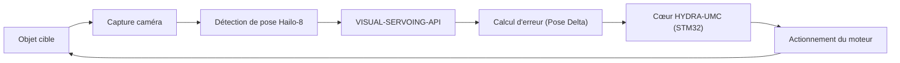

<p align="center">
  
</p>

# 🎯 HYDRA-UMC-VISUAL-SERVOING-API

<p align="center"><a href="README.md">🇺🇸 English</a> | <a href="README_spa.md">🇪🇸 Español</a> | 🇫🇷 <b>Français</b> | <a href="README_ita.md">🇮🇹 Italiano</a> | <a href="README_deu.md">🇩🇪 Deutsch</a> | <a href="README_zho.md">🇨🇳 简体中文</a> | <a href="README_jpn.md">🇯🇵 日本語</a></p>

### 📐 Correction cinématique en boucle fermée via retour visuel

<p align="left">
  
  
  
</p>

---

## 1. 🛠️ APERÇU TECHNIQUE

**HYDRA-UMC-VISUAL-SERVOING-API** est le pont de précision entre la perception et le mouvement. Il calcule le delta d'erreur entre une pose souhaitée et la pose visuelle réelle d'un objet, fournissant des corrections cinématiques en temps réel au cœur HYDRA-UMC.

Il prend en charge les configurations **Eye-in-Hand** (caméra sur l'outil) et **Eye-to-Hand** (caméra fixe), permettant un Pick-and-Place d'ultra-précision, un alignement CMS et un ajustement dynamique de la trajectoire.

### Caractéristiques principales :
* ✅ **Réel v0 - loi de correction PBVS :** `pose.py` + `servo.py` calculent le delta de pose entre une pose actuelle et une pose cible (enroulement angulaire par le plus court chemin, sans le long détour propice au blocage de cardan) et le transforment en commande de vitesse proportionnelle, plafonnée sans en déformer la direction. Exposé via la sous-commande `correct` ci-dessous - aucune caméra ni NPU nécessaire pour l'exécuter ou la tester.
* 🛡️ **Réel v0 - autorisation à verrou de sécurité :** `authorization.py` refuse de transformer la perception en mouvement à moins que l'état de sécurité en amont soit `READY` et que les données visuelles soient assez fraîches/fiables. Exposé via la nouvelle sous-commande `request` ci-dessous - aucune caméra, NPU ou processus SAFETY-ZONES nécessaire pour l'exécuter ou la tester.
* 🌐 **API JSON/HTTP (v0) :** la vraie sous-commande `serve` expose la même logique `correct`/`request` en tant que `POST /correct`/`POST /request` (plus `GET /stats`), via le `http.server` de la bibliothèque standard sans dépendance supplémentaire - accessible depuis un vrai appelant plutôt que via des arguments CLI ponctuels. Voir [`docs/CLI_REFERENCE.md`](docs/CLI_REFERENCE.md).
* 🔄 **Contrôle en boucle fermée :** Boucle de rétroaction continue contournant l'orchestrateur de haut niveau pour une faible latence. *(objectif d'architecture - l'envoi gRPC vers le cœur HYDRA-UMC reste un travail futur.)*
* 📐 **Estimation de la pose :** Estimation de la pose d'objet 6-DOF à partir de vues à caméra unique ou multiple. *(travail futur - nécessite la NPU Hailo-8 réelle que cet environnement n'a pas encore.)*
* ⚡ **Accélération matérielle :** Utilise la sortie Hailo-8 pour le calcul instantané des coordonnées. *(travail futur, même raison.)*
* 🔌 **Limite d'intégration HailoRT, préparée en amont du module :** `hailo_runtime.py` est écrit contre l'API réelle et confirmée `hailo_platform` (`VDevice`, `HEF`, `ConfigureParams`) - importée paresseusement afin que ce dépôt s'installe/se teste proprement sans le paquet `hailort` ni module Hailo-8 présent - et `hailo_output_to_pose()` adapte un résultat d'inférence réel directement vers le `Pose6D` que `compute_pose_error()` consomme déjà. *(implémenté, limite d'intégration seulement - exécuter réellement l'inférence nécessite encore un `.hef` d'estimation de pose réellement compilé et un module Hailo-8 physique.)*

---

## 2. 🔄 BOUCLE DE SERVOING VISUEL



---

## 3. 🧱 ARCHITECTURE & DÉCISIONS DE CONCEPTION

* **Pourquoi cette API n'a pas de matériel/firmware propre.** Elle tourne entièrement sur le module CM5 + Hailo-8 partagé que possède le parent d'intégration, HYDRA-UMC-VISION-NODE - aucune carte propre à concevoir ici, donc `hardware/`/`firmware/`/`os/` ont été supprimés plutôt que laissés vides.
* **Pourquoi c'est une sœur, pas un sous-module, de HYDRA-UMC-VISION-NODE.** La correction de pose tourne comme son propre processus/déploiement pour qu'un plantage ou un cycle d'inférence lent ici ne puisse pas bloquer le propre pipeline de détection du parent, dont dépend HYDRA-UMC-SAFETY-ZONES pour le timing de l'E-STOP.
* **Pourquoi la loi de correction arrive avant l'estimation de pose.** Transformer une paire de poses en une commande de vitesse plafonnée est de la pure mathématique de théorie du contrôle - inutile d'avoir une caméra ou un NPU pour l'écrire ou la tester, donc v0 livre cette pièce (`pose.py`, `servo.py`) en premier. La vraie estimation de pose à 6 degrés de liberté nécessite le matériel Hailo-8 que cet environnement n'a pas, et arrivera plus tard.
* **Comment cela s'intègre dans le reste de l'écosystème.** Se situe en aval de la perception (HYDRA-UMC-VISION-NODE) et en amont du mouvement (firmware HYDRA-UMC) - transforme les décalages détectés en corrections cinématiques que la propre boucle jog/servo du bras robotique applique.
* **Pourquoi `authorize_correction()` vérifie `safety_state` avant la confiance/fraîcheur.** Une défaillance de sécurité doit primer sur tout le reste, même face à une détection parfaitement fraîche et fiable - donc `INHIBITED` (safety_state != "READY") est vérifié en premier et court-circuite le reste de la politique. Ce n'est qu'une fois le bras confirmé sûr à déplacer que la fiabilité des *données* compte pour décider de le déplacer (`REJECTED` pour confiance faible ou données obsolètes). Cela reflète la même précédence `INHIBITED`-avant-`DANGER`/`WARNING` déjà utilisée dans HYDRA-UMC-SAFETY-ZONES.
* **Pourquoi `request` est une nouvelle sous-commande plutôt qu'une modification de `correct`.** `correct` est l'utilitaire de bas niveau existant, mathématique pur (sans conscience de sécurité ni notion de fraîcheur caméra) avec ses propres appelants et tests ; l'envelopper sur place dans un verrou de sécurité changerait silencieusement son contrat. `request` ajoute le point d'entrée verrouillé, orienté caméra, que le code de l'écosystème devrait réellement appeler, tandis que `correct` reste disponible sans changement pour un usage direct des mathématiques de pose.

---

## 📂 STRUCTURE DES RÉPERTOIRES

Le CM5 + Hailo-8 est du matériel existant sans carte propre, donc ce
projet ne comporte pas de dossier `hardware/` ni `firmware/`. `os/` et
`models/` ne vivent que dans le parent d'intégration,
`HYDRA-UMC-VISION-NODE`.

```text
HYDRA-UMC-VISUAL-SERVOING-API/
├── src/                 # Code source (paquet hydra_umc_visual_servoing_api)
│   └── hydra_umc_visual_servoing_api/
│       ├── pose.py           # Pose6D - pose à 6-DOF (x, y, z, roll, pitch, yaw)
│       ├── servo.py          # Loi de correction PBVS : erreur de pose + commande de vitesse
│       ├── authorization.py  # Politique à verrou de sécurité (INHIBITED/REJECTED/ACCEPTED)
│       ├── hailo_runtime.py  # Véritable limite d'intégration HailoRT (hailo_platform) de l'estimateur de pose, importée paresseusement
│       ├── api.py            # Surface JSON/HTTP simple (http.server de stdlib) sur correct/request
│       └── main.py           # Point d'entrée CLI (invocation nue + `correct` + `request`)
├── tests/               # Suite pytest réelle (pose, servo, authorization, hailo_runtime, api, CLI)
├── docs/                # Documentation et théorie cinématique
├── build/               # Sortie de build (le .venv local y vit aussi)
├── images/              # Médias et diagrammes
├── systemd/
│   └── hydra-umc-visual-servoing-api.service # Unité systemd de l'API locale de correction PBVS sur la CM5
├── tools/
│   ├── build_test.py    # Vérification de build sans versionnage
│   └── ci_validate.py   # Validation manifeste/CHANGELOG/docs utilisée par CI
├── pyproject.toml       # Métadonnées du paquet, dépendances, version compteur
├── bump_version.py      # Incrément de version native type compteur (build.sh/.bat)
├── bump_manifest_version.py # Synchronise la version de hydra-umc.project.json avec la version native (--sync)
├── build.sh / build.bat # venv + installation éditable + compile-check + tests
├── build-test.sh / build-test.bat # Vérification de build sans versionnage
└── run.sh / run.bat     # Exécute le point d'entrée depuis le venv local
```

---

## 🏗️ BUILD ET EXÉCUTION

Nécessite Python 3.10+.

```bash
# Linux / macOS
./build.sh   # incrémente la version compteur, crée .venv, installe le
             # paquet en mode éditable (avec les extras dev), compile-check
             # tout src/, et exécute la suite pytest réelle
./run.sh     # exécute le point d'entrée depuis .venv, affiche nom + version + rôle
```

```bat
:: Windows
build.bat
run.bat
```

`build.sh`/`build.bat` incrémentent la version du `pyproject.toml` de ce
projet selon la règle "compteur kilométrique" de l'écosystème (PATCH+1,
avec report sur MINOR au-delà de 9) avant chaque build réel, puis
effectuent un compile-check du code source avec `python -m compileall`.

Exemple réel - calculer la correction d'une pose actuelle vers une pose cible :

```bash
./run.sh correct --current "0,0,0.5,0,0,0" --target "0.02,-0.01,0.48,0,0,0.05" \
  --gain 0.8 --max-linear-speed 0.05
# pose error   : dx=0.020000 dy=-0.010000 dz=-0.020000  droll=0.000000 dpitch=0.000000 dyaw=0.050000
# error norm   : linear=0.030000 m  angular=0.050000 rad
# velocity cmd : vx=0.016000 vy=-0.008000 vz=-0.016000  wroll=0.000000 wpitch=0.000000 wyaw=0.040000
# converged    : False
```

Exemple réel - demander une correction à verrou de sécurité (acceptée, inhibée et rejetée) :

```bash
./run.sh request --current "0,0,0,0,0,0" --target "1,0,0,0,0,0" \
  --frame-id cam0-f42 --confidence 0.9 --data-age-ms 30 --safety-state READY
# outcome : ACCEPTED - frame 'cam0-f42' authorized (confidence=0.9, data_age_ms=30.0)
# pose error   : dx=1.000000 dy=0.000000 dz=0.000000  droll=0.000000 dpitch=0.000000 dyaw=0.000000
# velocity cmd : vx=1.000000 vy=0.000000 vz=0.000000  wroll=0.000000 wpitch=0.000000 wyaw=0.000000

./run.sh request --current "0,0,0,0,0,0" --target "1,0,0,0,0,0" \
  --frame-id cam0-f42 --confidence 0.9 --data-age-ms 30 --safety-state FAULT
# outcome : INHIBITED - safety_state is 'FAULT', not 'READY'   (code de sortie 2)

./run.sh request --current "0,0,0,0,0,0" --target "1,0,0,0,0,0" \
  --frame-id cam0-f42 --confidence 0.2 --data-age-ms 30 --safety-state READY
# outcome : REJECTED - confidence 0.2 is below the required minimum 0.6 for frame 'cam0-f42'   (code de sortie 1)
```

---

## ✅ État Actuel et Prochaines Étapes

**Réel aujourd'hui :** la loi de correction PBVS d'erreur de pose et de
commande de vitesse (`pose.py`, `servo.py`) - l'étape « Calcul d'erreur
(Pose Delta) » du diagramme de boucle ci-dessus - avec une vraie commande
CLI `correct` ; la politique d'autorisation à verrou de sécurité
(`authorization.py`) qui refuse de transformer une détection visuelle en
mouvement à moins que l'état de sécurité en amont soit `READY` et que les
données soient assez fiables/fraîches, exposée via la commande CLI
`request` ; et une véritable limite d'intégration HailoRT (`hailo_runtime.py`)
prête pour un véritable estimateur de pose Hailo-8 dès qu'il sera branché. 68 tests au total.

**Encore à venir, et bloqué par du matériel réel :** exécuter réellement
l'*estimation* de pose à 6 degrés de liberté via `hailo_runtime.py`
nécessite un `.hef` d'estimation de pose réellement compilé (aucun modèle
spécifique choisi pour l'instant) et une NPU Hailo-8 physique branchée, et
l'envoi gRPC à faible latence de la commande de vitesse résultante vers le
cœur HYDRA-UMC est un travail futur séparé.

## 🚀 FEUILLE DE ROUTE
* **Phase 1 :** Synchronisation et étalonnage du pipeline multi-caméras pour 8 flux USB 3.0.
* **Phase 2 :** Migration vers YOLOv11 et optimisation pour Hailo-8L pour la détection de composants industriels.
* **Phase 3 :** Reconstruction 3D en temps réel à partir de nœuds de vision stéréo et cartographie dynamique des zones de sécurité.
* **Phase 4 :** Prise en charge du suivi visuel 9-DOF (y compris la redondance d'orientation) et correction sub-micrométrique.

---

## 🔗 Projets Liés

Ce projet fait partie de l'écosystème robotique HYDRA-UMC du même auteur (JuanenRac / Electro Hobby 3D). Bon à savoir, car une demande pourrait en réalité concerner l'un de ceux-ci plutôt que ce dépôt.

**Projet Parent**
- **[HYDRA-UMC-VISION-NODE](https://github.com/JuanenRac/HYDRA-UMC-VISION-NODE)** — hub d'intégration pour le pipeline de vision Hailo-8, avec une vraie vérification de disponibilité matérielle par étape ; le parent dont ce dépôt est une étape ou un consommateur spécifique, au sein de son propre pipeline de perception.

**Projets Frères** — les autres étapes/consommateurs du propre pipeline de perception Hailo-8 de HYDRA-UMC-VISION-NODE
- **[HYDRA-UMC-VISION-STREAMER](https://github.com/JuanenRac/HYDRA-UMC-VISION-STREAMER)** — générateur réel de pipeline GStreamer + config MediaMTX, avec une vraie frontière d'intégration HailoRT.
- **[HYDRA-UMC-DETECTION-HEF](https://github.com/JuanenRac/HYDRA-UMC-DETECTION-HEF)** — registre réel de modèles compilés avec vérification de chargement sécurisé par architecture Hailo/checksum.
- **[HYDRA-UMC-SAFETY-ZONES](https://github.com/JuanenRac/HYDRA-UMC-SAFETY-ZONES)** — vraie vérification de violation de zone et demande d'E-STOP, avec application de la fraîcheur de calibration.

**Directement Liés**
- **[HYDRA-UMC](https://github.com/JuanenRac/HYDRA-UMC)** — la carte mère physique du bras robotique : hôte CM5 + coprocesseur STM32H745 double cœur, coordonnant jusqu'à 8 bras-outils via CAN-OTA/SPI-OTA ; le firmware cœur STM32 qui reçoit les propres corrections de pose cinématique de cette API.

**Fait Également Partie de l'Écosystème**

*Matériel & Plateforme de Base*
- **[HYDRA-UMC-OS](https://github.com/JuanenRac/HYDRA-UMC-OS)** — couche produit reproductible sur Raspberry Pi OS pour le CM5 : agent en lecture seule, config/profils validés, provisionnement WiFi de premier contact.
- **[HYDRA-UMC-SDK](https://github.com/JuanenRac/HYDRA-UMC-SDK)** — le contrat JSON-Schema partagé et la barrière de sécurité contre laquelle chaque bridge valide ses commandes.

*Backend Central & Clients*
- **[HYDRA-UMC-SERVER](https://github.com/JuanenRac/HYDRA-UMC-SERVER)** — le vrai backend headless (REST/WebSocket) auquel parle réellement chaque client de contrôle.
- **[HYDRA-UMC-STUDIO](https://github.com/JuanenRac/HYDRA-UMC-STUDIO)** — tableau de bord de contrôle web avec visualisation 3D multi-robot en temps réel.
- **[HYDRA-UMC-SUITE](https://github.com/JuanenRac/HYDRA-UMC-SUITE)** — centre de commande d'essaim de bureau (PySide6) pour plusieurs serveurs à la fois, empaqueté en exécutable autonome.
- **[HYDRA-UMC-ANDROID-CONTROL](https://github.com/JuanenRac/HYDRA-UMC-ANDROID-CONTROL)** — application de contrôle Android native avec connexion biométrique et un compagnon Wear OS jumelé.
- **[HYDRA-UMC-IOS-CONTROL](https://github.com/JuanenRac/HYDRA-UMC-IOS-CONTROL)** — application de contrôle iOS/iPadOS (Flutter) avec synchronisation WebSocket en temps réel.
- **[HYDRA-UMC-DSI](https://github.com/JuanenRac/HYDRA-UMC-DSI)** — interface tactile native pour l'écran tactile DSI 7" embarqué, intégrée directement sur le CM5.
- **[HYDRA-UMC-EDITOR-URDF](https://github.com/JuanenRac/HYDRA-UMC-EDITOR-URDF)** — créateur/éditeur graphique de bureau pour URDF qui envoie les modèles terminés vers le propre catalogue de STUDIO.
- **[HYDRA-UMC-BRIDGE-AMR](https://github.com/JuanenRac/HYDRA-UMC-BRIDGE-AMR)** — frontière de coordination pour les flottes AGV/AMR via un éditeur MQTT VDA 5050 réel.
- **[HYDRA-UMC-BRIDGE-CNC](https://github.com/JuanenRac/HYDRA-UMC-BRIDGE-CNC)** — coordinateur haut niveau pour cellules CNC avec accès réel au statut/octets de contrôle GRBL.
- **[HYDRA-UMC-BRIDGE-DROIDS](https://github.com/JuanenRac/HYDRA-UMC-BRIDGE-DROIDS)** — frontière de coordination pour droïdes à pattes/humanoïdes, avec un véritable émetteur de commandes Boston Dynamics Spot.
- **[HYDRA-UMC-BRIDGE-LASER](https://github.com/JuanenRac/HYDRA-UMC-BRIDGE-LASER)** — coordinateur de sécurité pour cellules laser lisant 3 vraies sécurités GPIO de clé/enceinte/verrouillage.
- **[HYDRA-UMC-BRIDGE-OPENPNP](https://github.com/JuanenRac/HYDRA-UMC-BRIDGE-OPENPNP)** — coordinateur haut niveau sûr pour le flux de cartes du pick-and-place OpenPnP.
- **[HYDRA-UMC-BRIDGE-PRINTER3D](https://github.com/JuanenRac/HYDRA-UMC-BRIDGE-PRINTER3D)** — frontière de coordination sûre pour imprimantes 3D Moonraker/Klipper, avec de vraies commandes de tâche contrôlées.
- **[HYDRA-UMC-BRIDGE-ROS2](https://github.com/JuanenRac/HYDRA-UMC-BRIDGE-ROS2)** — coordinateur de sécurité avec un vrai transport ROS 2 rclpy à importation paresseuse.
- **[HYDRA-UMC-BRIDGE-UAV](https://github.com/JuanenRac/HYDRA-UMC-BRIDGE-UAV)** — frontière de coordination pour UAV équipés de caméra, avec un véritable émetteur de commandes MAVLink.

*Plateforme d'Outils URTC*
- **[URTC](https://github.com/JuanenRac/URTC)** — firmware pour la carte physique Universal Robot Tool Controller, plus de 25 profils d'outil sur bus CAN.
- **[URTC-FLASHER](https://github.com/JuanenRac/URTC-FLASHER)** — outil de bureau à interface graphique pour flasher les cartes URTC, CAN-OTA plus SWD/JTAG puce complète.
- **[URTC-TESTER](https://github.com/JuanenRac/URTC-TESTER)** — outil de bureau de diagnostic CAN-bus en direct pour cartes URTC, un panneau par profil d'outil.
- **[URTC-WEB-STUDIO](https://github.com/JuanenRac/URTC-WEB-STUDIO)** — alternative basée navigateur à URTC-TESTER via la Web Serial API, sans installation locale.

*Nœud IA Cognitif (Hailo-10)*
- **[HYDRA-UMC-COGNITIVE-NODE](https://github.com/JuanenRac/HYDRA-UMC-COGNITIVE-NODE)** — hub d'intégration pour le pipeline cognitif Hailo-10 (orchestration LLM/VLA/voix).
- **[HYDRA-UMC-VLA-ENGINE](https://github.com/JuanenRac/HYDRA-UMC-VLA-ENGINE)** — vrai encodage/décodage de jetons d'action et génération de trajectoire pour un modèle Vision-Language-Action.
- **[HYDRA-UMC-VOICE-UI](https://github.com/JuanenRac/HYDRA-UMC-VOICE-UI)** — vrai front-end vocal (VAD + analyseur d'intention) avec un relais Watch borné et soumis à confirmation.
- **[HYDRA-UMC-SEMANTIC-PLANNER](https://github.com/JuanenRac/HYDRA-UMC-SEMANTIC-PLANNER)** — vraie décomposition de tâches basée sur des règles et récupération sémantique d'erreurs sur les codes d'erreur MCU.
- **[HYDRA-UMC-DOCS-QA](https://github.com/JuanenRac/HYDRA-UMC-DOCS-QA)** — vraie recherche documentaire TF-IDF (bibliothèque standard uniquement) sur les propres documents Markdown de cet écosystème.

*Orchestration & Essaim*
- **[HYDRA-UMC-ORCHESTRATOR](https://github.com/JuanenRac/HYDRA-UMC-ORCHESTRATOR)** — hub d'intégration avec un vrai contrat de rapport de santé gRPC/Protobuf et une machine à états de mission.
- **[HYDRA-UMC-JOB-DISPATCHER](https://github.com/JuanenRac/HYDRA-UMC-JOB-DISPATCHER)** — vraie file de tâches basée sur la priorité avec déduplication, via une vraie API HTTP.
- **[HYDRA-UMC-NODE-HEALING](https://github.com/JuanenRac/HYDRA-UMC-NODE-HEALING)** — vrai chien de garde de santé de flotte basé sur gRPC, avec retry/backoff et détection d'incohérence d'identité.
- **[HYDRA-UMC-PATH-PLANNER-3D](https://github.com/JuanenRac/HYDRA-UMC-PATH-PLANNER-3D)** — vrai planificateur de trajectoire 3D basé sur RRT, avec vraie validation des collisions obstacle/espace de travail.
- **[HYDRA-UMC-SWARM-SYNC](https://github.com/JuanenRac/HYDRA-UMC-SWARM-SYNC)** — vraie synchronisation d'état CRDT LWW-Element-Map, testée par propriétés pour la convergence multi-cellule.

*Jumeau Numérique & Simulation*
- **[HYDRA-UMC-TWIN](https://github.com/JuanenRac/HYDRA-UMC-TWIN)** — hub d'intégration pour le moteur de jumeau numérique, avec un vrai contrat de synchronisation par compatibilité de version.
- **[HYDRA-UMC-HIL-BRIDGE](https://github.com/JuanenRac/HYDRA-UMC-HIL-BRIDGE)** — vrai verrouillage de sécurité hardware-in-the-loop routant les commandes entre simulation et matériel réel.
- **[HYDRA-UMC-PHYSICS-REPLICA](https://github.com/JuanenRac/HYDRA-UMC-PHYSICS-REPLICA)** — vraie cinématique directe et validation des limites articulaires sur un vrai sous-ensemble URDF.
- **[HYDRA-UMC-SYNTHETIC-DATA-GEN](https://github.com/JuanenRac/HYDRA-UMC-SYNTHETIC-DATA-GEN)** — vrai générateur procédural de scènes 2D avec export d'annotations YOLO/COCO.

*Données & Analytique*
- **[HYDRA-UMC-DATALAKE](https://github.com/JuanenRac/HYDRA-UMC-DATALAKE)** — vrai magasin de séries temporelles basé sur sqlite3, avec une vraie API HTTP d'ingestion/requête.
- **[HYDRA-UMC-ANOMALY-DETECTOR](https://github.com/JuanenRac/HYDRA-UMC-ANOMALY-DETECTOR)** — vrai détecteur d'anomalies FFT + ligne de base statistique, avec surveillance de dérive.
- **[HYDRA-UMC-PRODUCTION-REPORTS](https://github.com/JuanenRac/HYDRA-UMC-PRODUCTION-REPORTS)** — vrai calcul OEE/disponibilité sur l'historique de DATALAKE, avec export CSV reproductible.
- **[HYDRA-UMC-TELEMETRY-COLLECTOR](https://github.com/JuanenRac/HYDRA-UMC-TELEMETRY-COLLECTOR)** — vrai pipeline d'ingestion CAN/WebSocket vers DATALAKE, avec déduplication par séquence.

*Passerelle Industrielle*
- **[HYDRA-UMC-GATEWAY-INDUSTRIAL](https://github.com/JuanenRac/HYDRA-UMC-GATEWAY-INDUSTRIAL)** — hub d'intégration relayant vers les protocoles industriels, avec une vraie couche de liste blanche de commandes/contre-pression.
- **[HYDRA-UMC-OPCUA-SERVER](https://github.com/JuanenRac/HYDRA-UMC-OPCUA-SERVER)** — vrai espace d'adressage OPC-UA, vérifié avec une vraie session client du protocole binaire.
- **[HYDRA-UMC-MQTT-BROKER](https://github.com/JuanenRac/HYDRA-UMC-MQTT-BROKER)** — vrai broker MQTT avec authentification par client optionnelle et ACL de sujets.
- **[HYDRA-UMC-MTCONNECT-ADAPTER](https://github.com/JuanenRac/HYDRA-UMC-MTCONNECT-ADAPTER)** — vrais points de terminaison XML MTConnect `/probe` et `/current`, avec sortie en mode dégradé.

*Outils Complémentaires & Opérations de l'Écosystème*
- **[HYDRA-UMC-DASHBOARD-AI](https://github.com/JuanenRac/HYDRA-UMC-DASHBOARD-AI)** — panneaux Smart Summaries et Anomaly Highlighting sur DATALAKE/ANOMALY-DETECTOR, avec un repli statistique honnête.
- **[HYDRA-UMC-TOOL-CLI](https://github.com/JuanenRac/HYDRA-UMC-TOOL-CLI)** — CLI de flotte avec un vrai contrat de codes de sortie stable, un vrai client en direct de la propre API de HYDRA-UMC-SERVER.
- **[HYDRA-UMC-WATCH](https://github.com/JuanenRac/HYDRA-UMC-WATCH)** — application compagnon WearOS avec de vraies alertes haptiques et un relais vocal vers le téléphone jumelé.
- **[URTC-SMART-RACK](https://github.com/JuanenRac/URTC-SMART-RACK)** — firmware pour un rack de montage de cartes avec décodage réel d'ID d'outil et logique de préchauffage Smart Idle.
- **[URTC-VISION-TOOL](https://github.com/JuanenRac/URTC-VISION-TOOL)** — firmware plus un vrai compagnon de vision Python pour une tête d'outil d'inspection thermique/RGB.
- **[HYDRA-UMC-UPDATER](https://github.com/JuanenRac/HYDRA-UMC-UPDATER)** — outil administratif de bureau qui découvre, clone et met à jour chaque dépôt de cet écosystème.
- **[HYDRA-UMC-OS-REBUILDER](https://github.com/JuanenRac/HYDRA-UMC-OS-REBUILDER)** — outil de bureau Windows/Linux qui construit une image de la CM5 prête à graver, préchargée avec les versions les plus actuelles de l'écosystème, avec une configuration de premier démarrage Wi-Fi/utilisateur/SSH façon Raspberry Pi Imager.


---

## 📚 Documentation & Communauté

- **[docs/CLI_REFERENCE.md](docs/CLI_REFERENCE.md)** — chaque invocation de `correct`/`request`/`serve`, sortie réelle capturée depuis une CLI installée, la table des codes de sortie, et le contrat HTTP JSON `POST /correct`/`POST /request`/`GET /stats`.
- **[CONTRIBUTING.md](CONTRIBUTING.md)** — pile technologique et lignes directrices de codage pour une pull request.
- **[CODE_OF_CONDUCT.md](CODE_OF_CONDUCT.md)** — les normes de comportement attendues dans cette communauté.
- **[SECURITY.md](SECURITY.md)** — comment signaler une vulnérabilité, et les véritables axes de sécurité de ce projet.
- **[SUPPORT.md](SUPPORT.md)** — où poser des questions et signaler des bugs.
- **[LICENSE.md](LICENSE.md)** — la licence propre de ce projet.

## 👤 AUTEUR
**JuanenRac** (Electro Hobby 3D)
📧 electrohobby3d@gmail.com
📺 [youtube.com/@electrohobby3d](https://youtube.com/@electrohobby3d)

## 📜 LICENCE
GPL-3.0 - Voir le fichier LICENSE pour plus de détails.
