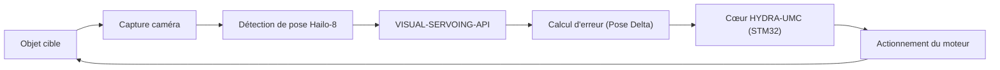

<p align="center">
  
</p>

# 🎯 HYDRA-UMC-VISUAL-SERVOING-API

<p align="center"><a href="README.md">🇺🇸 English</a> | <a href="README_spa.md">🇪🇸 Español</a> | 🇫🇷 <b>Français</b> | <a href="README_ita.md">🇮🇹 Italiano</a> | <a href="README_deu.md">🇩🇪 Deutsch</a> | <a href="README_zho.md">🇨🇳 简体中文</a> | <a href="README_jpn.md">🇯🇵 日本語</a></p>

### 📐 Correction cinématique en boucle fermée via retour visuel

<p align="left">
  
  
  
</p>

---

## 1. 🛠️ APERÇU TECHNIQUE

**HYDRA-UMC-VISUAL-SERVOING-API** est le pont de précision entre la perception et le mouvement. Il calcule le delta d'erreur entre une pose souhaitée et la pose visuelle réelle d'un objet, fournissant des corrections cinématiques en temps réel au cœur HYDRA-UMC.

Il prend en charge les configurations **Eye-in-Hand** (caméra sur l'outil) et **Eye-to-Hand** (caméra fixe), permettant un Pick-and-Place d'ultra-précision, un alignement CMS et un ajustement dynamique de la trajectoire.

### Caractéristiques principales :
* ✅ **Réel v0 - loi de correction PBVS :** `pose.py` + `servo.py` calculent le delta de pose entre une pose actuelle et une pose cible (enroulement angulaire par le plus court chemin, sans le long détour propice au blocage de cardan) et le transforment en commande de vitesse proportionnelle, plafonnée sans en déformer la direction. Exposé via la sous-commande `correct` ci-dessous - aucune caméra ni NPU nécessaire pour l'exécuter ou la tester.
* 🛡️ **Réel v0 - autorisation à verrou de sécurité :** `authorization.py` refuse de transformer la perception en mouvement à moins que l'état de sécurité en amont soit `READY` et que les données visuelles soient assez fraîches/fiables. Exposé via la nouvelle sous-commande `request` ci-dessous - aucune caméra, NPU ou processus SAFETY-ZONES nécessaire pour l'exécuter ou la tester.
* 🔄 **Contrôle en boucle fermée :** Boucle de rétroaction continue contournant l'orchestrateur de haut niveau pour une faible latence. *(objectif d'architecture - l'envoi gRPC vers le cœur HYDRA-UMC reste un travail futur.)*
* 📐 **Estimation de la pose :** Estimation de la pose d'objet 6-DOF à partir de vues à caméra unique ou multiple. *(travail futur - nécessite la NPU Hailo-8 réelle que cet environnement n'a pas encore.)*
* ⚡ **Accélération matérielle :** Utilise la sortie Hailo-8 pour le calcul instantané des coordonnées. *(travail futur, même raison.)*

---

## 2. 🔄 BOUCLE DE SERVOING VISUEL



---

## 3. 🧱 ARCHITECTURE & DÉCISIONS DE CONCEPTION

* **Pourquoi cette API n'a pas de matériel/firmware propre.** Elle tourne entièrement sur le module CM5 + Hailo-8 partagé que possède le parent d'intégration, HYDRA-UMC-VISION-NODE - aucune carte propre à concevoir ici, donc `hardware/`/`firmware/`/`os/` ont été supprimés plutôt que laissés vides.
* **Pourquoi c'est une sœur, pas un sous-module, de HYDRA-UMC-VISION-NODE.** La correction de pose tourne comme son propre processus/déploiement pour qu'un plantage ou un cycle d'inférence lent ici ne puisse pas bloquer le propre pipeline de détection du parent, dont dépend HYDRA-UMC-SAFETY-ZONES pour le timing de l'E-STOP.
* **Pourquoi la loi de correction arrive avant l'estimation de pose.** Transformer une paire de poses en une commande de vitesse plafonnée est de la pure mathématique de théorie du contrôle - inutile d'avoir une caméra ou un NPU pour l'écrire ou la tester, donc v0 livre cette pièce (`pose.py`, `servo.py`) en premier. La vraie estimation de pose à 6 degrés de liberté nécessite le matériel Hailo-8 que cet environnement n'a pas, et arrivera plus tard.
* **Comment cela s'intègre dans le reste de l'écosystème.** Se situe en aval de la perception (HYDRA-UMC-VISION-NODE) et en amont du mouvement (firmware HYDRA-UMC) - transforme les décalages détectés en corrections cinématiques que la propre boucle jog/servo du bras robotique applique.
* **Pourquoi `authorize_correction()` vérifie `safety_state` avant la confiance/fraîcheur.** Une défaillance de sécurité doit primer sur tout le reste, même face à une détection parfaitement fraîche et fiable - donc `INHIBITED` (safety_state != "READY") est vérifié en premier et court-circuite le reste de la politique. Ce n'est qu'une fois le bras confirmé sûr à déplacer que la fiabilité des *données* compte pour décider de le déplacer (`REJECTED` pour confiance faible ou données obsolètes). Cela reflète la même précédence `INHIBITED`-avant-`DANGER`/`WARNING` déjà utilisée dans HYDRA-UMC-SAFETY-ZONES.
* **Pourquoi `request` est une nouvelle sous-commande plutôt qu'une modification de `correct`.** `correct` est l'utilitaire de bas niveau existant, mathématique pur (sans conscience de sécurité ni notion de fraîcheur caméra) avec ses propres appelants et tests ; l'envelopper sur place dans un verrou de sécurité changerait silencieusement son contrat. `request` ajoute le point d'entrée verrouillé, orienté caméra, que le code de l'écosystème devrait réellement appeler, tandis que `correct` reste disponible sans changement pour un usage direct des mathématiques de pose.

---

## 📂 STRUCTURE DES RÉPERTOIRES

Le CM5 + Hailo-8 est du matériel existant sans carte propre, donc ce
projet ne comporte pas de dossier `hardware/` ni `firmware/`. `os/` et
`models/` ne vivent que dans le parent d'intégration,
`HYDRA-UMC-VISION-NODE`.

```text
HYDRA-UMC-VISUAL-SERVOING-API/
├── src/                 # Code source (paquet hydra_umc_visual_servoing_api)
│   └── hydra_umc_visual_servoing_api/
│       ├── pose.py           # Pose6D - pose à 6-DOF (x, y, z, roll, pitch, yaw)
│       ├── servo.py          # Loi de correction PBVS : erreur de pose + commande de vitesse
│       ├── authorization.py  # Politique à verrou de sécurité (INHIBITED/REJECTED/ACCEPTED)
│       └── main.py           # Point d'entrée CLI (invocation nue + `correct` + `request`)
├── tests/               # Suite pytest réelle (pose, servo, authorization, CLI)
├── docs/                # Documentation et théorie cinématique
├── build/               # Sortie de build (le .venv local y vit aussi)
├── images/              # Médias et diagrammes
├── scripts/             # Scripts utilitaires
├── tools/
│   ├── build_test.py    # Vérification de build sans versionnage
│   └── ci_validate.py   # Validation manifeste/CHANGELOG/docs utilisée par CI
├── pyproject.toml       # Métadonnées du paquet, dépendances, version compteur
├── bump_version.py      # Incrément de version type compteur (build.sh/.bat)
├── build.sh / build.bat # venv + installation éditable + compile-check + tests
├── build-test.sh / build-test.bat # Vérification de build sans versionnage
└── run.sh / run.bat     # Exécute le point d'entrée depuis le venv local
```

---

## 🏗️ BUILD & RUN

Nécessite Python 3.10+.

```bash
# Linux / macOS
./build.sh   # incrémente la version compteur, crée .venv, installe le
             # paquet en mode éditable (avec les extras dev), compile-check
             # tout src/, et exécute la suite pytest réelle
./run.sh     # exécute le point d'entrée depuis .venv, affiche nom + version + rôle
```

```bat
:: Windows
build.bat
run.bat
```

`build.sh`/`build.bat` incrémentent la version du `pyproject.toml` de ce
projet selon la règle "compteur kilométrique" de l'écosystème (PATCH+1,
avec report sur MINOR au-delà de 9) avant chaque build réel, puis
effectuent un compile-check du code source avec `python -m compileall`.

Exemple réel - calculer la correction d'une pose actuelle vers une pose cible :

```bash
./run.sh correct --current "0,0,0.5,0,0,0" --target "0.02,-0.01,0.48,0,0,0.05" \
  --gain 0.8 --max-linear-speed 0.05
# pose error   : dx=0.020000 dy=-0.010000 dz=-0.020000  droll=0.000000 dpitch=0.000000 dyaw=0.050000
# error norm   : linear=0.030000 m  angular=0.050000 rad
# velocity cmd : vx=0.016000 vy=-0.008000 vz=-0.016000  wroll=0.000000 wpitch=0.000000 wyaw=0.040000
# converged    : False
```

Exemple réel - demander une correction à verrou de sécurité (acceptée, inhibée et rejetée) :

```bash
./run.sh request --current "0,0,0,0,0,0" --target "1,0,0,0,0,0" \
  --frame-id cam0-f42 --confidence 0.9 --data-age-ms 30 --safety-state READY
# outcome : ACCEPTED - frame 'cam0-f42' authorized (confidence=0.9, data_age_ms=30.0)
# pose error   : dx=1.000000 dy=0.000000 dz=0.000000  droll=0.000000 dpitch=0.000000 dyaw=0.000000
# velocity cmd : vx=1.000000 vy=0.000000 vz=0.000000  wroll=0.000000 wpitch=0.000000 wyaw=0.000000

./run.sh request --current "0,0,0,0,0,0" --target "1,0,0,0,0,0" \
  --frame-id cam0-f42 --confidence 0.9 --data-age-ms 30 --safety-state FAULT
# outcome : INHIBITED - safety_state is 'FAULT', not 'READY'   (code de sortie 2)

./run.sh request --current "0,0,0,0,0,0" --target "1,0,0,0,0,0" \
  --frame-id cam0-f42 --confidence 0.2 --data-age-ms 30 --safety-state READY
# outcome : REJECTED - confidence 0.2 is below the required minimum 0.6 for frame 'cam0-f42'   (code de sortie 1)
```

---

## ✅ État Actuel et Prochaines Étapes

**Réel aujourd'hui :** la loi de correction PBVS d'erreur de pose et de
commande de vitesse (`pose.py`, `servo.py`) - l'étape « Calcul d'erreur
(Pose Delta) » du diagramme de boucle ci-dessus - avec une vraie commande
CLI `correct` ; et la politique d'autorisation à verrou de sécurité
(`authorization.py`) qui refuse de transformer une détection visuelle en
mouvement à moins que l'état de sécurité en amont soit `READY` et que les
données soient assez fiables/fraîches, exposée via la commande CLI
`request`. 40 tests au total.

**Encore à venir, et bloqué par du matériel réel :** l'estimation réelle
de pose à 6 degrés de liberté à partir d'images caméra (nécessite la NPU
Hailo-8), et l'envoi gRPC à faible latence de la commande de vitesse
résultante vers le cœur HYDRA-UMC.

## 🚀 ROADMAP
* **Phase 1 :** Synchronisation et étalonnage du pipeline multi-caméras pour 8 flux USB 3.0.
* **Phase 2 :** Migration vers YOLOv11 et optimisation pour Hailo-8L pour la détection de composants industriels.
* **Phase 3 :** Reconstruction 3D en temps réel à partir de nœuds de vision stéréo et cartographie dynamique des zones de sécurité.
* **Phase 4 :** Prise en charge du suivi visuel 9-DOF (y compris la redondance d'orientation) et correction sub-micrométrique.

---

## 🔗 Projets Liés

Ce projet fait partie d'un écosystème robotique plus large du même auteur (JuanenRac / Electro Hobby 3D), couvrant firmware, logiciel de contrôle, nœuds IA et outillage de flotte. Bon à savoir, car une demande pourrait en réalité concerner l'un de ces projets plutôt que ce dépôt.

### Famille

**Parent :** **[HYDRA-UMC-VISION-NODE](https://github.com/JuanenRac/HYDRA-UMC-VISION-NODE)** — le parent d'intégration pour lequel cette API transforme la perception en corrections de pose.

**Frères et sœurs :**
- **[HYDRA-UMC-VISION-STREAMER](https://github.com/JuanenRac/HYDRA-UMC-VISION-STREAMER)** — capture et pré-traite les flux caméra consommés par le parent.
- **[HYDRA-UMC-DETECTION-HEF](https://github.com/JuanenRac/HYDRA-UMC-DETECTION-HEF)** — compile les modèles `.hef` que le parent charge sur son NPU Hailo-8.
- **[HYDRA-UMC-SAFETY-ZONES](https://github.com/JuanenRac/HYDRA-UMC-SAFETY-ZONES)** — transforme la perception du parent en détection d'intrusion et déclenchement d'E-STOP.

### Relation Directe (hors de la famille)

- **[HYDRA-UMC](https://github.com/JuanenRac/HYDRA-UMC)** — envoie des corrections de pose cinématique à ce firmware.

### Reste de l'Écosystème

**Plateforme HYDRA-UMC** — la cellule de micro-usine multi-robot
- **[HYDRA-UMC](https://github.com/JuanenRac/HYDRA-UMC)** — la carte mère CM5 + STM32H745 orchestrant jusqu'à 8 bras robotiques.
- **[HYDRA-UMC-SERVER](https://github.com/JuanenRac/HYDRA-UMC-SERVER)** — le backend Express/WebSocket auquel parle chaque client de contrôle.
- **[HYDRA-UMC-STUDIO](https://github.com/JuanenRac/HYDRA-UMC-STUDIO)** — tableau de bord de contrôle web, visualisation 3D multi-robot.
- **[HYDRA-UMC-ANDROID-CONTROL](https://github.com/JuanenRac/HYDRA-UMC-ANDROID-CONTROL)** — application de contrôle Android via Wi-Fi/Bluetooth.
- **[HYDRA-UMC-IOS-CONTROL](https://github.com/JuanenRac/HYDRA-UMC-IOS-CONTROL)** — application de contrôle iOS/iPadOS construite en Flutter.
- **[HYDRA-UMC-SUITE](https://github.com/JuanenRac/HYDRA-UMC-SUITE)** — centre de commande d'essaim de bureau (Python/PySide6).
- **[HYDRA-UMC-EDITOR-URDF](https://github.com/JuanenRac/HYDRA-UMC-EDITOR-URDF)** — éditeur de modèles URDF de bureau pour le catalogue de robots.
- **[HYDRA-UMC-DSI](https://github.com/JuanenRac/HYDRA-UMC-DSI)** — interface tactile native pour l'écran DSI embarqué.

**Plateforme URTC** — le contrôleur de tête d'outil que porte chaque bras HYDRA-UMC
- **[URTC](https://github.com/JuanenRac/URTC)** — contrôleur de tête d'outil sur bus CAN, 25 profils d'outil.
- **[URTC-FLASHER](https://github.com/JuanenRac/URTC-FLASHER)** — outil de bureau de flashage CAN-OTA + SWD/JTAG.
- **[URTC-TESTER](https://github.com/JuanenRac/URTC-TESTER)** — outil de bureau de diagnostic CAN en direct.
- **[URTC-WEB-STUDIO](https://github.com/JuanenRac/URTC-WEB-STUDIO)** — alternative basée navigateur via l'API Web Serial.

**🧠 Cognitive AI Node (Hailo-10)**
- [HYDRA-UMC-COGNITIVE-NODE](https://github.com/JuanenRac/HYDRA-UMC-COGNITIVE-NODE)
- [HYDRA-UMC-VLA-ENGINE](https://github.com/JuanenRac/HYDRA-UMC-VLA-ENGINE)
- [HYDRA-UMC-VOICE-UI](https://github.com/JuanenRac/HYDRA-UMC-VOICE-UI)
- [HYDRA-UMC-SEMANTIC-PLANNER](https://github.com/JuanenRac/HYDRA-UMC-SEMANTIC-PLANNER)
- [HYDRA-UMC-DOCS-QA](https://github.com/JuanenRac/HYDRA-UMC-DOCS-QA)

**🐝 Orchestration & Swarm**
- [HYDRA-UMC-ORCHESTRATOR](https://github.com/JuanenRac/HYDRA-UMC-ORCHESTRATOR)
- [HYDRA-UMC-SWARM-SYNC](https://github.com/JuanenRac/HYDRA-UMC-SWARM-SYNC)
- [HYDRA-UMC-PATH-PLANNER-3D](https://github.com/JuanenRac/HYDRA-UMC-PATH-PLANNER-3D)
- [HYDRA-UMC-JOB-DISPATCHER](https://github.com/JuanenRac/HYDRA-UMC-JOB-DISPATCHER)
- [HYDRA-UMC-NODE-HEALING](https://github.com/JuanenRac/HYDRA-UMC-NODE-HEALING)

**🎮 Digital Twin & Simulation**
- [HYDRA-UMC-TWIN](https://github.com/JuanenRac/HYDRA-UMC-TWIN)
- [HYDRA-UMC-PHYSICS-REPLICA](https://github.com/JuanenRac/HYDRA-UMC-PHYSICS-REPLICA)
- [HYDRA-UMC-HIL-BRIDGE](https://github.com/JuanenRac/HYDRA-UMC-HIL-BRIDGE)
- [HYDRA-UMC-SYNTHETIC-DATA-GEN](https://github.com/JuanenRac/HYDRA-UMC-SYNTHETIC-DATA-GEN)

**📊 Data & Analytics**
- [HYDRA-UMC-DATALAKE](https://github.com/JuanenRac/HYDRA-UMC-DATALAKE)
- [HYDRA-UMC-TELEMETRY-COLLECTOR](https://github.com/JuanenRac/HYDRA-UMC-TELEMETRY-COLLECTOR)
- [HYDRA-UMC-ANOMALY-DETECTOR](https://github.com/JuanenRac/HYDRA-UMC-ANOMALY-DETECTOR)
- [HYDRA-UMC-PRODUCTION-REPORTS](https://github.com/JuanenRac/HYDRA-UMC-PRODUCTION-REPORTS)

**🏭 Industrial Gateway**
- [HYDRA-UMC-GATEWAY-INDUSTRIAL](https://github.com/JuanenRac/HYDRA-UMC-GATEWAY-INDUSTRIAL)
- [HYDRA-UMC-OPCUA-SERVER](https://github.com/JuanenRac/HYDRA-UMC-OPCUA-SERVER)
- [HYDRA-UMC-MQTT-BROKER](https://github.com/JuanenRac/HYDRA-UMC-MQTT-BROKER)
- [HYDRA-UMC-MTCONNECT-ADAPTER](https://github.com/JuanenRac/HYDRA-UMC-MTCONNECT-ADAPTER)

**🛠️ Complementary Tools**
- [URTC-SMART-RACK](https://github.com/JuanenRac/URTC-SMART-RACK)
- [URTC-VISION-TOOL](https://github.com/JuanenRac/URTC-VISION-TOOL)
- [HYDRA-UMC-WATCH](https://github.com/JuanenRac/HYDRA-UMC-WATCH)
- [HYDRA-UMC-TOOL-CLI](https://github.com/JuanenRac/HYDRA-UMC-TOOL-CLI)
- [HYDRA-UMC-DASHBOARD-AI](https://github.com/JuanenRac/HYDRA-UMC-DASHBOARD-AI)


## 👤 AUTEUR
**JuanenRac** (Electro Hobby 3D)
📧 electrohobby3d@gmail.com

## 📜 LICENCE
GPL-3.0 - Voir le fichier LICENSE pour plus de détails.
