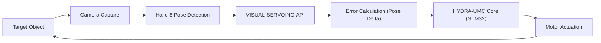

<p align="center">
  
</p>

# 🎯 HYDRA-UMC-VISUAL-SERVOING-API

<p align="center"><a href="README.md">🇺🇸 English</a> | <a href="README_spa.md">🇪🇸 Español</a> | <a href="README_fra.md">🇫🇷 Français</a> | <a href="README_ita.md">🇮🇹 Italiano</a> | <a href="README_deu.md">🇩🇪 Deutsch</a> | <a href="README_zho.md">🇨🇳 简体中文</a> | 🇯🇵 <b>日本語</b></p>

### 📐 画像フィードバックによる閉ループ運動学補正

<p align="left">
  
  
  
</p>

---

## 1. 🛠️ 技術概要

**HYDRA-UMC-VISUAL-SERVOING-API** は、知覚と運動をつなぐ精密なブリッジ
です。目標姿勢と物体の実際の視覚的姿勢との誤差量を計算し、HYDRA-UMC
コアにリアルタイムの運動学的補正を提供します。

**Eye-in-Hand**（カメラをツールに搭載）と **Eye-to-Hand**（固定カメラ）
の両方の構成をサポートし、超精密なピック＆プレース、SMD アライメント、
動的な軌道調整を可能にします。

### 主な機能：
* ✅ **実装済み v0 —— PBVS 補正則：** `pose.py` + `servo.py` が現在の姿勢と目標姿勢の姿勢差分を計算し（角度はジンバルロックを招きやすい遠回りではなく、最短経路でラップされます）、それを比例速度指令に変換します。クランプ処理は方向を歪めません。下記の `correct` サブコマンドから利用可能で、実行にもテストにもカメラや NPU は不要です。
* 🛡️ **実装済み v0 —— セーフティゲート付き認可：** `authorization.py` は、上流の安全状態が `READY` であり、かつ視覚データが十分に新しく信頼できる場合を除き、知覚を運動に変換することを拒否します。下記の新しい `request` サブコマンドから利用可能で、実行にもテストにもカメラ、NPU、SAFETY-ZONES プロセスは不要です。
* 🔄 **閉ループ制御：** 上位のオーケストレーターを経由しない連続フィードバックループにより低遅延を実現。*（アーキテクチャ上の目標——HYDRA-UMC コアへの gRPC 送信はまだ将来の作業です。）*
* 📐 **姿勢推定：** 単一または複数カメラビューからの 6 自由度物体姿勢推定。*（将来の作業——この環境にはまだない実際の Hailo-8 NPU が必要です。）*
* ⚡ **ハードウェアアクセラレーション：** Hailo-8 の出力を使用した即時座標計算。*（同じ理由で将来の作業です。）*
* 🔌 **モジュールに先立って準備されたHailoRT統合境界：** `hailo_runtime.py` は、実際の確認済み `hailo_platform` API(`VDevice`、`HEF`、`ConfigureParams`)に対して書かれています —— `hailort` パッケージやHailo-8モジュールが存在しなくてもこのリポジトリがクリーンにインストール/テストできるよう遅延インポートされており、`hailo_output_to_pose()` は実際の推論結果を、`compute_pose_error()` がすでに消費している `Pose6D` に直接変換します。*(実装済み、統合境界のみ —— 実際に推論を実行するには、実際にコンパイルされた姿勢推定用 `.hef` と物理的なHailo-8モジュールがまだ必要です。)*

---

## 2. 🔄 ビジュアルサーボループ



---

## 3. 🧱 アーキテクチャと設計上の決定

* **本 API が独自のハードウェア/ファームウェアを持たない理由。** 統合親プロジェクトである HYDRA-UMC-VISION-NODE が所有する共有 CM5 + Hailo-8 モジュール上で完全に動作します——独自に設計する基板がないため、`hardware/`/`firmware/`/`os/` は空のまま残すのではなく、意図的に省略されています。
* **HYDRA-UMC-VISION-NODE のサブモジュールではなく兄弟プロジェクトである理由。** 姿勢補正は独自のプロセス/デプロイ単位として実行されるため、ここでのクラッシュや遅い推論サイクルが、HYDRA-UMC-SAFETY-ZONES が E-STOP のタイミング判断のために依存している親プロジェクト自身の検知パイプラインを停滞させることはありません。
* **補正則が姿勢推定より先に実装される理由。** 姿勢の「ペア」を制限付き速度指令に変換するのは純粋な制御理論の数学であり、記述にもテストにもカメラや NPU は不要です。そのため v0 ではこの部分（`pose.py`、`servo.py`）が先に実装されます。実際の 6 自由度姿勢*推定*にはこの環境にない Hailo-8 ハードウェアが必要で、後で実装されます。
* **エコシステムの他の部分との関係。** 知覚（HYDRA-UMC-VISION-NODE）の下流、運動（HYDRA-UMC ファームウェア）の上流に位置します——検知されたオフセットを、ロボットアーム自身のジョグ/サーボループが適用する運動学的補正へと変換します。
* **`authorize_correction()` が信頼度・鮮度より先に `safety_state` を確認する理由。** 安全上の障害は、完全に新しく信頼できる検知結果よりも常に優先されなければなりません——そのため `INHIBITED`（safety_state != "READY"）が最初に確認され、残りのポリシーを短絡させます。アームが安全に動作できることが確認されて初めて、*データ*がそれを動かすのに十分信頼できるかどうかが問題になります（信頼度が低い、またはデータが古い場合は `REJECTED`）。これは HYDRA-UMC-SAFETY-ZONES ですでに使われている `INHIBITED` を `DANGER`/`WARNING` より優先する順序と一致します。
* **`correct` を変更する代わりに `request` を新しいサブコマンドとした理由。** `correct` は既存の低レベルな純粋数学ユーティリティ（安全状態の認識もカメラの鮮度という概念も持たない）であり、独自の呼び出し元とテストを持ちます。これをその場でセーフティゲートで包むと、その契約が暗黙のうちに変わってしまいます。`request` は、エコシステムのコードが実際に呼び出すべき、ゲート付きでカメラを意識した新しいエントリポイントを追加するものであり、`correct` は姿勢数学を直接利用する用途のために変更なく利用可能なままです。

---

## 📂 リポジトリ構成

CM5 + Hailo-8 は市販のハードウェアであり独自の基板を持たないため、本
プロジェクトは `hardware/` や `firmware/` フォルダを携えていません。
`os/` と `models/` は統合親プロジェクトである `HYDRA-UMC-VISION-NODE`
にのみ存在します。

```text
HYDRA-UMC-VISUAL-SERVOING-API/
├── src/                 # ソースコード（hydra_umc_visual_servoing_api パッケージ）
│   └── hydra_umc_visual_servoing_api/
│       ├── pose.py           # Pose6D —— 6 自由度姿勢（x, y, z, roll, pitch, yaw）
│       ├── servo.py          # PBVS 補正則：姿勢誤差 + 速度指令
│       ├── authorization.py  # セーフティゲート付きポリシー（INHIBITED/REJECTED/ACCEPTED）
│       ├── hailo_runtime.py  # 姿勢推定器の実際のHailoRT(hailo_platform)統合境界、遅延インポート
│       ├── api.py            # シンプルなJSON/HTTPサーフェス(stdlibのhttp.server)。correct/requestを橋渡し
│       └── main.py           # CLI エントリポイント（素の呼び出し + `correct` + `request`）
├── tests/               # 実際の pytest スイート（pose、servo、authorization、hailo_runtime、api、CLI）
├── docs/                # ドキュメントと運動学理論
├── build/               # ビルド出力（ローカルの .venv もここに存在）
├── images/              # メディアと図表
├── systemd/
│   └── hydra-umc-visual-servoing-api.service # ローカルCM5 PBVS補正APIのsystemdユニット
├── tools/
│   ├── build_test.py    # バージョンを増やさないビルドチェック
│   └── ci_validate.py   # CI が使用するマニフェスト/CHANGELOG/ドキュメント検証
├── pyproject.toml       # パッケージメタデータ、依存関係、オドメーターバージョン
├── bump_version.py      # ネイティブバージョンのオドメーター式インクリメント（build.sh/.bat が実行）
├── bump_manifest_version.py # hydra-umc.project.json のバージョンをネイティブ版と同期(--sync)
├── build.sh / build.bat # venv + editable インストール + コンパイルチェック + テスト
├── build-test.sh / build-test.bat # バージョンを増やさないビルドチェック
└── run.sh / run.bat     # ローカル venv からエントリポイントを実行
```

---

## 🏗️ ビルドと実行

Python 3.10+ が必要です。

```bash
# Linux / macOS
./build.sh   # オドメーターバージョンを増加させ、.venv を作成し、
             # パッケージを editable モード（dev エクストラ付き）で
             # インストールし、src/ 下の各ファイルをコンパイルチェックし、
             # 実際の pytest スイートを実行します
./run.sh     # .venv からエントリポイントを実行し、名前 + バージョン + 役割を表示します
```

```bat
:: Windows
build.bat
run.bat
```

`build.sh`/`build.bat` は、実際の各ビルドの前に、エコシステム全体で
統一された「オドメーター」規則（PATCH+1、9 を超えると MINOR に繰り上がる）
を使用して本プロジェクト自身の `pyproject.toml` のバージョンを増加させ、
その後 `python -m compileall` でソースをコンパイルチェックします。

実際の例 —— 現在の姿勢から目標姿勢への補正を計算する：

```bash
./run.sh correct --current "0,0,0.5,0,0,0" --target "0.02,-0.01,0.48,0,0,0.05" \
  --gain 0.8 --max-linear-speed 0.05
# pose error   : dx=0.020000 dy=-0.010000 dz=-0.020000  droll=0.000000 dpitch=0.000000 dyaw=0.050000
# error norm   : linear=0.030000 m  angular=0.050000 rad
# velocity cmd : vx=0.016000 vy=-0.008000 vz=-0.016000  wroll=0.000000 wpitch=0.000000 wyaw=0.040000
# converged    : False
```

実際の例 —— セーフティゲート付き補正をリクエストする（許可・阻止・拒否の 3 パターン）：

```bash
./run.sh request --current "0,0,0,0,0,0" --target "1,0,0,0,0,0" \
  --frame-id cam0-f42 --confidence 0.9 --data-age-ms 30 --safety-state READY
# outcome : ACCEPTED - frame 'cam0-f42' authorized (confidence=0.9, data_age_ms=30.0)
# pose error   : dx=1.000000 dy=0.000000 dz=0.000000  droll=0.000000 dpitch=0.000000 dyaw=0.000000
# velocity cmd : vx=1.000000 vy=0.000000 vz=0.000000  wroll=0.000000 wpitch=0.000000 wyaw=0.000000

./run.sh request --current "0,0,0,0,0,0" --target "1,0,0,0,0,0" \
  --frame-id cam0-f42 --confidence 0.9 --data-age-ms 30 --safety-state FAULT
# outcome : INHIBITED - safety_state is 'FAULT', not 'READY'   （終了コード 2）

./run.sh request --current "0,0,0,0,0,0" --target "1,0,0,0,0,0" \
  --frame-id cam0-f42 --confidence 0.2 --data-age-ms 30 --safety-state READY
# outcome : REJECTED - confidence 0.2 is below the required minimum 0.6 for frame 'cam0-f42'   （終了コード 1）
```

---

## ✅ 現在の状況と次のステップ

**現在実装済み：** PBVS 姿勢誤差・速度指令補正則（`pose.py`、
`servo.py`）——上のループ図の「誤差計算（姿勢差分）」ステップ——実際の
`correct` CLI コマンド付き。加えて、上流の安全状態が `READY` であり
データが十分に信頼できる/新しい場合を除き、視覚検知結果を運動に変換
することを拒否するセーフティゲート付き認可ポリシー（`authorization.py`）を
`request` CLI コマンドとして実装済み。加えて、実際のHailoRT統合境界
(`hailo_runtime.py`)も、実際のHailo-8姿勢推定器が接続され次第使える
ように準備済みです。テストは合計 68 個。

**まだ先で、実際のハードウェアに阻まれている：** `hailo_runtime.py` を通じて
実際に 6 自由度姿勢*推定*を実行するには、実際にコンパイルされた姿勢推定用
`.hef`(まだ具体的なモデルは選定されていません)と、接続された物理的な
Hailo-8 NPU が必要であり、結果として得られる速度指令の HYDRA-UMC コアへの
低遅延 gRPC 送信は別の将来の作業です。

## 🚀 ロードマップ
* **フェーズ 1：** 8 路の USB 3.0 フィード向けのマルチカメラパイプライン同期とキャリブレーション。
* **フェーズ 2：** YOLOv11 への移行と、産業用部品検出のための Hailo-8L 最適化。
* **フェーズ 3：** ステレオビジョンノードからのリアルタイム 3D 再構成と安全ゾーンの動的マッピング。
* **フェーズ 4：** 9 自由度視覚追跡（姿勢冗長性を含む）とサブマイクロメートル補正のサポート。

---

## 🔗 関連プロジェクト

本プロジェクトは、同じ作者(JuanenRac / Electro Hobby 3D)による HYDRA-UMC ロボティクスエコシステムの一部です。リクエストが実はこの中のどれかについてのものである可能性があるため、知っておく価値があります。

**親プロジェクト**
- **[HYDRA-UMC-VISION-NODE](https://github.com/JuanenRac/HYDRA-UMC-VISION-NODE)** — Hailo-8 ビジョンパイプラインの統合ハブ、段階ごとの実際のハードウェア準備状況チェック付き。本リポジトリは、その自身の知覚パイプライン内における特定の段階・消費者として、この親の一部を成す。

**兄弟プロジェクト** —— HYDRA-UMC-VISION-NODE 自身の Hailo-8 知覚パイプラインにおける他の段階・消費者
- **[HYDRA-UMC-VISION-STREAMER](https://github.com/JuanenRac/HYDRA-UMC-VISION-STREAMER)** — 実際の HailoRT 統合境界を持つ、実際の GStreamer パイプライン + MediaMTX 設定生成器。
- **[HYDRA-UMC-DETECTION-HEF](https://github.com/JuanenRac/HYDRA-UMC-DETECTION-HEF)** — Hailo アーキテクチャ/チェックサムによる安全読み込み検証を備えた、実際のコンパイル済みモデルレジストリ。
- **[HYDRA-UMC-SAFETY-ZONES](https://github.com/JuanenRac/HYDRA-UMC-SAFETY-ZONES)** — キャリブレーションの鮮度を強制する、実際のゾーン侵入チェックと E-STOP 要求。

**直接関連**
- **[HYDRA-UMC](https://github.com/JuanenRac/HYDRA-UMC)** — 実際のロボットアームのマザーボード——CM5 ホスト + デュアルコア STM32H745、CAN-OTA/SPI-OTA 経由で最大 8 本のツールアームを統括。この API 自身のキネマティック姿勢補正を受け取る STM32 コアファームウェア。

**エコシステムの他のプロジェクト**

*コアハードウェア&プラットフォーム*
- **[HYDRA-UMC-OS](https://github.com/JuanenRac/HYDRA-UMC-OS)** — CM5 向けの再現可能な Raspberry Pi OS プロダクト層——読み取り専用エージェント、検証済み設定/プロファイル、WiFi 初回接続プロビジョニング。
- **[HYDRA-UMC-SDK](https://github.com/JuanenRac/HYDRA-UMC-SDK)** — すべてのブリッジが自身のコマンドを検証する共有 JSON-Schema 契約と安全ゲートの境界。

*コアバックエンド&クライアント*
- **[HYDRA-UMC-SERVER](https://github.com/JuanenRac/HYDRA-UMC-SERVER)** — すべての制御クライアントが実際に通信する、本物のヘッドレスバックエンド(REST/WebSocket)。
- **[HYDRA-UMC-STUDIO](https://github.com/JuanenRac/HYDRA-UMC-STUDIO)** — リアルタイムのマルチロボット 3D 可視化を備えたウェブ制御ダッシュボード。
- **[HYDRA-UMC-SUITE](https://github.com/JuanenRac/HYDRA-UMC-SUITE)** — 複数のサーバーを同時に扱えるデスクトップ(PySide6)スウォームコマンドセンター、スタンドアロン実行ファイルとしてパッケージ化。
- **[HYDRA-UMC-ANDROID-CONTROL](https://github.com/JuanenRac/HYDRA-UMC-ANDROID-CONTROL)** — 生体認証ログインとペアリングされた Wear OS コンパニオンを備えたネイティブ Android 制御アプリ。
- **[HYDRA-UMC-IOS-CONTROL](https://github.com/JuanenRac/HYDRA-UMC-IOS-CONTROL)** — リアルタイム WebSocket 同期を備えた iOS/iPadOS 制御アプリ(Flutter)。
- **[HYDRA-UMC-DSI](https://github.com/JuanenRac/HYDRA-UMC-DSI)** — 本体搭載の 7 インチ DSI タッチスクリーン向けネイティブタッチ UI、CM5 自体に組み込み。
- **[HYDRA-UMC-EDITOR-URDF](https://github.com/JuanenRac/HYDRA-UMC-EDITOR-URDF)** — 完成したモデルを STUDIO 自身のカタログへ送信するデスクトップ用グラフィカル URDF 作成/編集ツール。
- **[HYDRA-UMC-BRIDGE-AMR](https://github.com/JuanenRac/HYDRA-UMC-BRIDGE-AMR)** — 実際の VDA 5050 MQTT パブリッシャーによる AGV/AMR フリートの調整境界。
- **[HYDRA-UMC-BRIDGE-CNC](https://github.com/JuanenRac/HYDRA-UMC-BRIDGE-CNC)** — 実際の GRBL ステータス/制御バイトへのアクセスを持つ、CNC セルの高レベルコーディネーター。
- **[HYDRA-UMC-BRIDGE-DROIDS](https://github.com/JuanenRac/HYDRA-UMC-BRIDGE-DROIDS)** — 実際の Boston Dynamics Spot コマンド送信機能を持つ、脚型/ヒューマノイドドロイドの調整境界。
- **[HYDRA-UMC-BRIDGE-LASER](https://github.com/JuanenRac/HYDRA-UMC-BRIDGE-LASER)** — 実際のキー/筐体/インターロック GPIO セーフガード 3 系統を読み取る、レーザーセルの安全コーディネーター。
- **[HYDRA-UMC-BRIDGE-OPENPNP](https://github.com/JuanenRac/HYDRA-UMC-BRIDGE-OPENPNP)** — OpenPnP ピックアンドプレースの基板フローを安全に統括する高レベルコーディネーター。
- **[HYDRA-UMC-BRIDGE-PRINTER3D](https://github.com/JuanenRac/HYDRA-UMC-BRIDGE-PRINTER3D)** — 実際にゲート制御されたジョブコマンドを持つ、Moonraker/Klipper 3D プリンター向けの安全な調整境界。
- **[HYDRA-UMC-BRIDGE-ROS2](https://github.com/JuanenRac/HYDRA-UMC-BRIDGE-ROS2)** — 実際の遅延インポート rclpy ROS 2 トランスポートを持つ安全コーディネーター。
- **[HYDRA-UMC-BRIDGE-UAV](https://github.com/JuanenRac/HYDRA-UMC-BRIDGE-UAV)** — 実際の MAVLink コマンド送信機能を持つ、カメラ搭載 UAV の調整境界。

*URTC ツールプラットフォーム*
- **[URTC](https://github.com/JuanenRac/URTC)** — 物理的な Universal Robot Tool Controller 基板向けファームウェア、CAN バス経由の 25 以上のツールプロファイル。
- **[URTC-FLASHER](https://github.com/JuanenRac/URTC-FLASHER)** — URTC 基板用のデスクトップ GUI 書き込みツール、CAN-OTA およびフルチップ SWD/JTAG。
- **[URTC-TESTER](https://github.com/JuanenRac/URTC-TESTER)** — URTC 基板向けのデスクトップ CAN バスライブ診断ツール、ツールプロファイルごとに 1 パネル。
- **[URTC-WEB-STUDIO](https://github.com/JuanenRac/URTC-WEB-STUDIO)** — Web Serial API を使ったブラウザベースの URTC-TESTER の代替、ローカルインストール不要。

*コグニティブ AI ノード(Hailo-10)*
- **[HYDRA-UMC-COGNITIVE-NODE](https://github.com/JuanenRac/HYDRA-UMC-COGNITIVE-NODE)** — Hailo-10 コグニティブパイプライン(LLM/VLA/音声オーケストレーション)の統合ハブ。
- **[HYDRA-UMC-VLA-ENGINE](https://github.com/JuanenRac/HYDRA-UMC-VLA-ENGINE)** — Vision-Language-Action モデル向けの、実際のアクショントークンのエンコード/デコードと軌道生成。
- **[HYDRA-UMC-VOICE-UI](https://github.com/JuanenRac/HYDRA-UMC-VOICE-UI)** — 確認ゲート付きの限定的な Watch リレーを備えた、実際の音声フロントエンド(VAD + 意図解析)。
- **[HYDRA-UMC-SEMANTIC-PLANNER](https://github.com/JuanenRac/HYDRA-UMC-SEMANTIC-PLANNER)** — MCU エラーコードに対する、実際のルールベースのタスク分解と意味的エラー復旧。
- **[HYDRA-UMC-DOCS-QA](https://github.com/JuanenRac/HYDRA-UMC-DOCS-QA)** — このエコシステム自身の Markdown ドキュメントに対する、標準ライブラリのみの実際の TF-IDF 文書検索。

*オーケストレーション&スウォーム*
- **[HYDRA-UMC-ORCHESTRATOR](https://github.com/JuanenRac/HYDRA-UMC-ORCHESTRATOR)** — 実際の gRPC/Protobuf ヘルスレポート契約とミッションステートマシンを持つ統合ハブ。
- **[HYDRA-UMC-JOB-DISPATCHER](https://github.com/JuanenRac/HYDRA-UMC-JOB-DISPATCHER)** — 実際の HTTP API 上に構築された、優先度ベースの実際のジョブキュー(重複排除付き)。
- **[HYDRA-UMC-NODE-HEALING](https://github.com/JuanenRac/HYDRA-UMC-NODE-HEALING)** — リトライ/バックオフとアイデンティティ不一致検出を備えた、実際の gRPC ベースのフリートヘルスウォッチドッグ。
- **[HYDRA-UMC-PATH-PLANNER-3D](https://github.com/JuanenRac/HYDRA-UMC-PATH-PLANNER-3D)** — 実際の障害物/ワークスペース衝突検証を備えた、実際の RRT ベースの 3D 経路プランナー。
- **[HYDRA-UMC-SWARM-SYNC](https://github.com/JuanenRac/HYDRA-UMC-SWARM-SYNC)** — 複数セルの収束についてプロパティテストされた、実際の CRDT LWW-Element-Map 状態同期。

*デジタルツイン&シミュレーション*
- **[HYDRA-UMC-TWIN](https://github.com/JuanenRac/HYDRA-UMC-TWIN)** — 実際のバージョン互換性同期契約を持つ、デジタルツインエンジンの統合ハブ。
- **[HYDRA-UMC-HIL-BRIDGE](https://github.com/JuanenRac/HYDRA-UMC-HIL-BRIDGE)** — シミュレーションと実際のハードウェアの間でコマンドをルーティングする、実際のハードウェア・イン・ザ・ループ安全インターロック。
- **[HYDRA-UMC-PHYSICS-REPLICA](https://github.com/JuanenRac/HYDRA-UMC-PHYSICS-REPLICA)** — 実際の URDF サブセットに対する、実際の順運動学と関節限界検証。
- **[HYDRA-UMC-SYNTHETIC-DATA-GEN](https://github.com/JuanenRac/HYDRA-UMC-SYNTHETIC-DATA-GEN)** — YOLO/COCO アノテーションのエクスポート機能を持つ、実際のプロシージャル 2D シーンジェネレーター。

*データ&分析*
- **[HYDRA-UMC-DATALAKE](https://github.com/JuanenRac/HYDRA-UMC-DATALAKE)** — 実際の取り込み/クエリ HTTP API を備えた、実際の sqlite3 ベースの時系列ストア。
- **[HYDRA-UMC-ANOMALY-DETECTOR](https://github.com/JuanenRac/HYDRA-UMC-ANOMALY-DETECTOR)** — ドリフト監視を備えた、実際の FFT + 統計ベースラインによる異常検知器。
- **[HYDRA-UMC-PRODUCTION-REPORTS](https://github.com/JuanenRac/HYDRA-UMC-PRODUCTION-REPORTS)** — DATALAKE の履歴に対する実際の OEE/稼働率計算、再現可能な CSV エクスポート付き。
- **[HYDRA-UMC-TELEMETRY-COLLECTOR](https://github.com/JuanenRac/HYDRA-UMC-TELEMETRY-COLLECTOR)** — シーケンス重複排除機能を備えた、DATALAKE への実際の CAN/WebSocket 取り込みパイプライン。

*産業用ゲートウェイ*
- **[HYDRA-UMC-GATEWAY-INDUSTRIAL](https://github.com/JuanenRac/HYDRA-UMC-GATEWAY-INDUSTRIAL)** — 実際のコマンド許可リスト/バックプレッシャー層を持つ、産業用プロトコルへ中継する統合ハブ。
- **[HYDRA-UMC-OPCUA-SERVER](https://github.com/JuanenRac/HYDRA-UMC-OPCUA-SERVER)** — 実際のバイナリプロトコルクライアントセッションで検証された、実際の OPC-UA アドレス空間。
- **[HYDRA-UMC-MQTT-BROKER](https://github.com/JuanenRac/HYDRA-UMC-MQTT-BROKER)** — クライアント単位のオプション認証とトピック ACL を備えた、実際の MQTT ブローカー。
- **[HYDRA-UMC-MTCONNECT-ADAPTER](https://github.com/JuanenRac/HYDRA-UMC-MTCONNECT-ADAPTER)** — 縮退モード出力を備えた、実際の MTConnect `/probe` および `/current` XML エンドポイント。

*補完ツール&エコシステム運用*
- **[HYDRA-UMC-DASHBOARD-AI](https://github.com/JuanenRac/HYDRA-UMC-DASHBOARD-AI)** — 誠実な統計フォールバックを備えた、DATALAKE/ANOMALY-DETECTOR 上のスマートサマリーと異常ハイライトパネル。
- **[HYDRA-UMC-TOOL-CLI](https://github.com/JuanenRac/HYDRA-UMC-TOOL-CLI)** — 実際の安定した終了コード契約を持つフリート CLI、HYDRA-UMC-SERVER 自身の API の本物のライブクライアント。
- **[HYDRA-UMC-WATCH](https://github.com/JuanenRac/HYDRA-UMC-WATCH)** — 実際の触覚アラートとペアリングされたスマートフォンへの音声リレーを備えた WearOS コンパニオンアプリ。
- **[URTC-SMART-RACK](https://github.com/JuanenRac/URTC-SMART-RACK)** — 実際の工具 ID デコードと Smart Idle 予熱ロジックを備えた、基板搭載ラック用ファームウェア。
- **[URTC-VISION-TOOL](https://github.com/JuanenRac/URTC-VISION-TOOL)** — サーマル/RGB 検査ツールヘッド向けの、ファームウェアと実際の Python ビジョンコンパニオン。
- **[HYDRA-UMC-UPDATER](https://github.com/JuanenRac/HYDRA-UMC-UPDATER)** — このエコシステム内のすべてのリポジトリを検出・クローン・更新する、管理用デスクトップツール。


---

## 📚 ドキュメント & コミュニティ

- **[CONTRIBUTING.md](CONTRIBUTING.md)** —— プルリクエストのための技術スタックとコーディング指針。
- **[CODE_OF_CONDUCT.md](CODE_OF_CONDUCT.md)** —— このコミュニティで期待される行動規範。
- **[SECURITY.md](SECURITY.md)** —— 脆弱性の報告方法と、このプロジェクトの実際のセキュリティ重点領域。
- **[SUPPORT.md](SUPPORT.md)** —— 質問の投稿先とバグの報告先。
- **[LICENSE.md](LICENSE.md)** —— このプロジェクト自身のライセンス。

## 👤 作者
**JuanenRac** (Electro Hobby 3D)
📧 electrohobby3d@gmail.com
📺 [youtube.com/@electrohobby3d](https://youtube.com/@electrohobby3d)

## 📜 ライセンス
GPL-3.0 —— 詳細は LICENSE を参照してください。
