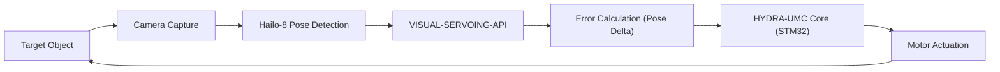

<p align="center">
  
</p>

# 🎯 HYDRA-UMC-VISUAL-SERVOING-API

<p align="center"><a href="README.md">🇺🇸 English</a> | <a href="README_spa.md">🇪🇸 Español</a> | <a href="README_fra.md">🇫🇷 Français</a> | <a href="README_ita.md">🇮🇹 Italiano</a> | <a href="README_deu.md">🇩🇪 Deutsch</a> | <a href="README_zho.md">🇨🇳 简体中文</a> | 🇯🇵 <b>日本語</b></p>

### 📐 画像フィードバックによる閉ループ運動学補正

<p align="left">
  
  
  
</p>

---

## 1. 🛠️ 技術概要

**HYDRA-UMC-VISUAL-SERVOING-API** は、知覚と運動をつなぐ精密なブリッジ
です。目標姿勢と物体の実際の視覚的姿勢との誤差量を計算し、HYDRA-UMC
コアにリアルタイムの運動学的補正を提供します。

**Eye-in-Hand**（カメラをツールに搭載）と **Eye-to-Hand**（固定カメラ）
の両方の構成をサポートし、超精密なピック＆プレース、SMD アライメント、
動的な軌道調整を可能にします。

### 主な機能：
* ✅ **実装済み v0 —— PBVS 補正則：** `pose.py` + `servo.py` が現在の姿勢と目標姿勢の姿勢差分を計算し（角度はジンバルロックを招きやすい遠回りではなく、最短経路でラップされます）、それを比例速度指令に変換します。クランプ処理は方向を歪めません。下記の `correct` サブコマンドから利用可能で、実行にもテストにもカメラや NPU は不要です。
* 🔄 **閉ループ制御：** 上位のオーケストレーターを経由しない連続フィードバックループにより低遅延を実現。*（アーキテクチャ上の目標——HYDRA-UMC コアへの gRPC 送信はまだ将来の作業です。）*
* 📐 **姿勢推定：** 単一または複数カメラビューからの 6 自由度物体姿勢推定。*（将来の作業——この環境にはまだない実際の Hailo-8 NPU が必要です。）*
* ⚡ **ハードウェアアクセラレーション：** Hailo-8 の出力を使用した即時座標計算。*（同じ理由で将来の作業です。）*

---

## 2. 🔄 ビジュアルサーボループ



---

## 3. 🧱 アーキテクチャと設計上の決定

* **本 API が独自のハードウェア/ファームウェアを持たない理由。** 統合親プロジェクトである HYDRA-UMC-VISION-NODE が所有する共有 CM5 + Hailo-8 モジュール上で完全に動作します——独自に設計する基板がないため、`hardware/`/`firmware/`/`os/` は空のまま残すのではなく、意図的に省略されています。
* **HYDRA-UMC-VISION-NODE のサブモジュールではなく兄弟プロジェクトである理由。** 姿勢補正は独自のプロセス/デプロイ単位として実行されるため、ここでのクラッシュや遅い推論サイクルが、HYDRA-UMC-SAFETY-ZONES が E-STOP のタイミング判断のために依存している親プロジェクト自身の検知パイプラインを停滞させることはありません。
* **補正則が姿勢推定より先に実装される理由。** 姿勢の「ペア」を制限付き速度指令に変換するのは純粋な制御理論の数学であり、記述にもテストにもカメラや NPU は不要です。そのため v0 ではこの部分（`pose.py`、`servo.py`）が先に実装されます。実際の 6 自由度姿勢*推定*にはこの環境にない Hailo-8 ハードウェアが必要で、後で実装されます。
* **エコシステムの他の部分との関係。** 知覚（HYDRA-UMC-VISION-NODE）の下流、運動（HYDRA-UMC ファームウェア）の上流に位置します——検知されたオフセットを、ロボットアーム自身のジョグ/サーボループが適用する運動学的補正へと変換します。

---

## 📂 リポジトリ構成

CM5 + Hailo-8 は市販のハードウェアであり独自の基板を持たないため、本
プロジェクトは `hardware/` や `firmware/` フォルダを携えていません。
`os/` と `models/` は統合親プロジェクトである `HYDRA-UMC-VISION-NODE`
にのみ存在します。

```text
HYDRA-UMC-VISUAL-SERVOING-API/
├── src/                 # ソースコード（hydra_umc_visual_servoing_api パッケージ）
│   └── hydra_umc_visual_servoing_api/
│       ├── pose.py      # Pose6D —— 6 自由度姿勢（x, y, z, roll, pitch, yaw）
│       ├── servo.py     # PBVS 補正則：姿勢誤差 + 速度指令
│       └── main.py      # CLI エントリポイント（素の呼び出し + `correct`）
├── tests/               # 実際の pytest スイート（pose、servo、CLI）
├── docs/                # ドキュメントと運動学理論
├── build/               # ビルド出力（ローカルの .venv もここに存在）
├── images/              # メディアと図表
├── scripts/             # ユーティリティスクリプト
├── pyproject.toml       # パッケージメタデータ、依存関係、オドメーターバージョン
├── bump_version.py      # オドメーター式バージョンインクリメント（build.sh/.bat が実行）
├── build.sh / build.bat # venv + editable インストール + コンパイルチェック + テスト
└── run.sh / run.bat     # ローカル venv からエントリポイントを実行
```

---

## 🏗️ ビルドと実行

Python 3.10+ が必要です。

```bash
# Linux / macOS
./build.sh   # オドメーターバージョンを増加させ、.venv を作成し、
             # パッケージを editable モード（dev エクストラ付き）で
             # インストールし、src/ 下の各ファイルをコンパイルチェックし、
             # 実際の pytest スイートを実行します
./run.sh     # .venv からエントリポイントを実行し、名前 + バージョン + 役割を表示します
```

```bat
:: Windows
build.bat
run.bat
```

`build.sh`/`build.bat` は、実際の各ビルドの前に、エコシステム全体で
統一された「オドメーター」規則（PATCH+1、9 を超えると MINOR に繰り上がる）
を使用して本プロジェクト自身の `pyproject.toml` のバージョンを増加させ、
その後 `python -m compileall` でソースをコンパイルチェックします。

実際の例 —— 現在の姿勢から目標姿勢への補正を計算する：

```bash
./run.sh correct --current "0,0,0.5,0,0,0" --target "0.02,-0.01,0.48,0,0,0.05" \
  --gain 0.8 --max-linear-speed 0.05
# pose error   : dx=0.020000 dy=-0.010000 dz=-0.020000  droll=0.000000 dpitch=0.000000 dyaw=0.050000
# error norm   : linear=0.030000 m  angular=0.050000 rad
# velocity cmd : vx=0.016000 vy=-0.008000 vz=-0.016000  wroll=0.000000 wpitch=0.000000 wyaw=0.040000
# converged    : False
```

---

## ✅ 現在の状況と次のステップ

**現在実装済み：** PBVS 姿勢誤差・速度指令補正則（`pose.py`、
`servo.py`）——上のループ図の「誤差計算（姿勢差分）」ステップ——15 個の
テストと実際の `correct` CLI コマンド付き。

**まだ先で、実際のハードウェアに阻まれている：** カメラ映像からの実際の
6 自由度姿勢*推定*（Hailo-8 NPU が必要）、および結果として得られる
速度指令の HYDRA-UMC コアへの低遅延 gRPC 送信。

## 🚀 ロードマップ
* **フェーズ 1：** 8 路の USB 3.0 フィード向けのマルチカメラパイプライン同期とキャリブレーション。
* **フェーズ 2：** YOLOv11 への移行と、産業用部品検出のための Hailo-8L 最適化。
* **フェーズ 3：** ステレオビジョンノードからのリアルタイム 3D 再構成と安全ゾーンの動的マッピング。
* **フェーズ 4：** 9 自由度視覚追跡（姿勢冗長性を含む）とサブマイクロメートル補正のサポート。

---

## 🔗 関連プロジェクト

本プロジェクトは、同一著者（JuanenRac / Electro Hobby 3D）による、
ファームウェア、制御ソフトウェア、AI ノード、フリート管理ツールにまたがる、
より大きなロボティクスエコシステムの一部です。ご要望が実際にはこれらの
プロジェクトのいずれかに関するものであり、本リポジトリのものではない
可能性もあるため、知っておく価値があります。

### プロジェクトファミリー

**親プロジェクト：** **[HYDRA-UMC-VISION-NODE](https://github.com/JuanenRac/HYDRA-UMC-VISION-NODE)** —— 本 API がその知覚結果を姿勢補正に変換する統合親プロジェクト。

**兄弟プロジェクト：**
- **[HYDRA-UMC-VISION-STREAMER](https://github.com/JuanenRac/HYDRA-UMC-VISION-STREAMER)** — 親プロジェクトが消費するカメラフィードをキャプチャし前処理します。
- **[HYDRA-UMC-DETECTION-HEF](https://github.com/JuanenRac/HYDRA-UMC-DETECTION-HEF)** — 親プロジェクトがその Hailo-8 NPU にロードする `.hef` モデルをコンパイルします。
- **[HYDRA-UMC-SAFETY-ZONES](https://github.com/JuanenRac/HYDRA-UMC-SAFETY-ZONES)** — 親プロジェクトの知覚結果を侵入検知と E-STOP トリガーに変換します。

### 直接関連（ファミリー外）

- **[HYDRA-UMC](https://github.com/JuanenRac/HYDRA-UMC)** — このファームウェアに運動学的姿勢補正を送信します。

### エコシステムのその他のプロジェクト

**HYDRA-UMC プラットフォーム** — マルチロボット・マイクロファクトリーセル
- **[HYDRA-UMC](https://github.com/JuanenRac/HYDRA-UMC)** — 最大 8 台のロボットアームを統括する CM5 + STM32H745 マザーボード。
- **[HYDRA-UMC-SERVER](https://github.com/JuanenRac/HYDRA-UMC-SERVER)** — すべての制御クライアントが接続する Express/WebSocket バックエンド。
- **[HYDRA-UMC-STUDIO](https://github.com/JuanenRac/HYDRA-UMC-STUDIO)** — Web ベースの制御ダッシュボード、マルチロボット 3D 可視化。
- **[HYDRA-UMC-ANDROID-CONTROL](https://github.com/JuanenRac/HYDRA-UMC-ANDROID-CONTROL)** — Wi-Fi/Bluetooth 経由の Android 制御アプリ。
- **[HYDRA-UMC-IOS-CONTROL](https://github.com/JuanenRac/HYDRA-UMC-IOS-CONTROL)** — Flutter で構築された iOS/iPadOS 制御アプリ。
- **[HYDRA-UMC-SUITE](https://github.com/JuanenRac/HYDRA-UMC-SUITE)** — デスクトップ版群制御コマンドセンター（Python/PySide6）。
- **[HYDRA-UMC-EDITOR-URDF](https://github.com/JuanenRac/HYDRA-UMC-EDITOR-URDF)** — ロボットカタログ向けのデスクトップ版 URDF モデルエディター。
- **[HYDRA-UMC-DSI](https://github.com/JuanenRac/HYDRA-UMC-DSI)** — 機載 DSI タッチスクリーン用のネイティブタッチ UI。

**URTC プラットフォーム** — すべての HYDRA-UMC ロボットアームが搭載するツールヘッドコントローラー
- **[URTC](https://github.com/JuanenRac/URTC)** — CAN バスツールヘッドコントローラー、25 種類のツールプロファイル。
- **[URTC-FLASHER](https://github.com/JuanenRac/URTC-FLASHER)** — デスクトップ版 CAN-OTA + SWD/JTAG フラッシュツール。
- **[URTC-TESTER](https://github.com/JuanenRac/URTC-TESTER)** — デスクトップ版ライブ CAN バス診断ツール。
- **[URTC-WEB-STUDIO](https://github.com/JuanenRac/URTC-WEB-STUDIO)** — Web Serial API によるブラウザベースの代替版。

**🧠 認知 AI ノード（Hailo-10）**
- [HYDRA-UMC-COGNITIVE-NODE](https://github.com/JuanenRac/HYDRA-UMC-COGNITIVE-NODE)
- [HYDRA-UMC-VLA-ENGINE](https://github.com/JuanenRac/HYDRA-UMC-VLA-ENGINE)
- [HYDRA-UMC-VOICE-UI](https://github.com/JuanenRac/HYDRA-UMC-VOICE-UI)
- [HYDRA-UMC-SEMANTIC-PLANNER](https://github.com/JuanenRac/HYDRA-UMC-SEMANTIC-PLANNER)
- [HYDRA-UMC-DOCS-QA](https://github.com/JuanenRac/HYDRA-UMC-DOCS-QA)

**🐝 オーケストレーションと群制御**
- [HYDRA-UMC-ORCHESTRATOR](https://github.com/JuanenRac/HYDRA-UMC-ORCHESTRATOR)
- [HYDRA-UMC-SWARM-SYNC](https://github.com/JuanenRac/HYDRA-UMC-SWARM-SYNC)
- [HYDRA-UMC-PATH-PLANNER-3D](https://github.com/JuanenRac/HYDRA-UMC-PATH-PLANNER-3D)
- [HYDRA-UMC-JOB-DISPATCHER](https://github.com/JuanenRac/HYDRA-UMC-JOB-DISPATCHER)
- [HYDRA-UMC-NODE-HEALING](https://github.com/JuanenRac/HYDRA-UMC-NODE-HEALING)

**🎮 デジタルツインとシミュレーション**
- [HYDRA-UMC-TWIN](https://github.com/JuanenRac/HYDRA-UMC-TWIN)
- [HYDRA-UMC-PHYSICS-REPLICA](https://github.com/JuanenRac/HYDRA-UMC-PHYSICS-REPLICA)
- [HYDRA-UMC-HIL-BRIDGE](https://github.com/JuanenRac/HYDRA-UMC-HIL-BRIDGE)
- [HYDRA-UMC-SYNTHETIC-DATA-GEN](https://github.com/JuanenRac/HYDRA-UMC-SYNTHETIC-DATA-GEN)

**📊 データと分析**
- [HYDRA-UMC-DATALAKE](https://github.com/JuanenRac/HYDRA-UMC-DATALAKE)
- [HYDRA-UMC-TELEMETRY-COLLECTOR](https://github.com/JuanenRac/HYDRA-UMC-TELEMETRY-COLLECTOR)
- [HYDRA-UMC-ANOMALY-DETECTOR](https://github.com/JuanenRac/HYDRA-UMC-ANOMALY-DETECTOR)
- [HYDRA-UMC-PRODUCTION-REPORTS](https://github.com/JuanenRac/HYDRA-UMC-PRODUCTION-REPORTS)

**🏭 産業用ゲートウェイ**
- [HYDRA-UMC-GATEWAY-INDUSTRIAL](https://github.com/JuanenRac/HYDRA-UMC-GATEWAY-INDUSTRIAL)
- [HYDRA-UMC-OPCUA-SERVER](https://github.com/JuanenRac/HYDRA-UMC-OPCUA-SERVER)
- [HYDRA-UMC-MQTT-BROKER](https://github.com/JuanenRac/HYDRA-UMC-MQTT-BROKER)
- [HYDRA-UMC-MTCONNECT-ADAPTER](https://github.com/JuanenRac/HYDRA-UMC-MTCONNECT-ADAPTER)

**🛠️ 補完ツール**
- [URTC-SMART-RACK](https://github.com/JuanenRac/URTC-SMART-RACK)
- [URTC-VISION-TOOL](https://github.com/JuanenRac/URTC-VISION-TOOL)
- [HYDRA-UMC-WATCH](https://github.com/JuanenRac/HYDRA-UMC-WATCH)
- [HYDRA-UMC-TOOL-CLI](https://github.com/JuanenRac/HYDRA-UMC-TOOL-CLI)
- [HYDRA-UMC-DASHBOARD-AI](https://github.com/JuanenRac/HYDRA-UMC-DASHBOARD-AI)


## 👤 作者
**JuanenRac**（Electro Hobby 3D）
📧 electrohobby3d@gmail.com

## 📜 ライセンス
GPL-3.0 —— 詳細は LICENSE を参照してください。
