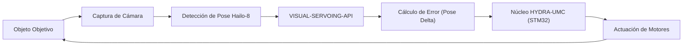

<p align="center">
  
</p>

# 🎯 HYDRA-UMC-VISUAL-SERVOING-API

<p align="center"><a href="README.md">🇺🇸 English</a> | 🇪🇸 <b>Español</b> | <a href="README_fra.md">🇫🇷 Français</a> | <a href="README_ita.md">🇮🇹 Italiano</a> | <a href="README_deu.md">🇩🇪 Deutsch</a> | <a href="README_zho.md">🇨🇳 简体中文</a> | <a href="README_jpn.md">🇯🇵 日本語</a></p>

### 📐 Corrección Cinemática en Bucle Cerrado mediante Feedback Visual

<p align="left">
  
  
  
</p>

---

## 1. 🛠️ VISIÓN GENERAL TÉCNICA

**HYDRA-UMC-VISUAL-SERVOING-API** es el puente de precisión entre la percepción y el movimiento. Calcula el delta de error entre una pose deseada y la pose visual real de un objeto, proporcionando correcciones cinemáticas en tiempo real al núcleo HYDRA-UMC.

Soporta configuraciones **Eye-in-Hand** (cámara en herramienta) y **Eye-to-Hand** (cámara fija), permitiendo Pick-and-Place de ultra precisión, alineación SMD y ajuste de trayectoria dinámico.

### Características Clave:
* 🎯 **Corrección Sub-micrométrica:** Ajuste dinámico basado en fiduciales visuales en tiempo real.
* 🔄 **Control en Bucle Cerrado:** Bucle de retroalimentación continuo que omite al orquestador de alto nivel para baja latencia.
* 📐 **Estimación de Pose:** Estimación de pose de objeto de 6-DOF desde vistas de cámara única o múltiple.
* ⚡ **Acelerado por Hardware:** Utiliza la salida de Hailo-8 para el cálculo instantáneo de coordenadas.

---

## 2. 🔄 BUCLE DE SERVOING VISUAL



---

## 3. 🧱 ARQUITECTURA Y DECISIONES DE DISEÑO

* **Por qué esta API no tiene hardware/firmware propio.** Corre por completo sobre el módulo CM5 + Hailo-8 compartido que posee el padre de integración, HYDRA-UMC-VISION-NODE - no hay ninguna placa propia que diseñar, así que `hardware/`/`firmware/`/`os/` se podaron en vez de dejarlas vacías.
* **Por qué es hermana, no un submódulo, de HYDRA-UMC-VISION-NODE.** La corrección de pose corre como su propio proceso/despliegue para que un fallo o un ciclo de inferencia lento aquí no pueda bloquear el propio pipeline de detección del padre, del que depende HYDRA-UMC-SAFETY-ZONES para el temporizado del E-STOP.
* **Por qué el punto de entrada solo imprime identidad/versión/rol hoy.** Etapa de andamiaje: probar que el paquete se instala, compila e importa limpiamente es un prerrequisito para las correcciones cinemáticas reales de 6 grados de libertad que llegarán después.
* **Cómo encaja en el resto del ecosistema.** Se sitúa aguas abajo de la percepción (HYDRA-UMC-VISION-NODE) y aguas arriba del movimiento (firmware de HYDRA-UMC) - convierte los desvíos detectados en las correcciones cinemáticas que aplica el propio bucle de jog/servo del brazo robótico.

---

## 📂 ESTRUCTURA DE DIRECTORIOS

CM5 + Hailo-8 es hardware ya existente sin placa propia, así que este
proyecto no lleva carpeta `hardware/` ni `firmware/`. `os/` y `models/`
viven solo en el padre de integración, `HYDRA-UMC-VISION-NODE`.

```text
HYDRA-UMC-VISUAL-SERVOING-API/
├── src/                 # Código fuente (paquete hydra_umc_visual_servoing_api)
├── docs/                # Documentación y teoría cinemática
├── build/               # Salida de build (aquí vive también el .venv local)
├── images/              # Medios y diagramas
├── scripts/             # Scripts de utilidad
├── pyproject.toml       # Metadatos del paquete, dependencias, version cuentakilometros
├── bump_version.py      # Bump de version tipo cuentakilometros (build.sh/.bat)
├── build.sh / build.bat # venv + instalacion editable + compile-check
└── run.sh / run.bat     # Ejecuta el entry point desde el venv local
```

---

## 🏗️ BUILD Y RUN

Requiere Python 3.10+.

```bash
# Linux / macOS
./build.sh   # bump de version cuentakilometros, crea .venv, instala el
             # paquete en modo editable, compile-check de todo src/
./run.sh     # ejecuta el entry point desde .venv, imprime nombre + version + rol
```

```bat
:: Windows
build.bat
run.bat
```

`build.sh`/`build.bat` incrementan la version del propio `pyproject.toml`
de este proyecto siguiendo la regla "cuentakilometros" del ecosistema
(PATCH+1, con acarreo a MINOR al pasar de 9) antes de cada build real, y
luego hacen compile-check del codigo fuente con `python -m compileall`.

---

## 🚀 HOJA DE RUTA
* **Fase 1:** Sincronización y calibración del pipeline multi-cámara para 8x entradas USB 3.0.
* **Fase 2:** Migración a YOLOv11 y optimización para Hailo-8L para detección de componentes industriales.
* **Fase 3:** Reconstrucción 3D en tiempo real desde nodos de visión estéreo y mapeo dinámico de zonas de seguridad.
* **Fase 4:** Soporte para seguimiento visual de 9-DOF (incluyendo redundancia de orientación) y corrección sub-micrométrica.

---

## 🔗 Proyectos Relacionados

Este proyecto forma parte de un ecosistema de robótica más amplio del mismo autor (JuanenRac / Electro Hobby 3D), que abarca firmware, software de control, nodos de IA y herramientas de flota. Vale la pena conocerlo, ya que una petición podría en realidad ser sobre uno de estos proyectos en vez de sobre este repositorio.

### Familia

**Padre:** **[HYDRA-UMC-VISION-NODE](https://github.com/JuanenRac/HYDRA-UMC-VISION-NODE)** — el padre de integración al que esta API convierte percepción en correcciones de pose.

**Hermanos:**
- **[HYDRA-UMC-VISION-STREAMER](https://github.com/JuanenRac/HYDRA-UMC-VISION-STREAMER)** — captura y pre-procesa los flujos de cámara que consume el padre.
- **[HYDRA-UMC-DETECTION-HEF](https://github.com/JuanenRac/HYDRA-UMC-DETECTION-HEF)** — compila los modelos `.hef` que el padre carga en su NPU Hailo-8.
- **[HYDRA-UMC-SAFETY-ZONES](https://github.com/JuanenRac/HYDRA-UMC-SAFETY-ZONES)** — convierte la percepción del padre en detección de intrusión y disparo de E-STOP.

### Relación Directa (fuera de la familia)

- **[HYDRA-UMC](https://github.com/JuanenRac/HYDRA-UMC)** — envía correcciones cinemáticas de pose a este firmware.

### Resto del Ecosistema

**Plataforma HYDRA-UMC** — la célula de micro-fábrica multi-robot
- **[HYDRA-UMC](https://github.com/JuanenRac/HYDRA-UMC)** — la placa base CM5 + STM32H745 que orquesta hasta 8 brazos robóticos.
- **[HYDRA-UMC-SERVER](https://github.com/JuanenRac/HYDRA-UMC-SERVER)** — el backend Express/WebSocket con el que habla cada cliente de control.
- **[HYDRA-UMC-STUDIO](https://github.com/JuanenRac/HYDRA-UMC-STUDIO)** — panel de control web, visualización 3D multi-robot.
- **[HYDRA-UMC-ANDROID-CONTROL](https://github.com/JuanenRac/HYDRA-UMC-ANDROID-CONTROL)** — app de control Android por Wi-Fi/Bluetooth.
- **[HYDRA-UMC-IOS-CONTROL](https://github.com/JuanenRac/HYDRA-UMC-IOS-CONTROL)** — app de control iOS/iPadOS construida en Flutter.
- **[HYDRA-UMC-SUITE](https://github.com/JuanenRac/HYDRA-UMC-SUITE)** — centro de mando de enjambre de escritorio (Python/PySide6).
- **[HYDRA-UMC-EDITOR-URDF](https://github.com/JuanenRac/HYDRA-UMC-EDITOR-URDF)** — editor de modelos URDF de escritorio para el catálogo de robots.
- **[HYDRA-UMC-DSI](https://github.com/JuanenRac/HYDRA-UMC-DSI)** — interfaz táctil nativa para la pantalla DSI integrada.

**Plataforma URTC** — el controlador de cabezal de herramienta que lleva cada brazo HYDRA-UMC
- **[URTC](https://github.com/JuanenRac/URTC)** — controlador de cabezal de herramienta CAN, 25 perfiles de herramienta.
- **[URTC-FLASHER](https://github.com/JuanenRac/URTC-FLASHER)** — herramienta de escritorio de flasheo CAN-OTA + SWD/JTAG.
- **[URTC-TESTER](https://github.com/JuanenRac/URTC-TESTER)** — herramienta de escritorio de diagnóstico CAN en vivo.
- **[URTC-WEB-STUDIO](https://github.com/JuanenRac/URTC-WEB-STUDIO)** — alternativa basada en navegador vía Web Serial API.

**🧠 Cognitive AI Node (Hailo-10)**
- [HYDRA-UMC-COGNITIVE-NODE](https://github.com/JuanenRac/HYDRA-UMC-COGNITIVE-NODE)
- [HYDRA-UMC-VLA-ENGINE](https://github.com/JuanenRac/HYDRA-UMC-VLA-ENGINE)
- [HYDRA-UMC-VOICE-UI](https://github.com/JuanenRac/HYDRA-UMC-VOICE-UI)
- [HYDRA-UMC-SEMANTIC-PLANNER](https://github.com/JuanenRac/HYDRA-UMC-SEMANTIC-PLANNER)
- [HYDRA-UMC-DOCS-QA](https://github.com/JuanenRac/HYDRA-UMC-DOCS-QA)

**🐝 Orchestration & Swarm**
- [HYDRA-UMC-ORCHESTRATOR](https://github.com/JuanenRac/HYDRA-UMC-ORCHESTRATOR)
- [HYDRA-UMC-SWARM-SYNC](https://github.com/JuanenRac/HYDRA-UMC-SWARM-SYNC)
- [HYDRA-UMC-PATH-PLANNER-3D](https://github.com/JuanenRac/HYDRA-UMC-PATH-PLANNER-3D)
- [HYDRA-UMC-JOB-DISPATCHER](https://github.com/JuanenRac/HYDRA-UMC-JOB-DISPATCHER)
- [HYDRA-UMC-NODE-HEALING](https://github.com/JuanenRac/HYDRA-UMC-NODE-HEALING)

**🎮 Digital Twin & Simulation**
- [HYDRA-UMC-TWIN](https://github.com/JuanenRac/HYDRA-UMC-TWIN)
- [HYDRA-UMC-PHYSICS-REPLICA](https://github.com/JuanenRac/HYDRA-UMC-PHYSICS-REPLICA)
- [HYDRA-UMC-HIL-BRIDGE](https://github.com/JuanenRac/HYDRA-UMC-HIL-BRIDGE)
- [HYDRA-UMC-SYNTHETIC-DATA-GEN](https://github.com/JuanenRac/HYDRA-UMC-SYNTHETIC-DATA-GEN)

**📊 Data & Analytics**
- [HYDRA-UMC-DATALAKE](https://github.com/JuanenRac/HYDRA-UMC-DATALAKE)
- [HYDRA-UMC-TELEMETRY-COLLECTOR](https://github.com/JuanenRac/HYDRA-UMC-TELEMETRY-COLLECTOR)
- [HYDRA-UMC-ANOMALY-DETECTOR](https://github.com/JuanenRac/HYDRA-UMC-ANOMALY-DETECTOR)
- [HYDRA-UMC-PRODUCTION-REPORTS](https://github.com/JuanenRac/HYDRA-UMC-PRODUCTION-REPORTS)

**🏭 Industrial Gateway**
- [HYDRA-UMC-GATEWAY-INDUSTRIAL](https://github.com/JuanenRac/HYDRA-UMC-GATEWAY-INDUSTRIAL)
- [HYDRA-UMC-OPCUA-SERVER](https://github.com/JuanenRac/HYDRA-UMC-OPCUA-SERVER)
- [HYDRA-UMC-MQTT-BROKER](https://github.com/JuanenRac/HYDRA-UMC-MQTT-BROKER)
- [HYDRA-UMC-MTCONNECT-ADAPTER](https://github.com/JuanenRac/HYDRA-UMC-MTCONNECT-ADAPTER)

**🛠️ Complementary Tools**
- [URTC-SMART-RACK](https://github.com/JuanenRac/URTC-SMART-RACK)
- [URTC-VISION-TOOL](https://github.com/JuanenRac/URTC-VISION-TOOL)
- [HYDRA-UMC-WATCH](https://github.com/JuanenRac/HYDRA-UMC-WATCH)
- [HYDRA-UMC-TOOL-CLI](https://github.com/JuanenRac/HYDRA-UMC-TOOL-CLI)
- [HYDRA-UMC-DASHBOARD-AI](https://github.com/JuanenRac/HYDRA-UMC-DASHBOARD-AI)


## 👤 AUTOR
**JuanenRac** (Electro Hobby 3D)
📧 electrohobby3d@gmail.com

## 📜 LICENCIA
GPL-3.0 - Ver archivo LICENSE para más detalles.
