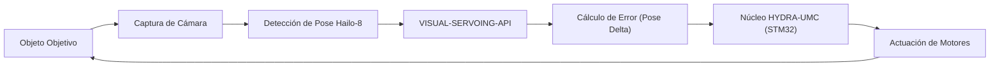

<p align="center">
  
</p>

# 🎯 HYDRA-UMC-VISUAL-SERVOING-API

<p align="center"><a href="README.md">🇺🇸 English</a> | 🇪🇸 <b>Español</b> | <a href="README_fra.md">🇫🇷 Français</a> | <a href="README_ita.md">🇮🇹 Italiano</a> | <a href="README_deu.md">🇩🇪 Deutsch</a> | <a href="README_zho.md">🇨🇳 简体中文</a> | <a href="README_jpn.md">🇯🇵 日本語</a></p>

### 📐 Corrección Cinemática en Bucle Cerrado mediante Feedback Visual

<p align="left">
  
  
  
</p>

---

## 1. 🛠️ VISIÓN GENERAL TÉCNICA

**HYDRA-UMC-VISUAL-SERVOING-API** es el puente de precisión entre la percepción y el movimiento. Calcula el delta de error entre una pose deseada y la pose visual real de un objeto, proporcionando correcciones cinemáticas en tiempo real al núcleo HYDRA-UMC.

Soporta configuraciones **Eye-in-Hand** (cámara en herramienta) y **Eye-to-Hand** (cámara fija), permitiendo Pick-and-Place de ultra precisión, alineación SMD y ajuste de trayectoria dinámico.

### Características Clave:
* ✅ **Real v0 - ley de corrección PBVS:** `pose.py` + `servo.py` calculan el delta de pose entre una pose actual y una objetivo (con envoltura angular por el giro más corto, sin dar el rodeo largo propenso al bloqueo de cardán) y lo convierten en un comando de velocidad proporcional, recortado sin distorsionar su dirección. Expuesto vía el subcomando `correct` más abajo - no necesita cámara ni NPU para ejecutarse ni testearse.
* 🛡️ **Real v0 - autorización con verja de seguridad:** `authorization.py` se niega a convertir percepción en movimiento a menos que el estado de seguridad aguas arriba sea `READY` y los datos visuales sean lo bastante frescos/confiables. Expuesto vía el nuevo subcomando `request` más abajo - no necesita cámara, NPU ni el proceso de SAFETY-ZONES para ejecutarse ni testearse.
* 🌐 **API JSON/HTTP (v0):** el subcomando real `serve` expone la misma lógica de `correct`/`request` como `POST /correct`/`POST /request` (además de `GET /stats`), usando `http.server` de la librería estándar sin dependencias extra - alcanzable desde un caller real en vez de argumentos CLI puntuales. Ver [`docs/CLI_REFERENCE.md`](docs/CLI_REFERENCE.md).
* 🔄 **Control en Bucle Cerrado:** Bucle de retroalimentación continuo que omite al orquestador de alto nivel para baja latencia. *(objetivo de arquitectura - el envío gRPC al núcleo HYDRA-UMC sigue siendo trabajo futuro.)*
* 📐 **Estimación de Pose:** Estimación de pose de objeto de 6-DOF desde vistas de cámara única o múltiple. *(trabajo futuro - necesita la NPU Hailo-8 real que este entorno todavía no tiene.)*
* ⚡ **Acelerado por Hardware:** Utiliza la salida de Hailo-8 para el cálculo instantáneo de coordenadas. *(trabajo futuro, mismo motivo.)*
* 🔌 **Límite de integración con HailoRT, preparado antes que el módulo:** `hailo_runtime.py` está escrito contra la API real y confirmada de `hailo_platform` (`VDevice`, `HEF`, `ConfigureParams`) - importada de forma perezosa para que este repositorio se instale/testee limpiamente sin el paquete `hailort` ni un módulo Hailo-8 presente - y `hailo_output_to_pose()` adapta un resultado de inferencia real directamente al `Pose6D` que `compute_pose_error()` ya consume. *(implementado, solo límite de integración - ejecutar inferencia de verdad todavía necesita un `.hef` de estimación de pose realmente compilado y un módulo Hailo-8 físico.)*

---

## 2. 🔄 BUCLE DE SERVOING VISUAL



---

## 3. 🧱 ARQUITECTURA Y DECISIONES DE DISEÑO

* **Por qué esta API no tiene hardware/firmware propio.** Corre por completo sobre el módulo CM5 + Hailo-8 compartido que posee el padre de integración, HYDRA-UMC-VISION-NODE - no hay ninguna placa propia que diseñar, así que `hardware/`/`firmware/`/`os/` se podaron en vez de dejarlas vacías.
* **Por qué es hermana, no un submódulo, de HYDRA-UMC-VISION-NODE.** La corrección de pose corre como su propio proceso/despliegue para que un fallo o un ciclo de inferencia lento aquí no pueda bloquear el propio pipeline de detección del padre, del que depende HYDRA-UMC-SAFETY-ZONES para el temporizado del E-STOP.
* **Por qué la ley de corrección llega antes que la estimación de pose.** Convertir un par de poses en un comando de velocidad acotado es matemática pura de teoría de control - no necesita cámara ni NPU para escribirse ni testearse, así que v0 entrega esa pieza (`pose.py`, `servo.py`) primero. La estimación real de pose de 6-DOF necesita el hardware Hailo-8 que este entorno no tiene, y llega después.
* **Cómo encaja en el resto del ecosistema.** Se sitúa aguas abajo de la percepción (HYDRA-UMC-VISION-NODE) y aguas arriba del movimiento (firmware de HYDRA-UMC) - convierte los desvíos detectados en las correcciones cinemáticas que aplica el propio bucle de jog/servo del brazo robótico.
* **Por qué `authorize_correction()` comprueba `safety_state` antes que confianza/frescura.** Un fallo de seguridad debe ganar por encima de todo, incluso ante una detección perfectamente fresca y confiable - así que `INHIBITED` (safety_state != "READY") se comprueba primero y corta el resto de la política. Solo una vez confirmado que el brazo puede moverse con seguridad importa si los *datos* son lo bastante confiables para moverlo (`REJECTED` por confianza baja o datos obsoletos). Esto refleja la misma precedencia `INHIBITED`-antes-de-`DANGER`/`WARNING` ya usada en HYDRA-UMC-SAFETY-ZONES.
* **Por qué `request` es un subcomando nuevo en vez de cambiar `correct`.** `correct` es la utilidad de bajo nivel existente, matemática pura (sin conciencia de seguridad ni concepto de frescura de cámara) con sus propios llamadores y tests; envolverla en una verja de seguridad in situ cambiaría su contrato en silencio. `request` añade el punto de entrada con verja, orientado a cámara, que el código del ecosistema debería llamar realmente, mientras `correct` sigue disponible sin cambios para uso directo de matemática de pose.

---

## 📂 ESTRUCTURA DE DIRECTORIOS

CM5 + Hailo-8 es hardware ya existente sin placa propia, así que este
proyecto no lleva carpeta `hardware/` ni `firmware/`. `os/` y `models/`
viven solo en el padre de integración, `HYDRA-UMC-VISION-NODE`.

```text
HYDRA-UMC-VISUAL-SERVOING-API/
├── src/                 # Código fuente (paquete hydra_umc_visual_servoing_api)
│   └── hydra_umc_visual_servoing_api/
│       ├── pose.py           # Pose6D - pose de 6-DOF (x, y, z, roll, pitch, yaw)
│       ├── servo.py          # Ley de corrección PBVS: error de pose + comando de velocidad
│       ├── authorization.py  # Política con verja de seguridad (INHIBITED/REJECTED/ACCEPTED)
│       ├── hailo_runtime.py  # Limite real de integracion HailoRT (hailo_platform) del estimador de pose, importado de forma perezosa
│       ├── api.py            # Superficie JSON/HTTP plana (http.server de stdlib) sobre correct/request
│       └── main.py           # Entry point CLI (invocación básica + `correct` + `request`)
├── tests/               # Suite pytest real (pose, servo, authorization, hailo_runtime, api, CLI)
├── docs/                # Documentación y teoría cinemática
├── build/               # Salida de build (aquí vive también el .venv local)
├── images/              # Medios y diagramas
├── systemd/
│   └── hydra-umc-visual-servoing-api.service # Unidad systemd de la API local de corrección PBVS en la CM5
├── tools/
│   ├── build_test.py    # Comprobación de compilación sin versionado
│   └── ci_validate.py   # Validación de manifiesto/CHANGELOG/docs usada por CI
├── pyproject.toml       # Metadatos del paquete, dependencias, version cuentakilometros
├── bump_version.py      # Bump de version nativa tipo cuentakilometros (build.sh/.bat)
├── bump_manifest_version.py # Sincroniza la versión de hydra-umc.project.json con la nativa (--sync)
├── build.sh / build.bat # venv + instalacion editable + compile-check + tests
├── build-test.sh / build-test.bat # Comprobación de compilación sin versionado
└── run.sh / run.bat     # Ejecuta el entry point desde el venv local
```

---

## 🏗️ BUILD Y RUN

Requiere Python 3.10+.

```bash
# Linux / macOS
./build.sh   # bump de version cuentakilometros, crea .venv, instala el
             # paquete en modo editable (con extras dev), compile-check de
             # todo src/, y ejecuta la suite pytest real
./run.sh     # ejecuta el entry point desde .venv, imprime nombre + version + rol
```

```bat
:: Windows
build.bat
run.bat
```

`build.sh`/`build.bat` incrementan la version del propio `pyproject.toml`
de este proyecto siguiendo la regla "cuentakilometros" del ecosistema
(PATCH+1, con acarreo a MINOR al pasar de 9) antes de cada build real, y
luego hacen compile-check del código fuente con `python -m compileall`.

Ejemplo real - calcular la corrección de una pose actual a una objetivo:

```bash
./run.sh correct --current "0,0,0.5,0,0,0" --target "0.02,-0.01,0.48,0,0,0.05" \
  --gain 0.8 --max-linear-speed 0.05
# pose error   : dx=0.020000 dy=-0.010000 dz=-0.020000  droll=0.000000 dpitch=0.000000 dyaw=0.050000
# error norm   : linear=0.030000 m  angular=0.050000 rad
# velocity cmd : vx=0.016000 vy=-0.008000 vz=-0.016000  wroll=0.000000 wpitch=0.000000 wyaw=0.040000
# converged    : False
```

Ejemplo real - solicitar una corrección con verja de seguridad (aceptada, inhibida y rechazada):

```bash
./run.sh request --current "0,0,0,0,0,0" --target "1,0,0,0,0,0" \
  --frame-id cam0-f42 --confidence 0.9 --data-age-ms 30 --safety-state READY
# outcome : ACCEPTED - frame 'cam0-f42' authorized (confidence=0.9, data_age_ms=30.0)
# pose error   : dx=1.000000 dy=0.000000 dz=0.000000  droll=0.000000 dpitch=0.000000 dyaw=0.000000
# velocity cmd : vx=1.000000 vy=0.000000 vz=0.000000  wroll=0.000000 wpitch=0.000000 wyaw=0.000000

./run.sh request --current "0,0,0,0,0,0" --target "1,0,0,0,0,0" \
  --frame-id cam0-f42 --confidence 0.9 --data-age-ms 30 --safety-state FAULT
# outcome : INHIBITED - safety_state is 'FAULT', not 'READY'   (código de salida 2)

./run.sh request --current "0,0,0,0,0,0" --target "1,0,0,0,0,0" \
  --frame-id cam0-f42 --confidence 0.2 --data-age-ms 30 --safety-state READY
# outcome : REJECTED - confidence 0.2 is below the required minimum 0.6 for frame 'cam0-f42'   (código de salida 1)
```

---

## ✅ Estado Actual y Próximos Pasos

**Real hoy:** la ley de corrección PBVS de error de pose y comando de
velocidad (`pose.py`, `servo.py`) - el paso "Cálculo de Error (Pose
Delta)" del diagrama de bucle de arriba - con un comando CLI `correct`
real; la política de autorización con verja de seguridad
(`authorization.py`) que se niega a convertir una detección visual en
movimiento a menos que el estado de seguridad aguas arriba sea `READY`
y los datos sean lo bastante confiables/frescos, expuesta vía el comando
CLI `request`; y un límite de integración con HailoRT real (`hailo_runtime.py`)
listo para un estimador de pose Hailo-8 real en el momento en que se conecte. 68 tests en total.

**Todavía por delante, bloqueado por hardware real:** ejecutar de verdad
la *estimación* de pose de 6-DOF a través de `hailo_runtime.py` necesita
un `.hef` de estimación de pose realmente compilado (aún no se ha elegido
un modelo concreto) y una NPU Hailo-8 física conectada, y el envío gRPC
de baja latencia del comando de velocidad resultante al núcleo HYDRA-UMC
es trabajo futuro aparte.

## 🚀 HOJA DE RUTA
* **Fase 1:** Sincronización y calibración del pipeline multi-cámara para 8x entradas USB 3.0.
* **Fase 2:** Migración a YOLOv11 y optimización para Hailo-8L para detección de componentes industriales.
* **Fase 3:** Reconstrucción 3D en tiempo real desde nodos de visión estéreo y mapeo dinámico de zonas de seguridad.
* **Fase 4:** Soporte para seguimiento visual de 9-DOF (incluyendo redundancia de orientación) y corrección sub-micrométrica.

---

## 🔗 Proyectos Relacionados

Este proyecto es parte del ecosistema de robótica HYDRA-UMC del mismo autor (JuanenRac / Electro Hobby 3D). Vale la pena conocerlo, ya que una petición podría en realidad ser sobre alguno de estos en vez de sobre este repositorio.

**Proyecto Padre**
- **[HYDRA-UMC-VISION-NODE](https://github.com/JuanenRac/HYDRA-UMC-VISION-NODE)** — nodo de integración para el pipeline de visión Hailo-8, con una comprobación real de disponibilidad de hardware por etapa; el padre del que este repositorio es una etapa o consumidor específico, dentro de su propio pipeline de percepción.

**Proyectos Hermanos** — las demás etapas/consumidores del propio pipeline de percepción Hailo-8 de HYDRA-UMC-VISION-NODE
- **[HYDRA-UMC-VISION-STREAMER](https://github.com/JuanenRac/HYDRA-UMC-VISION-STREAMER)** — generador real de pipeline GStreamer + config MediaMTX, con una frontera de integración HailoRT real.
- **[HYDRA-UMC-DETECTION-HEF](https://github.com/JuanenRac/HYDRA-UMC-DETECTION-HEF)** — registro real de modelos compilados con verificación de carga segura por arquitectura Hailo/checksum.
- **[HYDRA-UMC-SAFETY-ZONES](https://github.com/JuanenRac/HYDRA-UMC-SAFETY-ZONES)** — comprobación real de invasión de zona y solicitud de E-STOP, con exigencia de vigencia de calibración.

**Directamente Relacionados**
- **[HYDRA-UMC](https://github.com/JuanenRac/HYDRA-UMC)** — la placa madre física del brazo robótico: host CM5 + coprocesador STM32H745 de doble núcleo, coordinando hasta 8 brazos herramienta por CAN-OTA/SPI-OTA; el firmware núcleo STM32 que recibe las correcciones cinemáticas de pose de esta propia API.

**También Forma Parte del Ecosistema**

*Hardware y Plataforma Base*
- **[HYDRA-UMC-OS](https://github.com/JuanenRac/HYDRA-UMC-OS)** — capa de producto reproducible sobre Raspberry Pi OS para el CM5: agente de solo lectura, config/perfiles validados, aprovisionamiento WiFi de primer contacto.
- **[HYDRA-UMC-SDK](https://github.com/JuanenRac/HYDRA-UMC-SDK)** — el contrato JSON-Schema compartido y la barrera de seguridad contra la que cada bridge valida sus comandos.

*Backend Central y Clientes*
- **[HYDRA-UMC-SERVER](https://github.com/JuanenRac/HYDRA-UMC-SERVER)** — el backend headless real (REST/WebSocket) con el que habla de verdad cada cliente de control.
- **[HYDRA-UMC-STUDIO](https://github.com/JuanenRac/HYDRA-UMC-STUDIO)** — panel de control web con visualización 3D multi-robot en tiempo real.
- **[HYDRA-UMC-SUITE](https://github.com/JuanenRac/HYDRA-UMC-SUITE)** — centro de mando de enjambre de escritorio (PySide6) para varios servidores a la vez, empaquetado como ejecutable independiente.
- **[HYDRA-UMC-ANDROID-CONTROL](https://github.com/JuanenRac/HYDRA-UMC-ANDROID-CONTROL)** — app nativa de control para Android con inicio de sesión biométrico y un compañero Wear OS emparejado.
- **[HYDRA-UMC-IOS-CONTROL](https://github.com/JuanenRac/HYDRA-UMC-IOS-CONTROL)** — app de control para iOS/iPadOS (Flutter) con sincronización en tiempo real por WebSocket.
- **[HYDRA-UMC-DSI](https://github.com/JuanenRac/HYDRA-UMC-DSI)** — interfaz táctil nativa para la pantalla táctil DSI de 7" a bordo, embebida en el propio CM5.
- **[HYDRA-UMC-EDITOR-URDF](https://github.com/JuanenRac/HYDRA-UMC-EDITOR-URDF)** — creador/editor gráfico de URDF de escritorio que envía los modelos terminados al propio catálogo de STUDIO.
- **[HYDRA-UMC-BRIDGE-AMR](https://github.com/JuanenRac/HYDRA-UMC-BRIDGE-AMR)** — barrera de coordinación para flotas AGV/AMR mediante un publicador MQTT VDA 5050 real.
- **[HYDRA-UMC-BRIDGE-CNC](https://github.com/JuanenRac/HYDRA-UMC-BRIDGE-CNC)** — coordinador de alto nivel para celdas CNC con acceso real a estado/bytes de control GRBL.
- **[HYDRA-UMC-BRIDGE-DROIDS](https://github.com/JuanenRac/HYDRA-UMC-BRIDGE-DROIDS)** — barrera de coordinación para droides con patas/humanoides, con un emisor de comandos real para Boston Dynamics Spot.
- **[HYDRA-UMC-BRIDGE-LASER](https://github.com/JuanenRac/HYDRA-UMC-BRIDGE-LASER)** — coordinador de seguridad para celdas láser que lee 3 salvaguardas GPIO reales de llave/carcasa/enclavamiento.
- **[HYDRA-UMC-BRIDGE-OPENPNP](https://github.com/JuanenRac/HYDRA-UMC-BRIDGE-OPENPNP)** — coordinador de alto nivel seguro para el flujo de placas de pick-and-place OpenPnP.
- **[HYDRA-UMC-BRIDGE-PRINTER3D](https://github.com/JuanenRac/HYDRA-UMC-BRIDGE-PRINTER3D)** — barrera de coordinación segura para impresoras 3D Moonraker/Klipper, con comandos de trabajo reales y controlados.
- **[HYDRA-UMC-BRIDGE-ROS2](https://github.com/JuanenRac/HYDRA-UMC-BRIDGE-ROS2)** — coordinador de seguridad con un transporte ROS 2 rclpy real, importado de forma perezosa.
- **[HYDRA-UMC-BRIDGE-UAV](https://github.com/JuanenRac/HYDRA-UMC-BRIDGE-UAV)** — barrera de coordinación para UAV equipados con cámara, con un emisor de comandos MAVLink real.

*Plataforma de Herramientas URTC*
- **[URTC](https://github.com/JuanenRac/URTC)** — firmware para la placa física del Universal Robot Tool Controller, más de 25 perfiles de herramienta por bus CAN.
- **[URTC-FLASHER](https://github.com/JuanenRac/URTC-FLASHER)** — herramienta de escritorio con GUI para flashear placas URTC, CAN-OTA más SWD/JTAG de chip completo.
- **[URTC-TESTER](https://github.com/JuanenRac/URTC-TESTER)** — herramienta de escritorio de diagnóstico CAN-bus en vivo para placas URTC, un panel por perfil de herramienta.
- **[URTC-WEB-STUDIO](https://github.com/JuanenRac/URTC-WEB-STUDIO)** — alternativa basada en navegador a URTC-TESTER mediante la Web Serial API, sin instalación local.

*Nodo IA Cognitivo (Hailo-10)*
- **[HYDRA-UMC-COGNITIVE-NODE](https://github.com/JuanenRac/HYDRA-UMC-COGNITIVE-NODE)** — nodo de integración para el pipeline cognitivo Hailo-10 (orquestación de LLM/VLA/voz).
- **[HYDRA-UMC-VLA-ENGINE](https://github.com/JuanenRac/HYDRA-UMC-VLA-ENGINE)** — codificación/decodificación real de tokens de acción y generación de trayectoria para un modelo Vision-Language-Action.
- **[HYDRA-UMC-VOICE-UI](https://github.com/JuanenRac/HYDRA-UMC-VOICE-UI)** — front-end de voz real (VAD + analizador de intención) con un relé a Watch acotado y con confirmación.
- **[HYDRA-UMC-SEMANTIC-PLANNER](https://github.com/JuanenRac/HYDRA-UMC-SEMANTIC-PLANNER)** — descomposición real de tareas basada en reglas y recuperación semántica de errores sobre códigos de error del MCU.
- **[HYDRA-UMC-DOCS-QA](https://github.com/JuanenRac/HYDRA-UMC-DOCS-QA)** — búsqueda real de documentos TF-IDF (solo librería estándar) sobre los propios documentos Markdown de este ecosistema.

*Orquestación y Enjambre*
- **[HYDRA-UMC-ORCHESTRATOR](https://github.com/JuanenRac/HYDRA-UMC-ORCHESTRATOR)** — nodo de integración con un contrato real de informe de salud gRPC/Protobuf y una máquina de estados de misión.
- **[HYDRA-UMC-JOB-DISPATCHER](https://github.com/JuanenRac/HYDRA-UMC-JOB-DISPATCHER)** — cola de trabajos real basada en prioridad con deduplicación, sobre una API HTTP real.
- **[HYDRA-UMC-NODE-HEALING](https://github.com/JuanenRac/HYDRA-UMC-NODE-HEALING)** — watchdog de salud de flota real basado en gRPC, con reintento/backoff y detección de discrepancia de identidad.
- **[HYDRA-UMC-PATH-PLANNER-3D](https://github.com/JuanenRac/HYDRA-UMC-PATH-PLANNER-3D)** — planificador de rutas 3D real basado en RRT, con validación real de colisión de obstáculos/espacio de trabajo.
- **[HYDRA-UMC-SWARM-SYNC](https://github.com/JuanenRac/HYDRA-UMC-SWARM-SYNC)** — sincronización de estado real mediante CRDT LWW-Element-Map, con pruebas de propiedades para convergencia multi-celda.

*Gemelo Digital y Simulación*
- **[HYDRA-UMC-TWIN](https://github.com/JuanenRac/HYDRA-UMC-TWIN)** — nodo de integración para el motor de gemelo digital, con un contrato real de sincronización por compatibilidad de versión.
- **[HYDRA-UMC-HIL-BRIDGE](https://github.com/JuanenRac/HYDRA-UMC-HIL-BRIDGE)** — enclavamiento de seguridad real hardware-in-the-loop que enruta comandos entre simulación y hardware real.
- **[HYDRA-UMC-PHYSICS-REPLICA](https://github.com/JuanenRac/HYDRA-UMC-PHYSICS-REPLICA)** — cinemática directa real y validación de límites articulares sobre un subconjunto real de URDF.
- **[HYDRA-UMC-SYNTHETIC-DATA-GEN](https://github.com/JuanenRac/HYDRA-UMC-SYNTHETIC-DATA-GEN)** — generador real de escenas 2D procedurales con exportación de anotaciones YOLO/COCO.

*Datos y Analítica*
- **[HYDRA-UMC-DATALAKE](https://github.com/JuanenRac/HYDRA-UMC-DATALAKE)** — almacén de series temporales real respaldado por sqlite3, con una API HTTP real de ingesta/consulta.
- **[HYDRA-UMC-ANOMALY-DETECTOR](https://github.com/JuanenRac/HYDRA-UMC-ANOMALY-DETECTOR)** — detector de anomalías real basado en FFT + línea base estadística, con monitorización de deriva.
- **[HYDRA-UMC-PRODUCTION-REPORTS](https://github.com/JuanenRac/HYDRA-UMC-PRODUCTION-REPORTS)** — cálculo real de OEE/disponibilidad sobre el histórico de DATALAKE, con exportación CSV reproducible.
- **[HYDRA-UMC-TELEMETRY-COLLECTOR](https://github.com/JuanenRac/HYDRA-UMC-TELEMETRY-COLLECTOR)** — pipeline real de ingesta CAN/WebSocket hacia DATALAKE, con deduplicación por secuencia.

*Pasarela Industrial*
- **[HYDRA-UMC-GATEWAY-INDUSTRIAL](https://github.com/JuanenRac/HYDRA-UMC-GATEWAY-INDUSTRIAL)** — nodo de integración que retransmite a protocolos industriales, con una capa real de lista blanca de comandos/contrapresión.
- **[HYDRA-UMC-OPCUA-SERVER](https://github.com/JuanenRac/HYDRA-UMC-OPCUA-SERVER)** — espacio de direcciones OPC-UA real, verificado con una sesión de cliente real del protocolo binario.
- **[HYDRA-UMC-MQTT-BROKER](https://github.com/JuanenRac/HYDRA-UMC-MQTT-BROKER)** — broker MQTT real con autenticación por cliente opcional y ACL de tópicos.
- **[HYDRA-UMC-MTCONNECT-ADAPTER](https://github.com/JuanenRac/HYDRA-UMC-MTCONNECT-ADAPTER)** — endpoints XML reales `/probe` y `/current` de MTConnect, con salida en modo degradado.

*Herramientas Complementarias y Operaciones del Ecosistema*
- **[HYDRA-UMC-DASHBOARD-AI](https://github.com/JuanenRac/HYDRA-UMC-DASHBOARD-AI)** — paneles de Resúmenes Inteligentes y Resaltado de Anomalías sobre DATALAKE/ANOMALY-DETECTOR, con un respaldo estadístico honesto.
- **[HYDRA-UMC-TOOL-CLI](https://github.com/JuanenRac/HYDRA-UMC-TOOL-CLI)** — CLI de flota con un contrato real y estable de códigos de salida, cliente real y en vivo de la propia API de HYDRA-UMC-SERVER.
- **[HYDRA-UMC-WATCH](https://github.com/JuanenRac/HYDRA-UMC-WATCH)** — app compañera de WearOS con alertas hápticas reales y un relé de voz al teléfono emparejado.
- **[URTC-SMART-RACK](https://github.com/JuanenRac/URTC-SMART-RACK)** — firmware para un rack de montaje de placas con decodificación real de ID de herramienta y lógica de precalentamiento Smart Idle.
- **[URTC-VISION-TOOL](https://github.com/JuanenRac/URTC-VISION-TOOL)** — firmware más un compañero de visión real en Python para un cabezal de inspección térmica/RGB.
- **[HYDRA-UMC-UPDATER](https://github.com/JuanenRac/HYDRA-UMC-UPDATER)** — herramienta administrativa de escritorio que descubre, clona y actualiza cada repositorio de este ecosistema.
- **[HYDRA-UMC-OS-REBUILDER](https://github.com/JuanenRac/HYDRA-UMC-OS-REBUILDER)** — herramienta de escritorio Windows/Linux que construye una imagen de la CM5 lista para grabar, precargada con las versiones más actuales del ecosistema, con configuración de primer arranque de Wi-Fi/usuario/SSH al estilo de Raspberry Pi Imager.


---

## 📚 Documentación y Comunidad

- **[docs/CLI_REFERENCE.md](docs/CLI_REFERENCE.md)** — cada invocación de `correct`/`request`/`serve`, salida real capturada de una CLI instalada, la tabla de códigos de salida, y el contrato HTTP JSON de `POST /correct`/`POST /request`/`GET /stats`.
- **[CONTRIBUTING.md](CONTRIBUTING.md)** — stack tecnológico y pautas de codificación para un pull request.
- **[CODE_OF_CONDUCT.md](CODE_OF_CONDUCT.md)** — los estándares de comportamiento esperados en esta comunidad.
- **[SECURITY.md](SECURITY.md)** — cómo reportar una vulnerabilidad, y las áreas reales de enfoque en seguridad de este proyecto.
- **[SUPPORT.md](SUPPORT.md)** — dónde hacer preguntas y reportar errores.
- **[LICENSE.md](LICENSE.md)** — la licencia propia de este proyecto.

## 👤 AUTOR
**JuanenRac** (Electro Hobby 3D)
📧 electrohobby3d@gmail.com
📺 [youtube.com/@electrohobby3d](https://youtube.com/@electrohobby3d)

## 📜 LICENCIA
GPL-3.0 - Ver archivo LICENSE para más detalles.
