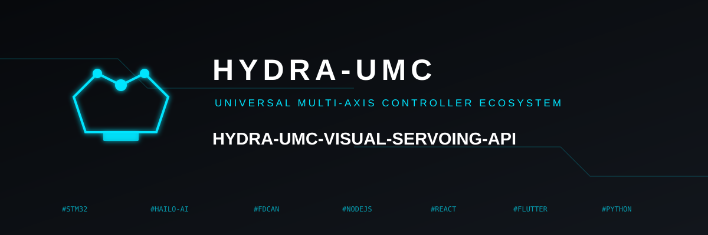
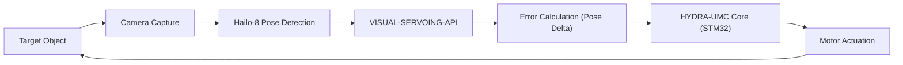

<p align="center">
  
</p>

# 🎯 HYDRA-UMC-VISUAL-SERVOING-API

<p align="center"><a href="README.md">🇺🇸 English</a> | <a href="README_spa.md">🇪🇸 Español</a> | <a href="README_fra.md">🇫🇷 Français</a> | <a href="README_ita.md">🇮🇹 Italiano</a> | <a href="README_deu.md">🇩🇪 Deutsch</a> | 🇨🇳 <b>简体中文</b> | <a href="README_jpn.md">🇯🇵 日本語</a></p>

### 📐 通过图像反馈实现的闭环运动学修正

<p align="left">
  
  
  
</p>

---

## 1. 🛠️ 技术概述

**HYDRA-UMC-VISUAL-SERVOING-API** 是感知与运动之间的精密桥梁。它计算目标
位姿与物体实际视觉位姿之间的误差增量，向 HYDRA-UMC 核心提供实时运动学
修正。

它同时支持 **Eye-in-Hand**（摄像头装于工具上）和 **Eye-to-Hand**（固定
摄像头）两种配置，实现超精密抓取放置、SMD 对位和动态轨迹调整。

### 关键特性：
* ✅ **真实 v0 —— PBVS 修正律：** `pose.py` + `servo.py` 计算当前位姿与目标位姿之间的位姿增量（角度按最短路径环绕，不走容易导致万向节死锁的长路），并将其转化为比例速度指令，限幅时不改变其方向。通过下面的 `correct` 子命令暴露——运行或测试都不需要摄像头或 NPU。
* 🛡️ **真实 v0 —— 安全联锁授权：** `authorization.py` 拒绝将感知转化为运动，除非上游安全状态为 `READY` 且视觉数据足够新鲜/可信。通过下面的新 `request` 子命令暴露——运行或测试都不需要摄像头、NPU 或 SAFETY-ZONES 进程。
* 🔄 **闭环控制：** 持续反馈回路，绕过高层编排器以降低延迟。*（架构目标——向 HYDRA-UMC 核心的 gRPC 传输仍是未来工作。）*
* 📐 **位姿估计：** 从单摄像头或多摄像头视角进行 6 自由度物体位姿估计。*（未来工作——需要本环境尚不具备的真实 Hailo-8 NPU。）*
* ⚡ **硬件加速：** 使用 Hailo-8 输出进行即时坐标计算。*（未来工作，原因相同。）*
* 🔌 **HailoRT 集成边界，先于模块本身准备就绪：** `hailo_runtime.py` 依据真实、已确认的 `hailo_platform` API(`VDevice`、`HEF`、`ConfigureParams`)编写——采用延迟导入,因此即使没有安装 `hailort` 包或没有 Hailo-8 模块存在,本仓库也能干净地安装/测试——并且 `hailo_output_to_pose()` 会将真实的推理结果直接适配为 `compute_pose_error()` 已经在使用的 `Pose6D`。*(已实现,仅为集成边界——真正运行推理仍然需要一个真实编译好的姿态估计 `.hef` 和一个物理的 Hailo-8 模块。)*

---

## 2. 🔄 视觉伺服回路



---

## 3. 🧱 架构与设计决策

* **为什么本 API 没有自己的硬件/固件。** 它完全运行在集成父项目 HYDRA-UMC-VISION-NODE 所拥有的共享 CM5 + Hailo-8 模块上——没有需要自行设计的板卡，因此 `hardware/`/`firmware/`/`os/` 被直接省略，而非留空。
* **为什么它是 HYDRA-UMC-VISION-NODE 的兄弟项目，而非子模块。** 位姿修正作为独立的进程/可部署单元运行，因此这里的崩溃或缓慢的推理周期不会拖累父项目自身的检测流水线，而 HYDRA-UMC-SAFETY-ZONES 依赖该流水线来确定 E-STOP 时机。
* **为什么修正律先于位姿估计落地。** 将一对位姿转化为受限速度指令是纯粹的控制理论数学——编写和测试都不需要摄像头或 NPU，因此 v0 优先交付这一部分（`pose.py`、`servo.py`）。真正的 6 自由度位姿*估计*需要本环境尚不具备的 Hailo-8 硬件，将在后续落地。
* **这如何融入生态系统的其余部分。** 位于感知（HYDRA-UMC-VISION-NODE）的下游、运动（HYDRA-UMC 固件）的上游——将检测到的偏移转化为机械臂自身点动/伺服回路所应用的运动学修正。
* **为什么 `authorize_correction()` 在检查置信度/新鲜度之前先检查 `safety_state`。** 安全故障必须凌驾于一切之上，即便面对一个完全新鲜、可信的检测结果也是如此——因此 `INHIBITED`（safety_state != "READY"）被最先检查，并短路掉策略的其余部分。只有在确认机械臂可以安全移动之后，*数据*是否足够可信才会影响是否据此移动它（置信度过低或数据过期则返回 `REJECTED`）。这与 HYDRA-UMC-SAFETY-ZONES 中已经使用的 `INHIBITED` 优先于 `DANGER`/`WARNING` 的顺序一致。
* **为什么 `request` 是新增子命令而不是修改 `correct`。** `correct` 是已有的底层纯数学工具（不感知安全状态，也没有摄像头新鲜度的概念），有自己的调用方和测试；就地为其套上安全联锁会悄悄改变它的契约。`request` 增加了这个带联锁、面向摄像头的入口点，生态系统代码实际上应当调用它，而 `correct` 保持不变，仍可用于直接的位姿数学运算。

---

## 📂 目录结构

CM5 + Hailo-8 是现成硬件，没有自己的板卡，因此本项目不携带 `hardware/`
或 `firmware/` 文件夹。`os/` 和 `models/` 仅存在于集成父项目
`HYDRA-UMC-VISION-NODE` 中。

```text
HYDRA-UMC-VISUAL-SERVOING-API/
├── src/                 # 源代码（hydra_umc_visual_servoing_api 包）
│   └── hydra_umc_visual_servoing_api/
│       ├── pose.py           # Pose6D —— 6 自由度位姿（x, y, z, roll, pitch, yaw）
│       ├── servo.py          # PBVS 修正律：位姿误差 + 速度指令
│       ├── authorization.py  # 安全联锁策略（INHIBITED/REJECTED/ACCEPTED）
│       └── main.py           # CLI 入口点（裸调用 + `correct` + `request`）
├── tests/               # 真实 pytest 套件（pose、servo、authorization、CLI）
├── docs/                # 文档与运动学理论
├── build/               # 构建输出（本地 .venv 也存放于此）
├── images/              # 媒体与图表
├── scripts/             # 实用脚本
├── tools/
│   ├── build_test.py    # 不递增版本号的构建检查
│   └── ci_validate.py   # CI 使用的清单/CHANGELOG/文档校验
├── pyproject.toml       # 包元数据、依赖项、里程表版本号
├── bump_version.py      # 里程表式版本递增（由 build.sh/.bat 运行）
├── build.sh / build.bat # venv + 可编辑安装 + 编译检查 + 测试
├── build-test.sh / build-test.bat # 不递增版本号的构建检查
└── run.sh / run.bat     # 从本地 venv 运行入口点
```

---

## 🏗️ 构建与运行

需要 Python 3.10+。

```bash
# Linux / macOS
./build.sh   # 递增里程表版本号，创建 .venv，以可编辑模式（含 dev 附加项）
             # 安装该包，对 src/ 下的每个文件进行编译检查，并运行真实的
             # pytest 套件
./run.sh     # 从 .venv 运行入口点，打印名称 + 版本 + 角色
```

```bat
:: Windows
build.bat
run.bat
```

`build.sh`/`build.bat` 会在每次真实构建之前，使用生态系统统一的"里程表"
规则（PATCH+1，超过 9 时进位到 MINOR）递增本项目自身的 `pyproject.toml`
版本号，然后使用 `python -m compileall` 对源代码进行编译检查。

真实示例——计算从当前位姿到目标位姿的修正：

```bash
./run.sh correct --current "0,0,0.5,0,0,0" --target "0.02,-0.01,0.48,0,0,0.05" \
  --gain 0.8 --max-linear-speed 0.05
# pose error   : dx=0.020000 dy=-0.010000 dz=-0.020000  droll=0.000000 dpitch=0.000000 dyaw=0.050000
# error norm   : linear=0.030000 m  angular=0.050000 rad
# velocity cmd : vx=0.016000 vy=-0.008000 vz=-0.016000  wroll=0.000000 wpitch=0.000000 wyaw=0.040000
# converged    : False
```

真实示例——请求一次带安全联锁的修正（接受、联锁阻止、拒绝三种情形）：

```bash
./run.sh request --current "0,0,0,0,0,0" --target "1,0,0,0,0,0" \
  --frame-id cam0-f42 --confidence 0.9 --data-age-ms 30 --safety-state READY
# outcome : ACCEPTED - frame 'cam0-f42' authorized (confidence=0.9, data_age_ms=30.0)
# pose error   : dx=1.000000 dy=0.000000 dz=0.000000  droll=0.000000 dpitch=0.000000 dyaw=0.000000
# velocity cmd : vx=1.000000 vy=0.000000 vz=0.000000  wroll=0.000000 wpitch=0.000000 wyaw=0.000000

./run.sh request --current "0,0,0,0,0,0" --target "1,0,0,0,0,0" \
  --frame-id cam0-f42 --confidence 0.9 --data-age-ms 30 --safety-state FAULT
# outcome : INHIBITED - safety_state is 'FAULT', not 'READY'   （退出码 2）

./run.sh request --current "0,0,0,0,0,0" --target "1,0,0,0,0,0" \
  --frame-id cam0-f42 --confidence 0.2 --data-age-ms 30 --safety-state READY
# outcome : REJECTED - confidence 0.2 is below the required minimum 0.6 for frame 'cam0-f42'   （退出码 1）
```

---

## ✅ 当前状态与后续步骤

**今天的真实进展：** PBVS 位姿误差与速度指令修正律（`pose.py`、
`servo.py`）——上方回路图中的“误差计算（位姿增量）”步骤——附带一个
真实的 `correct` CLI 命令；以及安全联锁授权策略（`authorization.py`），
除非上游安全状态为 `READY` 且数据足够可信/新鲜，否则拒绝将视觉检测
结果转化为运动，通过 `request` CLI 命令暴露;以及一个真实的 HailoRT 集成边界
(`hailo_runtime.py`),已准备好在真实的 Hailo-8 姿态估计器接入的那一刻使用。
共计 57 个测试。

**仍待完成，受限于真实硬件：** 要真正通过 `hailo_runtime.py` 运行 6 自由度
位姿*估计*,需要一个真实编译好的姿态估计 `.hef`(目前尚未选定具体模型)
以及一块连接好的物理 Hailo-8 NPU;而将计算出的速度指令以低延迟通过
gRPC 传输至 HYDRA-UMC 核心则是另一项独立的未来工作。

## 🚀 路线图
* **第一阶段：** 针对 8 路 USB 3.0 画面的多摄像头流水线同步与标定。
* **第二阶段：** 迁移至 YOLOv11 并针对工业组件检测进行 Hailo-8L 优化。
* **第三阶段：** 基于立体视觉节点的实时 3D 重建以及安全区域动态映射。
* **第四阶段：** 支持 9 自由度视觉跟踪（包括姿态冗余）以及亚微米级修正。

---

## 🔗 相关项目

本项目是同一作者（JuanenRac / Electro Hobby 3D）打造的更大规模机器人生态
系统的一部分，涵盖固件、控制软件、AI 节点和车队工具。值得了解，因为某个
需求实际上可能是关于这些项目之一，而非本仓库。

### 项目族

**父项目：** **[HYDRA-UMC-VISION-NODE](https://github.com/JuanenRac/HYDRA-UMC-VISION-NODE)** —— 本 API 为其将感知结果转化为位姿修正的集成父项目。

**同族项目：**
- **[HYDRA-UMC-VISION-STREAMER](https://github.com/JuanenRac/HYDRA-UMC-VISION-STREAMER)** —— 捕获并预处理父项目所消费的摄像头画面。
- **[HYDRA-UMC-DETECTION-HEF](https://github.com/JuanenRac/HYDRA-UMC-DETECTION-HEF)** —— 编译父项目加载到其 Hailo-8 NPU 上的 `.hef` 模型。
- **[HYDRA-UMC-SAFETY-ZONES](https://github.com/JuanenRac/HYDRA-UMC-SAFETY-ZONES)** —— 将父项目的感知结果转化为入侵检测和 E-STOP 触发。

### 直接相关（项目族之外）

- **[HYDRA-UMC](https://github.com/JuanenRac/HYDRA-UMC)** —— 向该固件发送运动学位姿修正。

### 生态系统的其余部分

**HYDRA-UMC 平台** —— 多机器人微工厂单元
- **[HYDRA-UMC](https://github.com/JuanenRac/HYDRA-UMC)** —— 协调最多 8 条机械臂的 CM5 + STM32H745 主板。
- **[HYDRA-UMC-SERVER](https://github.com/JuanenRac/HYDRA-UMC-SERVER)** —— 每个控制客户端所对接的 Express/WebSocket 后端。
- **[HYDRA-UMC-STUDIO](https://github.com/JuanenRac/HYDRA-UMC-STUDIO)** —— 基于 Web 的控制仪表盘，多机器人 3D 可视化。
- **[HYDRA-UMC-ANDROID-CONTROL](https://github.com/JuanenRac/HYDRA-UMC-ANDROID-CONTROL)** —— 通过 Wi-Fi/蓝牙的 Android 控制应用。
- **[HYDRA-UMC-IOS-CONTROL](https://github.com/JuanenRac/HYDRA-UMC-IOS-CONTROL)** —— 基于 Flutter 构建的 iOS/iPadOS 控制应用。
- **[HYDRA-UMC-SUITE](https://github.com/JuanenRac/HYDRA-UMC-SUITE)** —— 桌面端集群指挥中心（Python/PySide6）。
- **[HYDRA-UMC-EDITOR-URDF](https://github.com/JuanenRac/HYDRA-UMC-EDITOR-URDF)** —— 用于机器人目录的桌面端 URDF 模型编辑器。
- **[HYDRA-UMC-DSI](https://github.com/JuanenRac/HYDRA-UMC-DSI)** —— 机载 DSI 触摸屏的原生触控 UI。

**URTC 平台** —— 每台 HYDRA-UMC 机械臂搭载的工具头控制器
- **[URTC](https://github.com/JuanenRac/URTC)** —— CAN 总线工具头控制器，25 种工具配置。
- **[URTC-FLASHER](https://github.com/JuanenRac/URTC-FLASHER)** —— 桌面端 CAN-OTA + SWD/JTAG 刷写工具。
- **[URTC-TESTER](https://github.com/JuanenRac/URTC-TESTER)** —— 桌面端实时 CAN 总线诊断工具。
- **[URTC-WEB-STUDIO](https://github.com/JuanenRac/URTC-WEB-STUDIO)** —— 通过 Web Serial API 的浏览器端替代方案。

**🧠 认知 AI 节点（Hailo-10）**
- [HYDRA-UMC-COGNITIVE-NODE](https://github.com/JuanenRac/HYDRA-UMC-COGNITIVE-NODE)
- [HYDRA-UMC-VLA-ENGINE](https://github.com/JuanenRac/HYDRA-UMC-VLA-ENGINE)
- [HYDRA-UMC-VOICE-UI](https://github.com/JuanenRac/HYDRA-UMC-VOICE-UI)
- [HYDRA-UMC-SEMANTIC-PLANNER](https://github.com/JuanenRac/HYDRA-UMC-SEMANTIC-PLANNER)
- [HYDRA-UMC-DOCS-QA](https://github.com/JuanenRac/HYDRA-UMC-DOCS-QA)

**🐝 编排与集群**
- [HYDRA-UMC-ORCHESTRATOR](https://github.com/JuanenRac/HYDRA-UMC-ORCHESTRATOR)
- [HYDRA-UMC-SWARM-SYNC](https://github.com/JuanenRac/HYDRA-UMC-SWARM-SYNC)
- [HYDRA-UMC-PATH-PLANNER-3D](https://github.com/JuanenRac/HYDRA-UMC-PATH-PLANNER-3D)
- [HYDRA-UMC-JOB-DISPATCHER](https://github.com/JuanenRac/HYDRA-UMC-JOB-DISPATCHER)
- [HYDRA-UMC-NODE-HEALING](https://github.com/JuanenRac/HYDRA-UMC-NODE-HEALING)

**🎮 数字孪生与仿真**
- [HYDRA-UMC-TWIN](https://github.com/JuanenRac/HYDRA-UMC-TWIN)
- [HYDRA-UMC-PHYSICS-REPLICA](https://github.com/JuanenRac/HYDRA-UMC-PHYSICS-REPLICA)
- [HYDRA-UMC-HIL-BRIDGE](https://github.com/JuanenRac/HYDRA-UMC-HIL-BRIDGE)
- [HYDRA-UMC-SYNTHETIC-DATA-GEN](https://github.com/JuanenRac/HYDRA-UMC-SYNTHETIC-DATA-GEN)

**📊 数据与分析**
- [HYDRA-UMC-DATALAKE](https://github.com/JuanenRac/HYDRA-UMC-DATALAKE)
- [HYDRA-UMC-TELEMETRY-COLLECTOR](https://github.com/JuanenRac/HYDRA-UMC-TELEMETRY-COLLECTOR)
- [HYDRA-UMC-ANOMALY-DETECTOR](https://github.com/JuanenRac/HYDRA-UMC-ANOMALY-DETECTOR)
- [HYDRA-UMC-PRODUCTION-REPORTS](https://github.com/JuanenRac/HYDRA-UMC-PRODUCTION-REPORTS)

**🏭 工业网关**
- [HYDRA-UMC-GATEWAY-INDUSTRIAL](https://github.com/JuanenRac/HYDRA-UMC-GATEWAY-INDUSTRIAL)
- [HYDRA-UMC-OPCUA-SERVER](https://github.com/JuanenRac/HYDRA-UMC-OPCUA-SERVER)
- [HYDRA-UMC-MQTT-BROKER](https://github.com/JuanenRac/HYDRA-UMC-MQTT-BROKER)
- [HYDRA-UMC-MTCONNECT-ADAPTER](https://github.com/JuanenRac/HYDRA-UMC-MTCONNECT-ADAPTER)

**🛠️ 配套工具**
- [URTC-SMART-RACK](https://github.com/JuanenRac/URTC-SMART-RACK)
- [URTC-VISION-TOOL](https://github.com/JuanenRac/URTC-VISION-TOOL)
- [HYDRA-UMC-WATCH](https://github.com/JuanenRac/HYDRA-UMC-WATCH)
- [HYDRA-UMC-TOOL-CLI](https://github.com/JuanenRac/HYDRA-UMC-TOOL-CLI)
- [HYDRA-UMC-DASHBOARD-AI](https://github.com/JuanenRac/HYDRA-UMC-DASHBOARD-AI)


## 👤 作者
**JuanenRac** (Electro Hobby 3D)
📧 electrohobby3d@gmail.com
📺 [youtube.com/@electrohobby3d](https://youtube.com/@electrohobby3d)

## 📜 许可证
GPL-3.0 —— 详见 LICENSE。
